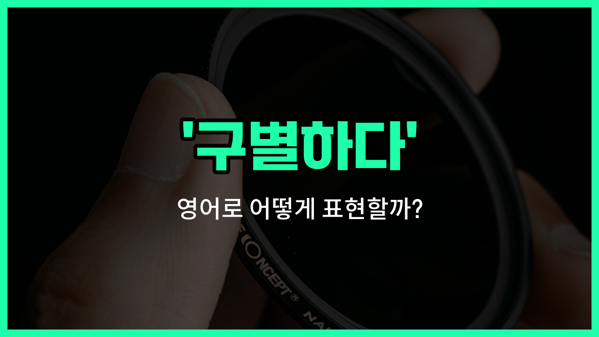

## 🌟 영어 표현 - differentiate

안녕하세요 👋 오늘은 '구별하다'라는 뜻을 가진 영어 표현을 소개해드리려고 해요. 바로 '**differentiate**'라는 단어인데요~

'differentiate'는 두 가지 이상의 사물이나 개념을 **구별하거나 식별할 때** 자주 쓰이는 단어예요. 즉, 비슷해 보이지만 서로 다른 점을 찾아내서 구분하는 상황에서 활용할 수 있어요~

예를 들어, 비슷한 제품이나 사람, 생각 등을 비교해서 차이점을 말할 때 'differentiate'를 사용해요. 또한, '차별하다'라는 의미로도 쓰일 수 있지만, 주로 '구별하다', '식별하다'의 의미로 더 많이 사용된답니다~

## 📖 예문

1. "우리는 진짜와 가짜를 구별할 수 있어요."

   "We can differentiate between the real and the fake."

2. "이 두 제품을 어떻게 구별하나요?"

   "How do you differentiate these two products?"

3. "성공한 회사들은 자신들만의 특징으로 경쟁사와 구별돼요."

   "[Successful](/blog/in-english/276.successful/) companies differentiate themselves from their competitors by their unique features."

## 💬 연습해보기

<ul data-interactive-list>

  <li data-interactive-item>
    가끔은 코카콜라랑 펩시 맛만으로 구분하기 어려워요.
    It's <a href="/blog/in-english/270.sometimes/">sometimes</a> hard to differentiate between Coke and Pepsi just by taste.
  </li>

  <li data-interactive-item>
    제 동생은 원본 포켓몬 카드랑 가짜 카드도 쉽게 구분해요.
    My little brother can easily differentiate between <a href="/blog/in-english/424.original/">original</a> and fake Pokemon cards.
  </li>

  <li data-interactive-item>
    이 두 글꼴 구분할 수 있어요? 저한테는 너무 비슷하게 보여서요.
    Can you differentiate these two fonts? They look so similar to me.
  </li>

  <li data-interactive-item>
    선생님들은 학생들 학습 스타일에 맞게 수업 방법을 다르게 해야 해요.
    Teachers have to differentiate their instruction for students with different <a href="/blog/in-english/245.learn/">learning</a> styles.
  </li>

  <li data-interactive-item>
    진짜 가죽 가방이랑 가짜 가방 구분하는 법 알아요?
    Do you know how to differentiate a real leather bag from a fake one?
  </li>

  <li data-interactive-item>
    진짜 그림이랑 복제품을 구분하려면 전문가 눈이 필요해요.
    It takes a trained eye to differentiate the authentic painting from a replica.
  </li>

  <li data-interactive-item>
    잠에서 막 깼을 때는 꿈인지 현실인지 헷갈릴 때가 있어요.
    Sometimes I can't differentiate my dreams from reality when I first <a href="/blog/in-english/300.wake-up/">wake up</a>.
  </li>

  <li data-interactive-item>
    알레르기인지 감기인지 구분하는 방법이 있을까요?
    Is there a way to differentiate <a href="/blog/in-english/578.allergy/">allergies</a> from a regular cold?
  </li>

  <li data-interactive-item>
    온라인에서 특히 사실과 소문을 구분하는 게 중요해요.
    It's <a href="/blog/in-english/318.important/">important</a> to differentiate fact from <a href="/blog/in-english/798.rumor/">rumor</a>, especially online.
  </li>

  <li data-interactive-item>
    저는 열쇠 구분할 때 항상 컬러 키체인을 사용해서 구분해요.
    I always have to differentiate my keys by using different colored keychains.
  </li>

</ul>

## 🤝 함께 알아두면 좋은 표현들

### distinguish

'distinguish'는 "구별하다" 또는 "식별하다"라는 뜻으로, 비슷한 것들 사이에서 차이점을 찾아내는 상황에서 자주 사용돼요. 두 가지 이상의 사물이나 개념을 명확하게 구분할 때 쓰는 표현이에요.

- "It's sometimes hard to distinguish between real and fake [news](/blog/in-english/536.news/) online."
- "온라인에서는 진짜 뉴스와 가짜 뉴스를 구별하기가 가끔 어려워요."

### tell apart

'tell apart'는 "구분하다" 또는 "분간하다"라는 의미로, 겉모습이나 특징이 비슷한 것들을 서로 다르게 알아보는 상황에서 많이 써요. 일상 대화에서 자주 쓰이는 구어체 표현이에요.

- "I can't tell the twins apart because they look [exactly](/blog/in-english/419.exactly/) the same."
- "쌍둥이들이 너무 똑같이 생겨서 누가 누군지 구분을 못 하겠어요."

### confuse

'confuse'는 "혼동하다" 또는 "헷갈리다"라는 뜻으로, 두 가지 이상의 것을 제대로 구별하지 못하고 섞어서 생각하는 상황에서 사용해요. 'differentiate'의 반대 의미로 볼 수 있어요.

- "I always confuse their names because they sound so similar."
- "그들의 이름이 너무 비슷하게 들려서 항상 헷갈려요."

---

오늘은 '구별하다', '식별하다', '차별하다'라는 뜻을 가진 영어 표현 '**differentiate**'에 대해 알아봤어요. 비슷한 것들 사이에서 차이점을 말하고 싶을 때 이 단어를 떠올려보면 좋겠어요~ 😊

오늘 배운 표현과 예문들을 꼭 소리 내서 여러 번 읽어보세요. 다음에도 더 유익한 영어 표현으로 찾아올게요! 감사합니다~

