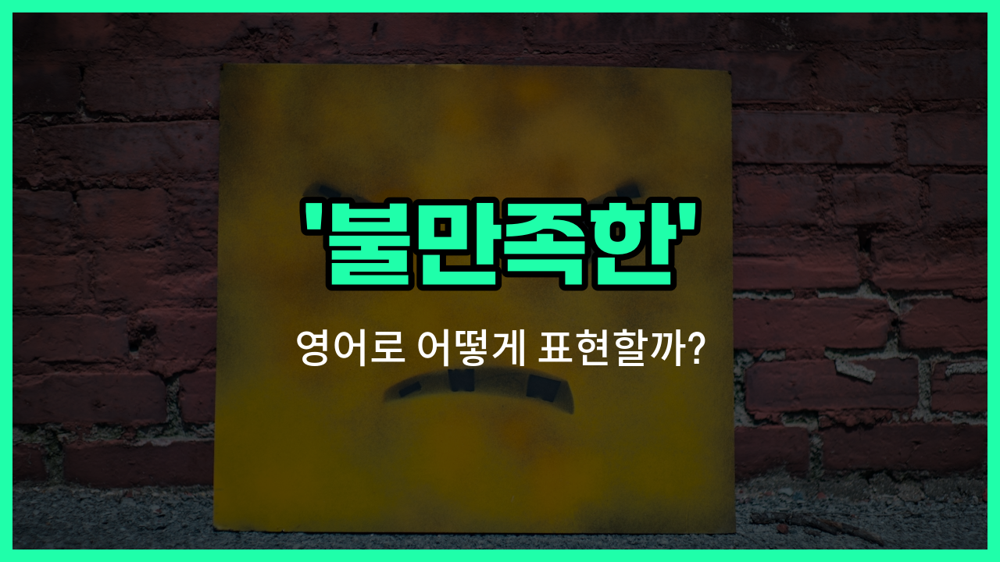

## 🌟 영어 표현 - dissatisfied

안녕하세요 👋 오늘은 우리가 자주 느낄 수 있는 감정, 바로 '**불만족한**'이라는 영어 표현에 대해 알아보려고 해요. 영어로는 '**dissatisfied**'라고 해요. 이 단어는 어떤 상황이나 결과, 혹은 서비스 등에 대해 **기대에 미치지 못해 마음에 들지 않을 때** 사용할 수 있어요.

예를 들어, 식당에서 음식을 먹었는데 기대했던 맛이 아니거나, 쇼핑한 물건이 생각보다 별로일 때 'dissatisfied'라는 표현을 쓸 수 있어요. 또, 회사에서 자신의 업무 환경이나 결과에 만족하지 않을 때도 이 단어를 사용해요.

비슷한 의미로 '마음에 안 드는', '불평하는'이라는 뜻도 함께 기억해두면 좋아요. 일상 대화나 리뷰, 피드백을 줄 때 자주 쓰이는 표현이니 꼭 알아두세요!

## 📖 예문

1. "저는 서비스에 불만족했어요."

   "I was dissatisfied with the service."

2. "그는 결과에 불만족한 것 같아요."

   "He seems dissatisfied with the result."

## 💬 연습해보기

<ul data-interactive-list>

  <li data-interactive-item>
    어젯밤 그 식당 서비스 완전 별로였어요. 웨이터가 저희를 완전 잊은 것 같았어요.
    I was pretty dissatisfied with the service at that restaurant last night. The waiter totally <a href="/blog/in-english/023.forget/">forgot</a> about us.
  </li>

  <li data-interactive-item>
    솔직히 휴대폰에 좀 실망했어요. 배터리가 하루도 제대로 안 가네요.
    <a href="/blog/in-english/336.honestly/">Honestly</a>, I'm a little dissatisfied with my phone. The battery <a href="/blog/in-english/078.barely/">barely</a> lasts a day now.
  </li>

  <li data-interactive-item>
    회의 끝나고 그녀가 좀 실망한 표정이었어요, 더 좋은 소식 기대한 거 같았거든요.
    She looked dissatisfied after the meeting, like she was expecting better <a href="/blog/in-english/536.news/">news</a>.
  </li>

  <li data-interactive-item>
    그가 숨기려 했지만, 생일 선물에 꽤 실망한 게 티 났어요.
    He <a href="/blog/in-english/117.try-to/">tried to</a> hide it, but you could tell he was dissatisfied with his birthday gift.
  </li>

  <li data-interactive-item>
    프로젝트 결과에 불만이에요. 훨씬 더 잘할 수 있었을 텐데.
    I'm dissatisfied with how the project <a href="/blog/vocab-1/038.turn-out/">turned out</a>. It could've been so much better.
  </li>

  <li data-interactive-item>
    이번 학기 성적 때문에 부모님이 좀 실망하셨거든요.
    My parents were dissatisfied with my grades this semester.
  </li>

  <li data-interactive-item>
    인터넷 속도도 느려서 불만이에요? 저도 완전 느려서 짜증나요.
    Are you dissatisfied with your internet provider too? Mine's been super slow.
  </li>

  <li data-interactive-item>
    그녀가 온라인에 불만족 리뷰 남겼어요. 호텔 사진들이 실제랑 다르다고요.
    She <a href="/blog/in-english/402.leave/">left</a> a dissatisfied <a href="/blog/in-english/251.review/">review</a> online. She said the hotel photos were misleading.
  </li>

  <li data-interactive-item>
    일에 불만은 없는데, 그렇다고 완전 만족도 아니에요.
    I'm not dissatisfied with my job, but I wouldn't say I'm happy either.
  </li>

  <li data-interactive-item>
    음식 기다리는데 한 시간이나 걸려서 전체 경험에 꽤 실망했어요.
    After waiting an hour for the food, we were pretty dissatisfied with the whole <a href="/blog/in-english/415.experience/">experience</a>.
  </li>

</ul>

## 🤝 함께 알아두면 좋은 표현들

### discontented

'discontented'는 "불만스러운" 또는 "만족하지 못하는"이라는 뜻이에요. 주로 현재 상황이나 결과에 대해 마음에 들지 않아서 불평하거나 불만을 느낄 때 사용해요.

- "She felt discontented with her current job and started [looking for](/blog/in-english/173.look-for/) new opportunities."
- "그녀는 현재 직장에 불만족을 느껴서 새로운 기회를 찾기 시작했어요."

### pleased

'pleased'는 '만족한', '기쁜'이라는 뜻으로, 어떤 결과나 상황에 대해 마음에 들어 하거나 기뻐하는 감정을 나타낼 때 써요. 'dissatisfied'의 반대말이에요.

- "He was very pleased with the service at the restaurant."
- "그는 식당 서비스에 아주 만족했어요."

### content

'content'는 "만족하는" 또는 "더 바랄 게 없는"이라는 뜻이에요. 현재 상황이나 결과에 대해 불평 없이 편안하게 받아들이는 긍정적인 감정을 나타낼 때 사용해요.

- "[Despite](/blog/in-english/341.despite/) not [winning](/blog/in-english/456.win/) the prize, she was content with her performance."
- "비록 상을 받지는 못했지만, 그녀는 자신의 실력에 만족했어요."

---

오늘은 '**불만족한**'이라는 뜻을 가진 영어 표현 '**dissatisfied**'에 대해 알아봤어요. 앞으로 마음에 들지 않는 상황이 있을 때 이 표현을 떠올려 보세요 😊

오늘 배운 표현과 예문들을 꼭 최소 3번씩 소리 내서 읽어보세요. 다음에도 더 재미있고 유익한 영어 표현으로 찾아올게요! 감사합니다!
