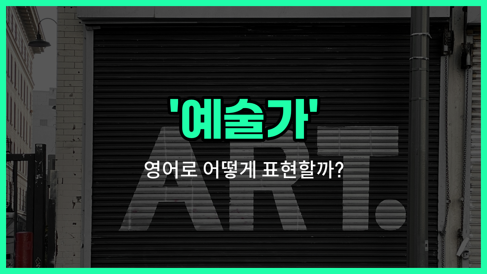

## 🌟 영어 표현 - artist

안녕하세요 👋 오늘은 '예술가'라는 뜻을 가진 영어 표현을 소개해드릴게요. 바로 '**artist**'라는 단어에요. 'artist'는 그림을 그리는 화가뿐만 아니라, 음악, 조각, 무용, 연극 등 다양한 예술 분야에서 창작 활동을 하는 사람을 모두 가리킬 수 있어요.

즉, **예술적인 재능을 가지고 창작 활동을 하는 사람**을 말할 때 'artist'라는 단어를 사용해요. 예를 들어, 그림을 그리는 사람은 'painter'라고도 하지만, 좀 더 넓은 의미로 'artist'라고 부를 수 있어요. 작가, 조각가, 댄서 등도 모두 'artist'에 포함돼요.

'artist'는 일상 대화뿐만 아니라, 전시회, 공연, 예술 관련 기사 등 다양한 상황에서 자주 쓰이는 단어에요.

## 📖 예문

1. "그는 유명한 예술가에요."

   "He is a famous artist."

2. "이 그림은 젊은 예술가가 그렸어요."

   "This painting was created by a young artist."

## 💬 연습해보기

<ul data-interactive-list>

  <li data-interactive-item>
    우리 언니 진짜 대박 아티스트예요. 초상화 그리는데 완전 리얼하거든요.
    My sister is an incredible artist. She paints portraits that look totally real.
  </li>

  <li data-interactive-item>
    우리 친구 제이크 만나봐요. 걔는 도시 곳곳에 그래피티 그리는 멋진 아티스트예요.
    You should meet my friend Jake. He's a brilliant artist who does graffiti all over the city.
  </li>

  <li data-interactive-item>
    난 항상 아티스트가 되고 싶었는데, 난 간신히 막대기 사람도 못 그리겠더라고요.
    I've always wanted to be an artist, but I can't even draw a stick figure.
  </li>

  <li data-interactive-item>
    어제 길거리 아티스트 봤는데, 보도에 완전 대박 분필 그림 그리더라고요.
    We saw a street artist yesterday who made these amazing chalk drawings on the sidewalk.
  </li>

  <li data-interactive-item>
    그 아티스트 새 전시회가 시내에서 막 열렸대요. 이번 주말에 같이 갈래요?
    That artist's new exhibit just opened downtown. Wanna go this weekend?
  </li>

  <li data-interactive-item>
    파머스 마켓에서 동네 아티스트 작품 한 점 샀는데, 완전 싸고 멋졌어요.
    I bought a print from a local artist at the farmers <a href="/blog/in-english/641.market/">market</a>. It was super cheap but really cool.
  </li>

  <li data-interactive-item>
    그 영화는 뉴욕에서 성공하려 애쓰는 고군분투 중인 아티스트 이야기였어요.
    The movie was about a struggling artist <a href="/blog/in-english/117.try-to/">trying to</a> <a href="/blog/in-english/244.make-it/">make it</a> in New York.
  </li>

  <li data-interactive-item>
    자기 아티스트라 그러는데, 난 걔가 만들기 작업에 더 관심 많은 것 같아요.
    She calls herself an artist, but I think she's more into crafts.
  </li>

  <li data-interactive-item>
    내 최애 아티스트가 새 앨범 냈는데 하루 종일 반복해서 듣고 있어요.
    My favorite artist just released a new album. I've had it on repeat all day.
  </li>

  <li data-interactive-item>
    혹시 괜찮은 디지털 아티스트 알아요? 프로젝트 도와줄 사람 찾고 있어요.
    Do you know any good digital artists? I'm <a href="/blog/in-english/173.look-for/">looking for</a> someone to help with a project.
  </li>

</ul>

## 🤝 함께 알아두면 좋은 표현들

### creative person

'creative person'은 "창의적인 사람"이라는 뜻으로, 예술가뿐만 아니라 새로운 아이디어를 내고 독창적으로 생각하는 모든 사람을 가리킬 때 써요. 예술가와 비슷하게 창의성을 강조하지만, 꼭 예술 분야에 한정되진 않아요.

- "She's such a creative person; she always [comes up with](/blog/아이디어를-생각하다-영어표현/) unique solutions to problems."
- "그녀는 정말 창의적인 사람이에요. 항상 문제에 대해 독특한 해결책을 생각해내요."

### craftsman

'craftsman'은 "장인" 또는 "숙련공"이라는 뜻이에요. 예술가와 비슷하게 손재주가 뛰어나고, 무언가를 정성스럽게 만드는 사람을 말해요. 하지만 예술가가 창의성과 예술성을 강조한다면, 장인은 기술과 정교함을 더 강조하는 편이에요.

- "The furniture was made by a skilled craftsman who takes pride in his work."
- "그 가구는 자신의 일에 자부심을 가진 숙련된 장인이 만든 거예요."

### non-artist

'non-artist'는 "예술가가 아닌 사람"이라는 뜻이에요. 예술적 재능이나 창의적인 활동과는 거리가 있는 사람을 가리킬 때 쓰는 말이에요. 예술가의 반대 개념으로 볼 수 있어요.

- "As a non-artist, I find it hard to understand abstract paintings."
- "저는 예술가가 아니라서 추상화는 이해하기가 어려워요."

---

오늘은 '예술가'라는 뜻을 가진 영어 표현 'artist'에 대해 알아봤어요. 예술과 관련된 다양한 분야에서 쓸 수 있는 단어이니 꼭 기억해두세요~

오늘 배운 표현과 예문들을 소리 내서 여러 번 읽어보면 더 쉽게 익힐 수 있어요. 다음에도 더 유익한 영어 표현으로 찾아올게요! 감사합니다~
