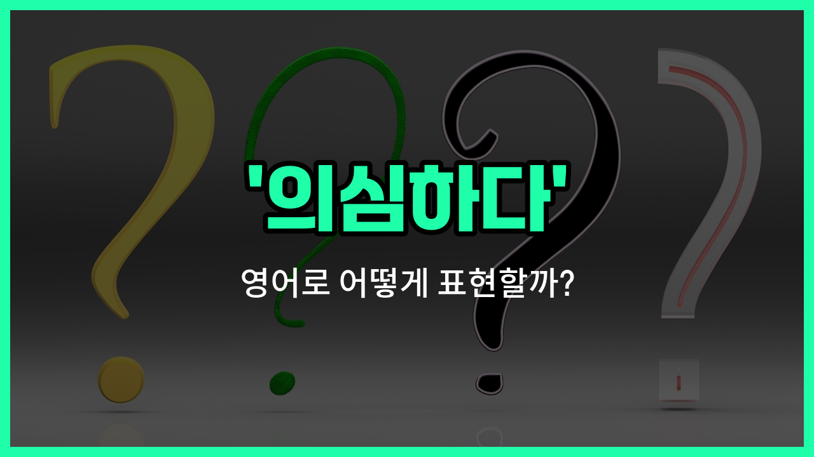

## 🌟 영어 표현 - second guess

안녕하세요 👋 오늘은 우리가 일상에서 자주 겪는 감정 중 하나인 '의심하다'를 영어로 어떻게 표현하는지 알아보려고 해요. 바로 '**second guess**'라는 표현이에요.

'**second guess**'는 어떤 결정이나 생각에 대해 다시 한 번 의심하거나, 스스로 확신하지 못하고 재고하는 상황에서 쓰여요. 즉, 이미 내린 결정을 다시 생각해보거나, 자신이 한 선택에 대해 망설일 때 자연스럽게 사용할 수 있는 표현이에요!

예를 들어, 시험을 보고 답을 적었는데 "이게 맞나?" 하고 다시 고민할 때, 또는 누군가의 말을 듣고 내 생각이 흔들릴 때 'second guess'를 쓸 수 있어요.

## 📖 예문

1. "나는 내 결정을 자꾸 의심하게 돼요."

   "I keep second guessing my decision."

2. "그의 말 때문에 내 선택을 재고하게 됐어요."

   "His words made me second guess my [choice](/blog/in-english/399.choice/)."

## 💬 연습해보기

<ul data-interactive-list>

  <li data-interactive-item>
    중대한 결정을 내리고 나면 항상 내 선택이 맞았는지 의심하게 돼요.
    I always second guess myself after making a big decision. Did I make the right call?
  </li>

  <li data-interactive-item>
    그녀는 제가 하는 말마다 다 의심하는 편이라 좀 짜증날 때 있어요.
    She <a href="/blog/in-english/259.tend-to/">tends to</a> second guess everything I say, which gets kind of <a href="/blog/in-english/364.annoying/">annoying</a>.
  </li>

  <li data-interactive-item>
    본능을 의심하지 마세요—당신이 잘 해낼 거예요!
    Don't second guess your instincts—you got this!
  </li>

  <li data-interactive-item>
    문밖을 나서자마자 입은 옷이 괜찮았나 의심되기 시작했어요.
    I started to second guess my outfit choice as soon as I stepped out the door.
  </li>

  <li data-interactive-item>
    그는 시험에서 답을 바꿨다가 틀린 답으로 바꿔 버렸어요.
    He second guessed his answer on the test and ended up changing it to the <a href="/blog/in-english/316.wrong/">wrong</a> one.
  </li>

  <li data-interactive-item>
    솔직히 당신을 의심하려던 게 아니라, 도우려던 마음이었어요.
    <a href="/blog/in-english/336.honestly/">Honestly</a>, I didn't mean to second guess you, I was just <a href="/blog/in-english/117.try-to/">trying to</a> help.
  </li>

  <li data-interactive-item>
    중요한 이메일을 보낼 때마다 내가 쓴 내용이 맞나 계속 의심하게 돼요.
    Every time I <a href="/blog/in-english/292.send/">send</a> an <a href="/blog/in-english/318.important/">important</a> email, I second guess what I wrote.
  </li>

  <li data-interactive-item>
    자신의 감을 믿고 매번 하는 행동을 의심하는 걸 멈춰야 해요.
    You need to <a href="/blog/in-english/880.trust/">trust</a> your gut and stop second guessing every move you make.
  </li>

  <li data-interactive-item>
    새로운 직장에서는 자신을 의심하기 쉽다는 걸 알지만, 당신은 정말 잘하고 있어요.
    I know it's easy to second guess yourself in a new job, but you're doing great.
  </li>

  <li data-interactive-item>
    모든 사람 의견을 듣고 나서 제 결정을 다시 의심하기 시작했어요.
    After hearing everyone's <a href="/blog/in-english/527.opinion/">opinions</a>, I started to second guess my decision.
  </li>

</ul>

## 🤝 함께 알아두면 좋은 표현들

### doubt

'[doubt](/blog/in-english/307.doubt/)'는 "의심하다"라는 뜻으로, 어떤 사실이나 사람의 말, 행동 등에 대해 확신이 없거나 믿지 못할 때 사용해요. 'second guess'와 비슷하게 신뢰하지 못하는 상황에서 자주 쓰여요.

- "She started to doubt his [explanation](/blog/in-english/913.explanation/) after hearing different [stories](/blog/in-english/537.story/) from others."
- "다른 사람들한테서 다른 얘기를 듣고 나서 그녀는 그의 설명을 의심하기 시작했어요."

### trust

'trust'는 "신뢰하다" 또는 "믿다"라는 뜻이에요. 누군가의 말이나 행동을 의심하지 않고 그대로 받아들이는 긍정적인 태도를 나타내요. 'second guess'의 반대 의미로, 의심하지 않고 믿는 상황에서 사용해요.

- "I trust my team to [finish](/blog/in-english/295.finish/) the project [on time](/blog/vocab-1/043.on-time/)."
- "저는 우리 팀이 제시간에 프로젝트를 끝낼 거라고 믿어요."

### take at face value

'take [at face value](/blog/in-english/223.at-face-value/)'는 "겉으로 보이는 대로 받아들이다"라는 뜻이에요. 누군가의 말이나 행동을 깊이 의심하지 않고, 있는 그대로 믿는다는 의미로, 'second guess'의 반대되는 표현이에요.

- "You shouldn't always take what people say at face value."
- "사람들이 하는 말을 항상 곧이곧대로 믿으면 안 돼요."

---

오늘은 '의심하다', '재고하다', '망설이다'라는 뜻을 가진 영어 표현 '**second guess**'에 대해 알아봤어요. 앞으로 스스로를 의심하거나 망설일 때 이 표현을 떠올려보면 좋겠어요 😊

오늘 배운 표현과 예문들을 꼭 소리 내서 여러 번 읽어보세요. 다음에도 더 유익한 영어 표현으로 찾아올게요! 감사합니다!
