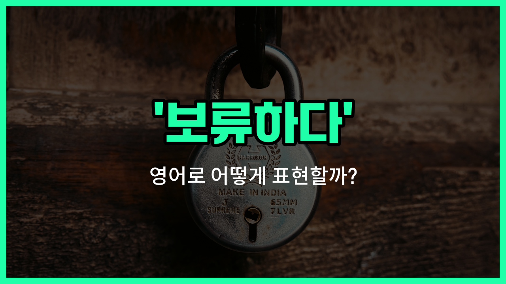

## 🌟 영어 표현 - withhold

안녕하세요 👋 오늘은 '보류하다', '유보하다'라는 뜻을 가진 영어 표현을 소개해드릴게요. 바로 '**withhold**'라는 단어에요.

'**withhold**'는 어떤 것을 잠시 멈추거나, 주지 않고 보류하는 상황에서 사용돼요. 예를 들어, 정보를 바로 공개하지 않고 잠시 보류할 때, 혹은 감정을 드러내지 않고 유보할 때 쓸 수 있어요.

이 단어는 공식적인 문서나 일상 대화 모두에서 자주 등장해요. 예를 들어, 회사에서 중요한 결정을 내릴 때 정보를 잠시 보류하거나, 누군가에게 돈이나 지원을 바로 주지 않고 유보할 때 사용할 수 있어요.

## 📖 예문

1. "그는 중요한 정보를 보류했어요."

   "He withheld [important](/blog/in-english/318.important/) information."

2. "회사는 보너스 지급을 유보했어요."

   "The company withheld the bonus payment."

## 💬 연습해보기

<ul data-interactive-list>

  <li data-interactive-item>
    회사가 올해 말까지 보너스를 미루기로 했대요. 다들 휴게실에서 그 얘기로 난리였어요.
    The company <a href="/blog/in-english/062.decide-to/">decided to</a> withhold his bonus until the end of the year. Everyone was talking about it in the breakroom.
  </li>

  <li data-interactive-item>
    그녀는 정보를 숨기고 싶진 않았는데, 진실을 다 말하는 게 좀 떨렸나 봐요.
    She didn't want to withhold any information, but she felt <a href="/blog/in-english/115.nervous/">nervous</a> about telling the whole truth.
  </li>

  <li data-interactive-item>
    계속 마음에 감정 숨기면 결국 터질 거예요. 솔직하게 말해줘요.
    If you keep withholding your feelings, it's going to <a href="/blog/in-english/021.catch-up-on/">catch up</a> to you eventually. Just be honest with me.
  </li>

  <li data-interactive-item>
    은행에서 자금이 완전히 정리되기 전에 며칠간 보류한다고 하더라고요. 좀 짜증 났어요.
    My bank said they have to withhold the funds for <a href="/blog/in-english/911.a-few/">a few</a> days before they clear. I was kind of annoyed.
  </li>

  <li data-interactive-item>
    솔직히 좋은 소식 숨기진 않을 거예요—제일 먼저 알려줄 거니까요!
    <a href="/blog/in-english/336.honestly/">Honestly</a>, I'd never withhold good <a href="/blog/in-english/536.news/">news</a> from you—you'd be the first to know!
  </li>

  <li data-interactive-item>
    선생님이 재시험 끝날 때까지 성적을 보류하기로 해서 그 학생이 좀 불안해했어요.
    The teacher decided to withhold his grade until he finished the makeup test. That made him a little <a href="/blog/vocab-1/036.anxious/">anxious</a>.
  </li>

  <li data-interactive-item>
    시간제 근로자한테 기본 혜택도 안 주다니, 진짜 불공평한 것 같아요.
    I can't believe they withhold <a href="/blog/in-english/445.basic/">basic</a> benefits from <a href="/blog/in-english/736.part-time/">part-time</a> workers. That really doesn't seem fair.
  </li>

  <li data-interactive-item>
    어젯밤 대화하면서 리사가 뭔가 숨기고 있단 느낌이 들었어요.
    I had a feeling Lisa was withholding something during our conversation last night.
  </li>

  <li data-interactive-item>
    칭찬 좀 왜 항상 숨기는 거예요? 가끔 좋은 얘기 들으면 기분 좋잖아요!
    Why do you always withhold compliments? <a href="/blog/in-english/270.sometimes/">Sometimes</a> it's nice to hear good things!
  </li>

  <li data-interactive-item>
    집주인이 파손 때문에 보증금 일부를 떼겠다고 해서 더 조심했어야 했어요.
    The landlord said he'd withhold part of my <a href="/blog/in-english/554.security/">security</a> deposit because of the damages. I <a href="/blog/in-english/257.should've/">should've</a> been more careful.
  </li>

</ul>

## 🤝 함께 알아두면 좋은 표현들

### hold back

'[hold](/blog/in-english/388.hold/) back'은 "감정이나 정보, 행동 등을 억누르다" 또는 "참다"라는 뜻이에요. 무언가를 일부러 내보이지 않거나, 행동을 멈추는 상황에서 자주 써요.

- "She wanted to tell the truth, but decided to hold back her feelings."
- "그녀는 진실을 말하고 싶었지만, 자신의 감정을 억누르기로 했어요."

### release

'release'는 "풀어주다", "공개하다" 또는 "방출하다"라는 뜻으로, 'withhold'의 반대말이에요. 감추거나 보류했던 것을 밖으로 내보내거나 공개할 때 사용해요.

- "The company decided to release the new product details to the public."
- "그 회사는 신제품 정보를 대중에게 공개하기로 했어요."

### keep under wraps

'keep under wraps'는 "비밀로 하다" 또는 "숨기다"라는 뜻이에요. 어떤 정보를 일부러 공개하지 않고 감추는 상황에서 자주 쓰여요.

- "They kept the project under wraps until everything was ready."
- "모든 준비가 끝날 때까지 그들은 프로젝트를 비밀로 했어요."

---

오늘은 '보류하다', '유보하다'라는 뜻을 가진 영어 표현 '**withhold**'에 대해 알아봤어요. 앞으로 정보를 잠시 멈추거나, 뭔가를 바로 주지 않을 때 이 표현을 떠올려보세요 😊

오늘 배운 표현과 예문들을 꼭 최소 3번씩 소리 내서 읽어보세요. 다음에도 더 재미있고 유익한 영어 표현으로 찾아올게요! 감사합니다!
