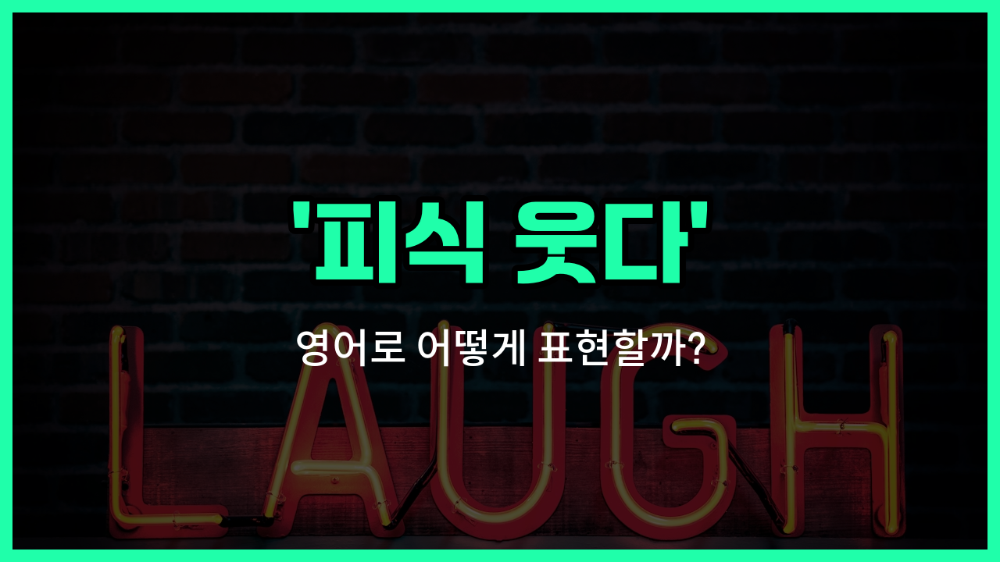

## 🌟 영어 표현 - chuckle

안녕하세요 👋 오늘은 '피식 웃다'라는 뜻을 가진 영어 표현을 소개해드릴게요. 바로 '**chuckle**'이에요. 'chuckle'은 조용히, 또는 속으로 피식 웃거나 낄낄거릴 때 쓰는 단어예요. 큰 소리로 웃는 것이 아니라, 입을 다물고 소리 없이 혹은 아주 작게 웃는 모습을 떠올리면 이해하기 쉬워요.

이 단어는 누군가의 말이나 행동이 살짝 재미있거나 귀엽게 느껴질 때 자연스럽게 사용할 수 있어요. 예를 들어, 친구가 귀여운 실수를 했을 때, 혹은 재미있는 농담을 들었지만 크게 웃기보다는 피식 웃고 싶을 때 'chuckle'을 쓸 수 있어요.

또한, 'chuckle'은 명사와 동사로 모두 사용할 수 있어서 다양한 상황에 활용할 수 있어요. 동사로는 '피식 웃다', 명사로는 '피식 웃음'이라는 뜻이에요.

## 📖 예문

1. "그의 농담에 피식 웃었어요."

   "I chuckled at his joke."

2. "그녀는 조용히 피식 웃음을 터뜨렸어요."

   "She let out a [quiet](/blog/in-english/958.quiet/) chuckle."

## 💬 연습해보기

<ul data-interactive-list>

  <li data-interactive-item>
    그가 농담할 때 웃음을 참을 수 없었어요. 완전 예상 못해서 빵 터졌거든요.
    I couldn't help but chuckle when he told that joke. It totally caught me off guard.
  </li>

  <li data-interactive-item>
    회의 중에 그녀가 미소를 숨기려고 했지만, 웃음소리를 들었어요.
    She <a href="/blog/in-english/117.try-to/">tried to</a> hide her smile, but I saw her chuckle during the meeting.
  </li>

  <li data-interactive-item>
    우리 강아지가 바보 같은 짓 할 때마다 혼자 빙그레 웃게 돼요.
    Every time my dog does something silly, I chuckle to myself.
  </li>

  <li data-interactive-item>
    그가 비꼬는 말을 했을 때, 그냥 웃음이 나왔어요.
    He made a sarcastic comment, and I just had to chuckle.
  </li>

  <li data-interactive-item>
    그 밈을 봤을 때 살짝 웃음이 나왔어요.
    When I saw the meme, I gave a little chuckle.
  </li>

  <li data-interactive-item>
    제이크가 웃긴 영상을 보면서 조용히 웃기 시작했어요.
    Jake was watching a funny video and started to chuckle quietly.
  </li>

  <li data-interactive-item>
    선생님이 학생의 똑똑한 대답에 웃으시는 걸 봤어요.
    I <a href="/blog/in-english/061.notice/">noticed</a> the teacher chuckle at the student's clever answer.
  </li>

  <li data-interactive-item>
    가끔 몇 년 전 부끄러운 기억 생각나면 혼자 웃게 돼요.
    <a href="/blog/in-english/270.sometimes/">Sometimes</a>, I chuckle when I remember something embarrassing from years ago.
  </li>

  <li data-interactive-item>
    우리 모두 웃음 참으려고 했는데, 진짜 웃음 못 참겠더라고요.
    We all tried not to chuckle, but it was really hard to keep a straight face.
  </li>

  <li data-interactive-item>
    그 영화 진짜 좋았어요. 보는 내내 자꾸 웃음이 나왔어요.
    That movie was good. I caught myself chuckling throughout the whole thing.
  </li>

</ul>

## 🤝 함께 알아두면 좋은 표현들

### giggle

'giggle'은 '피식 웃다'와 비슷하게 '낄낄거리다', '킥킥 웃다'라는 뜻이에요. 주로 뭔가 재미있거나 우스운 상황에서 가볍고 조용하게 웃는 모습을 나타낼 때 써요. 특히 어린아이들이나 누군가 장난스럽게 웃을 때 자주 사용돼요.

- "The kids couldn't stop giggling during the funny movie."
- "아이들이 재미있는 영화를 보면서 계속 킥킥거렸어요."

### burst out laughing

'burst out [laughing](/blog/in-english/321.laugh/)'은 '피식 웃다'와는 반대로, '빵 터져서 크게 웃다'라는 뜻이에요. 뭔가 정말 웃긴 일이 생겼을 때 참지 못하고 갑자기 크게 웃음을 터뜨리는 상황에서 써요.

- "When he told the joke, everyone burst out laughing."
- "그가 농담을 하자 모두가 빵 터져서 웃었어요."

### keep a straight face

'keep a straight face'는 '피식 웃다'와 반대되는 표현으로, '웃음을 참다', '무표정하게 있다'는 뜻이에요. 웃긴 상황에서도 일부러 웃지 않고 진지한 표정을 유지할 때 사용해요.

- "It was hard to keep a straight face during the silly performance."
- "그 우스꽝스러운 공연을 보면서 웃음을 참기가 정말 힘들었어요."

---

오늘은 '피식 웃다', '낄낄거리다'라는 뜻을 가진 영어 표현 'chuckle'에 대해 알아봤어요. 앞으로 누군가의 말이나 행동에 피식 웃고 싶을 때 이 표현을 떠올려보세요 😊

오늘 배운 표현과 예문들을 꼭 최소 3번씩 소리 내서 읽어보세요. 다음에도 더 재미있고 유익한 영어 표현으로 찾아올게요! 감사합니다!

