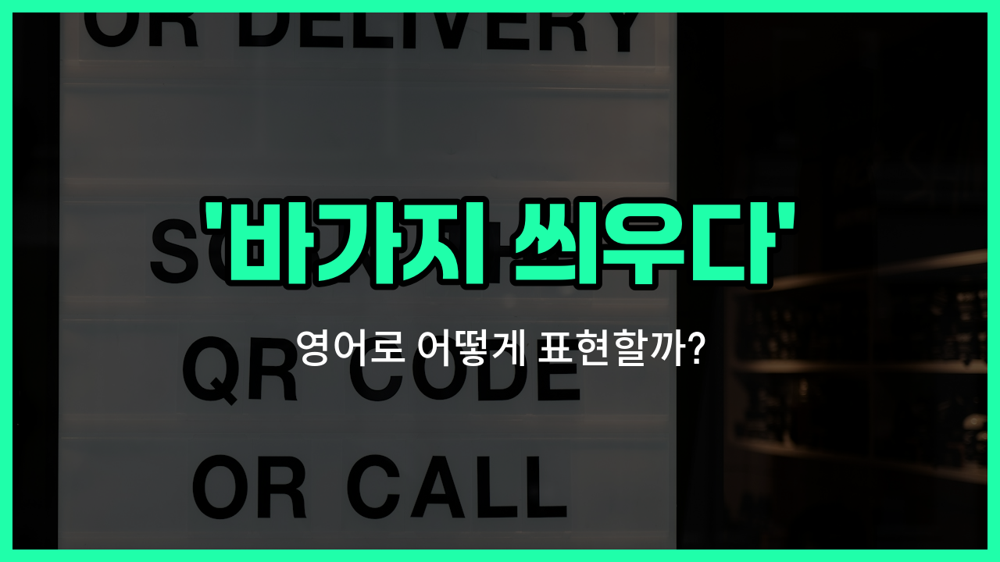

## 🌟 영어 표현 - rip off

안녕하세요 👋 오늘은 영어로 '바가지 씌우다'라는 표현을 어떻게 말하는지 알아볼 거예요. 바로 '**rip off**'라는 표현이에요. 이 표현은 누군가에게 물건이나 서비스를 실제 가치보다 훨씬 비싸게 팔거나, 부당하게 돈을 더 받는 상황에서 자주 사용돼요.

'**rip off**'는 단순히 비싸다는 의미를 넘어서, 상대방이 일부러 속여서 돈을 더 받는 느낌이 강해요. 그래서 여행지에서 택시비를 과하게 요구하거나, 시장에서 외국인에게만 비싼 값을 부를 때 쓸 수 있는 표현이에요.

예를 들어, "They [tried to](/blog/in-english/117.try-to/) rip me off at the [market](/blog/in-english/641.market/)."라고 하면 "시장에선 나한테 바가지를 씌우려고 했어."라는 뜻이에요.

또한, '**rip-off**'라고 하면 명사로 '바가지 상품'이나 '사기'라는 의미로도 쓸 수 있어요. 예를 들어, "That souvenir was a total rip-off."라고 하면 "그 기념품은 완전 바가지였어."라는 뜻이에요.

## 📖 예문

1. "택시기사가 나한테 바가지를 씌웠어요."

   "The taxi driver ripped me off."

2. "이 레스토랑은 가격이 너무 비싸요. 완전 바가지예요."

   "This restaurant is so [expensive](/blog/in-english/317.expensive/). It's a total rip-off."

## 💬 연습해보기

<ul data-interactive-list>

  <li data-interactive-item>
    저 커피 가격 진짜 믿기지가 않아요. 완전 바가지였어요.
    I can't believe the <a href="/blog/in-english/640.price/">price</a> they charged for that coffee. Total rip off.
  </li>

  <li data-interactive-item>
    주차비 얼마나 받는지 봤어요? 완전 바가지에요.
    Did you see how much they wanted for parking? What a rip off.
  </li>

  <li data-interactive-item>
    그 콘서트 티켓 완전 바가지였어요. 작년에 반값에 밴드 봤는데.
    That concert ticket was such a rip off. I could've seen the band for half the price last year.
  </li>

  <li data-interactive-item>
    그 관광지 조심해요. 손님들 바가지 씌우기로 유명해요.
    Be careful at that tourist trap. They're known to rip off customers.
  </li>

  <li data-interactive-item>
    저 신발 디자이너인 줄 알았는데 알고 보니 가짜였어요. 완전 바가지였어요.
    I thought those shoes were designer, but <a href="/blog/vocab-1/038.turn-out/">turns out</a> they were fake. Total rip off.
  </li>

  <li data-interactive-item>
    티셔츠 한 장에 4만원이나 받더라고요. 완전 바가지 당한 기분이에요.
    They charged me forty bucks for a t-shirt. I feel ripped off.
  </li>

  <li data-interactive-item>
    그 가게 갈 때마다 바가지 쓰는 느낌이에요.
    Every time I go to that store, I feel like I'm getting ripped off.
  </li>

  <li data-interactive-item>
    그 친구가 거기서 전자제품 사지 말래요. 바가지 많이 씌운대요.
    Her friend warned her not to buy electronics there since they <a href="/blog/in-english/259.tend-to/">tend to</a> rip people off.
  </li>

  <li data-interactive-item>
    물 한 병에 5달러라니, 정말 바가지에요.
    <a href="/blog/in-english/336.honestly/">Honestly</a>, five bucks for a bottle of water is just a rip off.
  </li>

  <li data-interactive-item>
    택시비 바가지 씌워서 진짜 화났어요.
    He was <a href="/blog/in-english/395.upset/">upset</a> after <a href="/blog/in-english/166.realize/">realizing</a> the taxi driver ripped him off on the fare.
  </li>

</ul>

## 🤝 함께 알아두면 좋은 표현들

### overcharge

'overcharge'는 "과도하게 요금을 청구하다" 또는 "바가지를 씌우다"라는 뜻이에요. 누군가에게 정당한 가격보다 훨씬 더 많은 돈을 요구할 때 쓰는 표현이에요. 주로 상점이나 서비스에서 가격이 지나치게 높을 때 사용해요.

- "The taxi driver tried to overcharge us because we were tourists."
- "택시 기사님이 우리가 관광객이라고 바가지를 씌우려고 했어요."

### fair price

'fair price'는 "적정한 가격" 또는 "공정한 가격"이라는 뜻이에요. 물건이나 서비스가 실제 가치에 맞는 가격에 판매될 때 쓰는 표현이에요. 바가지와는 반대되는 개념이에요.

- "I [finally](/blog/in-english/182.finally/) found a shop that sells souvenirs at a fair price."
- "드디어 기념품을 적정한 가격에 파는 가게를 찾았어요."

### get a good deal

'get a good deal'은 "좋은 거래를 하다" 또는 "싸게 잘 사다"라는 뜻이에요. 물건이나 서비스를 시세보다 저렴하게 구입했을 때, 또는 가격 대비 만족스러운 거래를 했을 때 자주 써요. 'rip off'의 반대되는 긍정적인 표현이에요.

- "I got a good deal on my new phone during the [holiday](/blog/in-english/517.holiday/) sale."
- "연휴 세일 때 새 핸드폰을 싸게 잘 샀어요."

---

오늘은 '바가지 씌우다'라는 뜻을 가진 영어 표현 '**rip off**'에 대해 알아봤어요. 여행이나 쇼핑할 때 이 표현을 떠올리면 정말 유용할 거예요 😊

오늘 배운 표현과 예문들을 꼭 최소 3번씩 소리 내서 읽어보세요. 다음에도 더 재미있고 유익한 영어 표현으로 찾아올게요! 감사합니다!
