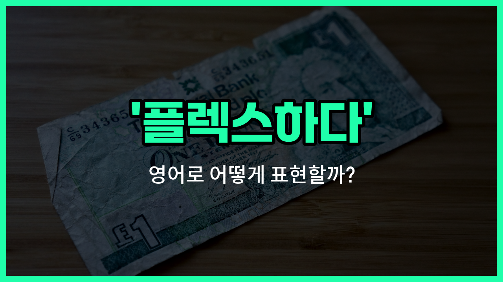

## 🌟 영어 표현 - splash out

안녕하세요 👋 오늘은 요즘 많이 쓰이는 표현인 '**플렉스하다**'를 영어로 어떻게 말하는지 알아볼 거예요. 바로 '**splash out**'라는 표현이 있어요. 이 표현은 **돈을 아낌없이 쓰거나, 평소보다 더 많이 소비할 때** 자주 사용돼요.

예를 들어, 평소에는 절약하지만 특별한 날에는 비싼 옷이나 음식을 사면서 돈을 펑펑 쓸 때 '**splash out**'라고 해요. 우리말로는 '플렉스하다', '돈을 펑펑 쓰다', '사치하다'와 비슷한 느낌이에요!

이 표현은 주로 영국식 영어에서 많이 쓰이고, 미국에서는 '[splurge](/blog/in-english/731.splurge/)'라는 단어도 비슷하게 사용돼요. 하지만 오늘은 'splash out'에 집중해서 알아볼게요~

## 📖 예문

1. "이번 주말에 새 신발에 플렉스했어요."

   "I splashed out on new shoes this weekend."

2. "생일이라서 좋은 레스토랑에서 돈을 펑펑 썼어요."

   "I splashed out at a nice restaurant for my birthday."

## 💬 연습해보기

<ul data-interactive-list>

  <li data-interactive-item>
    한 달 내내 눈여겨봤던 신발, 결국 큰맘 먹고 샀어요. 예산 초과였지만 참을 수가 없었거든요.
    I <a href="/blog/in-english/182.finally/">finally</a> <a href="/blog/in-english/062.decide-to/">decided to</a> splash out on those shoes I've been eyeing all month. They were way over my <a href="/blog/in-english/661.budget/">budget</a>, but I couldn't resist.
  </li>

  <li data-interactive-item>
    첫 월급 받고 잭스가 새 휴대폰 샀어요. 자기가 정말 보상 받을 자격 있다고 하더라고요.
    After getting her first paycheck, Jess splashed out on a brand new phone. She said she deserved a treat.
  </li>

  <li data-interactive-item>
    오늘 밤은 색다르게 멋진 스테이크집에서 저녁 먹으려고요. 특별한 날이라서요.
    We're going to splash out tonight and have dinner at that fancy steakhouse downtown. It's a special occasion.
  </li>

  <li data-interactive-item>
    평소에는 집에서 요리하는데 지난 주말에는 초밥 사 먹었어요. 완전 만족스러웠어요.
    He usually <a href="/blog/in-english/461.cook/">cooks</a> at home, but he splashed out on sushi last weekend. It was totally worth it.
  </li>

  <li data-interactive-item>
    자주는 아니지만 이번엔 그냥 안 살 수 없어서 노트북 업그레이드했어요. 너무 느렸거든요.
    I don't splash out very <a href="/blog/in-english/326.often/">often</a>, but I just had to upgrade my laptop this time. My old one was so slow.
  </li>

  <li data-interactive-item>
    우리 기념일 다음 주라서 5성급 호텔에서 묵을 계획이에요. 이런 거 자주는 안 해요!
    Our anniversary's next week, so we're planning to splash out and stay in a five-star hotel. We don't do this often!
  </li>

  <li data-interactive-item>
    자기 최애 밴드 콘서트 표를 샀어요. 당연히 앞줄 자리로요.
    She splashed out on tickets to see her favorite band. Front row, of course.
  </li>

  <li data-interactive-item>
    부모님께서 졸업 선물로 완전 꽉 쥐고 차를 사주셨어요!
    My parents really splashed out for my graduation gift. They bought me a car!
  </li>

  <li data-interactive-item>
    세일할 때 화장품 엄청 샀다니까요. 후회 1도 없어요.
    I went a little crazy and splashed out on makeup during the sale. No regrets.
  </li>

  <li data-interactive-item>
    가끔은 이렇게 크게 쓰면서 자신을 챙겨주는 것도 필요하더라고요, 알죠?
    Every once in a while, it feels good to splash out and treat yourself, you know?
  </li>

</ul>

## 🤝 함께 알아두면 좋은 표현들

### treat oneself

'treat oneself'는 "자신에게 선물하다" 또는 "스스로에게 보상을 주다"라는 뜻이에요. 평소보다 특별하게 자신을 위해 돈을 쓰거나 맛있는 걸 먹는 등, 자기 자신을 챙기는 상황에서 자주 써요.

- "After a long week at work, I decided to treat myself to a nice dinner."
- "일주일 내내 열심히 일한 뒤에, 나 자신에게 맛있는 저녁을 선물했어요."

### tighten one's belt

'[tighten one's belt](/blog/in-english/855.tighten-one's-belt/)'는 "허리띠를 졸라매다"라는 뜻으로, 돈을 아끼고 절약해야 할 때 쓰는 표현이에요. 경제적으로 힘들거나 지출을 줄여야 할 때 자주 사용해요.

- "With rising [prices](/blog/in-english/640.price/), many families have to tighten their belts [these days](/blog/in-english/417.these-days/)."
- "요즘 물가가 올라서 많은 가정이 허리띠를 졸라매야 해요."

### go on a spending spree

'go on a [spending](/blog/in-english/258.spend/) spree'는 "돈을 펑펑 쓰다" 또는 "지름신이 오다"라는 뜻이에요. 충동적으로 짧은 시간 동안 많은 돈을 쓰는 상황에서 자주 쓰는 표현이에요.

- "She went on a spending spree after getting her bonus."
- "보너스를 받은 뒤에 그녀는 지름신이 와서 돈을 펑펑 썼어요."

---

오늘은 '**플렉스하다**'라는 뜻을 가진 영어 표현 '**splash out**'에 대해 알아봤어요. 특별한 날이나 자신을 위해 사치하고 싶을 때 이 표현을 떠올려 보세요~ 😊

오늘 배운 표현과 예문들을 꼭 소리 내서 여러 번 읽어보세요. 다음에도 더 재미있고 유익한 영어 표현으로 찾아올게요! 감사합니다~

