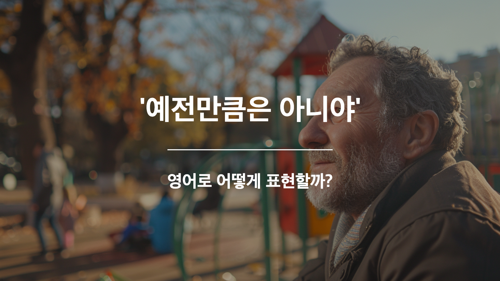

## 🌟 영어 표현 - not as ... as I used to

안녕하세요, 오늘은 **'예전만큼은 \~하지 않다, 옛날만큼은 아니다'** 라는 의미를 전달하기 위한 영어 패턴을 가져왔어요! '예전만큼 책을 읽지 않는다’ 같은 말을 어떻게 영어로 할 수 있을까요?

'**not as <형용사/부사> as I used to**' 패턴을 사용하면 이런 말을 영어로 할 수 있어요. 이 패턴을 사용하면 '요즘은 예전만큼 뭔가를 많이 하지 않는다.'는 의미를 전달할 수 있어요. 이 표현은 **과거와 현재를 비교할 때 사용**하는 표현이에요. 주로 과거의 상태나 능력과 현재를 비교하면서, 변화가 있음을 나타낼 때 씁니다. **"예전만큼 ~하지 않다"** 라는 의미를 전달할 때 아주 유용해요.

일상 대화에서 자주 사용되는 이 표현은 나이가 들면서 겪는 변화, 시간에 따른 상황의 변화, 또는 어떤 것에 대한 관심이나 능력의 변화 등을 설명할 때 아주 유용해요.

<!-- engple-horizontal-ad -->

<ins class="adsbygoogle"
     style="display:block"
     data-ad-client="ca-pub-1465612013356152"
     data-ad-slot="2106896038"
     data-ad-format="auto"
     data-full-width-responsive="true"></ins>

## 📖 예문

"요즘에는 예전만큼 책을 읽지 않아요. 사실, 요즘엔 다른 취미에 더 관심이 많아요."

"I don’t read books as much as I used to. Actually, these days I’m more interested in other hobbies."

"그들은 예전만큼 자주 여행을 가지 않습니다. 요즘에는 집에서 시간을 보내는 것을 더 선호하네요."

"They don’t travel as much as they used to. Nowadays, they [prefer](/blog/in-english/191.prefer/) spending time at home."

그럼 이제 이 표현을 활용한 예문들을 함께 연습해볼까요? 크게 소리 내어 따라 해보세요! 🎉

## 💬 연습해보기

  
이 커피는 예전만큼 진하지 않아요. 어쩌면 그들이 커피 블렌드를 바꿨을지도 몰라요.

  This coffee isn't as strong as it used to be. Maybe they changed the blend.

 
넌 예전만큼 말이 많지 않은 것 같아. 괜찮은거야?

  I don’t think you're as talkative as you used to be. Is everything alright?

  
우리가 화학 비료 사용을 중단한 이후로, 우리의 정원은 예전만큼 생생하게 꽃이 피지 않아요.

  Our garden doesn’t bloom as vividly as it used to since we stopped using chemical fertilizers

  
나는 예전만큼 파티를 즐기지 않아. 이제는 조용한 저녁을 더 선호해

  I don't <a href="/blog/in-english/128.enjoy-ing/">enjoy</a> parties as much as I used to. I prefer quiet evenings now.

  
이 도시는 예전만큼 안전하지 않아요. 우리는 밤에 더 조심해야 해요.

  This city isn't as safe as it used to be. We need to be more cautious at night.

  
그는 다친 후 예전만큼 빨리 달릴 수 없지만, 점차 나아지고 있어요.

  He can't run as fast as he used to after his injury, but he's gradually improving.

  
A: 우리가 어릴 적 얼마나 모험적이었는지 기억해? 우리는 예전만큼 겁이 없지 않아. B: 맞아, 하지만 그건 우리가 이제 결과를 더 잘 알고 있기 때문이야. 떨어질 생각 없이 그냥 나무에 오를 수는 없잖아.

  A: Do you remember how adventurous we were as kids? We're not as fearless as we used to be. B: True, but I think it's because we're more aware of the consequences now. We can't just climb trees without thinking about the fall.

  
A: 우리가 예전만큼 자주 야근하지 않는다는 걸 눈치챘어? B: 맞아. 회사가 커지면서 워크라이프 밸런스를 더 추구하게 됐나 봐.

  A: Have you <a href="/blog/in-english/061.notice/">noticed</a> that we don't stay late at the office as often as we used to? B: Indeed, I've <a href="/blog/in-english/061.notice/">noticed</a> that. As the company has grown, there's been a shift towards valuing work-life balance more.

## 🤝 함께 알아두면 좋은 표현들

### not what it used to be

'not what it used to be'는 **"예전만 못하다" 또는 "옛날보다 못하다"** 라는 뜻이에요. 이 표현은 **과거와 비교해서 현재 상태나 상황이 나빠졌거나 퇴보했음**을 나타내요. 주로 아쉬움이나 실망감을 표현할 때 사용돼요.

"The neighborhood is not what it used to be. it's become so noisy and crowded."

"이 동네는 예전만 못해요. 너무 시끄럽고 복잡해졌어요."

### be getting worse

'be getting worse'는 **"점점 나빠지고 있다" 또는 "악화되고 있다"** 라는 의미예요. 이 표현은 **상황이나 상태가 계속해서 나빠지고 있음**을 나타내요. 매우 간단하고 직접적인 표현이라 일상에서 자주 사용돼요.

"My headache is getting worse. I think I need to lie down."

"두통이 점점 심해지고 있어요. 좀 누워야 할 것 같아요."

---

오늘은 **'예전만큼 \~하지 않는다'** 라는 의미를 전달하는 **'not ... as <형용사/부사> as I used to'** 라는 표현을 배워봤어요. 실제로 소리내어 말하면서 해당 표현을 자연스럽게 사용할 수 있도록 연습해주세요! 그러면 다음에도 유용한 표현으로 찾아올게요! 다음에 또 만나요 🙂
