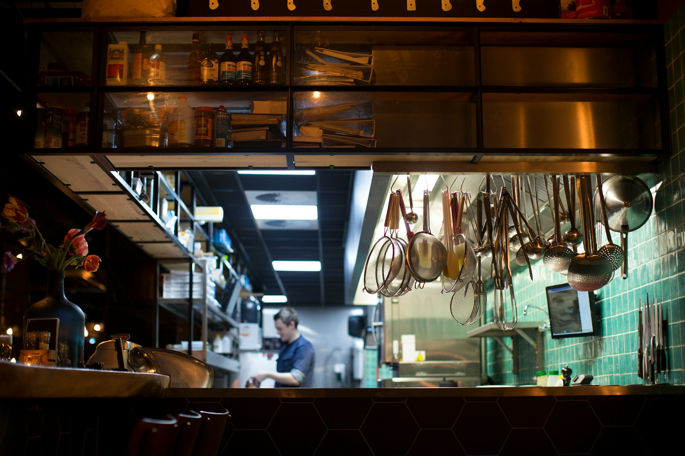

주방에서 요리를 할 때 가장 많이 사용하는 도구들을 영어로는 어떻게 표현할까요? 🍳 오늘은 칼(knife), 냄비(pot), 프라이팬(frying pan) 등 기본적인 조리도구들의 영어 표현을 알아볼게요. 각 도구의 발음과 함께 관련 표현, 예문들도 함께 살펴볼 거예요. 이 표현들을 익히고 나면 요리 관련 영어 대화나 레시피를 이해하는 데 큰 도움이 될 거예요. ✨

<!-- engple-horizontal-ad -->

<ins class="adsbygoogle"
     style="display:block"
     data-ad-client="ca-pub-1465612013356152"
     data-ad-slot="2106896038"
     data-ad-format="auto"
     data-full-width-responsive="true"></ins>

## 1. 칼 (Knife)

음식을 자르고 썰기 위해 사용하는 가장 기본적인 주방 도구예요.

### 🗣️ 발음

- 발음기호: /naɪf/
- 한국어 발음: 나이프

### 💭 관련 표현

- sharp knife: 날카로운 칼
- kitchen knife: 주방용 칼
- butter knife: 버터 나이프

### 📝 예문으로 연습하기!

1. "Always be careful when using a sharp knife."

   "날카로운 칼을 사용할 때는 항상 조심해야 해요."

2. "I need a knife to chop these vegetables."

   "야채를 썰려면 칼이 필요해요."

## 2. 냄비 (Pot)

음식을 끓이거나 조리하는 데 사용하는 깊이가 있는 조리 용기예요.

### 🗣️ 발음

- 발음기호: /pɒt/
- 한국어 발음: 팟

### 💭 관련 표현

- cooking pot: 요리 냄비
- soup pot: 수프 냄비
- stainless steel pot: 스테인리스 냄비

### 📝 예문으로 연습하기!

1. "I boiled water in the pot for pasta."

   "파스타를 위해 냄비에 물을 끓였어요."

2. "This pot is perfect for making stew."

   "이 냄비는 스튜 만들기에 딱이에요."

## 3. 프라이팬 (Frying Pan)

음식을 볶거나 굽는 데 사용하는 납작한 바닥의 조리 도구예요.

### 🗣️ 발음

- 발음기호: /ˈfraɪ.ɪŋ pæn/
- 한국어 발음: 프라잉 팬

### 💭 관련 표현

- non-stick frying pan: 붙지 않는 프라이팬
- cast iron frying pan: 주철 프라이팬
- frying pan lid: 프라이팬 뚜껑

### 📝 예문으로 연습하기!

1. "I fried eggs in the frying pan this morning."

   "오늘 아침에 프라이팬으로 계란을 부쳤어요."

2. "This frying pan is great for making pancakes."

   "이 프라이팬은 팬케이크 만들기에 완전 좋아요."

## 4. 주걱 (Spatula)

음식을 뒤집거나 섞는 데 사용하는 납작한 조리 도구예요.

### 🗣️ 발음

- 발음기호: /ˈspætʃ.ə.lə/
- 한국어 발음: 스패츌라

### 💭 관련 표현

- silicone spatula: 실리콘 주걱
- metal spatula: 금속 주걱
- flipping spatula: 뒤집개 주걱

### 📝 예문으로 연습하기!

1. "Use a spatula to flip the pancakes."

   "팬케이크를 뒤집으려면 주걱을 사용해요."

2. "The spatula is perfect for scraping the bowl."

   "주걱은 그릇을 긁어내기에 딱이에요."

## 5. 믹싱볼 (Mixing Bowl)

재료를 섞거나 반죽을 만드는 데 사용하는 큰 그릇이에요.

### 🗣️ 발음

- 발음기호: /ˈmɪk.sɪŋ boʊl/</a>
- 한국어 발음: 믹싱 볼

### 💭 관련 표현

- large mixing bowl: 큰 믹싱볼
- stainless steel mixing bowl: 스테인리스 믹싱볼
- glass mixing bowl: 유리 믹싱볼

### 📝 예문으로 연습하기!

1. "I mixed the dough in a large mixing bowl."

   "큰 믹싱볼에 반죽을 섞었어요."

2. "This mixing bowl is easy to clean."

   "이 믹싱볼은 청소하기 쉬워요."

## 6. 계량컵 (Measuring Cup)

정확한 양의 재료를 측정하는 데 사용하는 눈금이 있는 컵이에요.

### 🗣️ 발음

- 발음기호: /ˈmeʒ.ər.ɪŋ kʌp/</a>
- 한국어 발음: 메저링 컵

### 💭 관련 표현

- liquid measuring cup: 액체 계량컵
- dry measuring cup: 건재료 계량컵
- plastic measuring cup: 플라스틱 계량컵

### 📝 예문으로 연습하기!

1. "I used a measuring cup to pour the milk."

   "우유를 붓기 위해 계량컵을 사용했어요."

2. "This measuring cup has both metric and imperial units."

   "이 계량컵에는 미터법과 야드파운드법 단위가 다 있어요."

## 7. 휘핑기 (Whisk)

계란이나 크림을 거품내는 데 사용하는 철사로 만든 도구예요.

### 🗣️ 발음

- 발음기호: /wɪsk/
- 한국어 발음: 위스크

### 💭 관련 표현

- balloon whisk: 풍선형 휘핑기
- electric whisk: 전동 휘핑기
- silicone whisk: 실리콘 휘핑기

### 📝 예문으로 연습하기!

1. "I used a whisk to beat the eggs."

   "계란을 풀기 위해 휘핑기를 사용했어요."

2. "This whisk is great for making whipped cream."

   "이 휘핑기는 휘핑크림 만들기에 완전 좋아요."

## 8. 도마 (Cutting Board)

재료를 썰거나 자르는 작업을 할 때 사용하는 평평한 판이에요.

### 🗣️ 발음

- 발음기호: /ˈkʌt.ɪŋ bɔːrd/
- 한국어 발음: 커팅 보드

### 💭 관련 표현

- wooden cutting board: 나무 도마
- plastic cutting board: 플라스틱 도마
- bamboo cutting board: 대나무 도마

### 📝 예문으로 연습하기!

1. "I chopped vegetables on the cutting board."

   "도마 위에서 야채를 썰었어요."

2. "This cutting board is easy to clean."

   "이 도마는 청소하기 쉬워요."

## 9. 오븐 (Oven)

음식을 구워내거나 베이킹하는 데 사용하는 가열 조리기구예요.

### 🗣️ 발음

- 발음기호: /ˈʌv.ən/
- 한국어 발음: 어번

### 💭 관련 표현

- electric oven: 전기 오븐
- gas oven: 가스 오븐
- convection oven: 대류 오븐

### 📝 예문으로 연습하기!

1. "I baked cookies in the oven."

   "오븐에 쿠키를 구웠어요."

2. "This oven heats up really quickly."

   "이 오븐은 정말 빨리 예열되요."

## 10. 그라탕 팬 (Casserole Dish)

오븐에서 음식을 구워낼 때 사용하는 깊이가 있는 그릇이에요.

### 🗣️ 발음

- 발음기호: /ˈkæs.ə.roʊl dɪʃ/
- 한국어 발음: 캐서롤 디시

### 💭 관련 표현

- glass casserole dish: 유리 그라탕 팬
- ceramic casserole dish: 세라믹 그라탕 팬
- oven-safe casserole dish: 오븐용 그라탕 팬

### 📝 예문으로 연습하기!

1. "I made lasagna in a casserole dish."

   "그라탕 팬에 라자냐를 만들었어요."

2. "This casserole dish is perfect for baking."

   "이 그라탕 팬은 베이킹에 딱이에요."

## 11. 집게 (Tongs)

뜨거운 음식을 집거나 옮기는 데 사용하는 집게 모양의 도구예요.

### 🗣️ 발음

- 발음기호: /tɒŋz/
- 한국어 발음: 통즈

### 💭 관련 표현

- kitchen tongs: 주방용 집게
- silicone tongs: 실리콘 집게
- metal tongs: 금속 집게

### 📝 예문으로 연습하기!

1. "I used tongs to flip the steak."

   "스테이크를 뒤집기 위해 집게를 사용했어요."

2. "These tongs are great for serving salad."

   "이 집게는 샐러드 서빙에 완전 좋아요."

## 12. 체 (Sieve)

가루 재료를 곱게 치거나 액체를 걸러내는 데 사용하는 도구예요.

### 🗣️ 발음

- 발음기호: /sɪv/
- 한국어 발음: 시브

### 💭 관련 표현

- fine sieve: 고운 체
- metal sieve: 금속 체
- flour sieve: 밀가루 체

### 📝 예문으로 연습하기!

1. "I sifted the flour using a sieve."

   "체로 밀가루를 쳤어요."

2. "This sieve is perfect for straining pasta."

   "이 체는 파스타 물 빼기에 딱이에요."

## 13. 믹서기 (Blender)

재료를 갈거나 섞어서 퓨레나 음료를 만드는 전자 기구예요.

### 🗣️ 발음

- 발음기호: /ˈblen.dər/</a>
- 한국어 발음: 블렌더

### 💭 관련 표현

- immersion blender: 핸드 블렌더
- countertop blender: 스탠드 블렌더
- high-speed blender: 고속 블렌더

### 📝 예문으로 연습하기!

1. "I made a smoothie using the blender."

   "블렌더로 스무디를 만들었어요."

2. "This blender is powerful enough to crush ice."

   "이 블렌더는 얼음을 갈 정도로 강력해요."

---

이렇게 요리도구와 관련된 영어 단어와 예문을 알아봤어요! 이제 요리할 때 영어로 말해보는 건 어렵지 않겠죠? 🍴😊

오늘 배운 단어와 예문들을 최소 3번 소리내어 말해보세요. 반복해서 소리내어 말하는 것 만큼 영어학습에 도움되는 것은 없습니다.

그럼 다음에 더 유용한 단어와 예문들로 찾아올게요~ 👋
