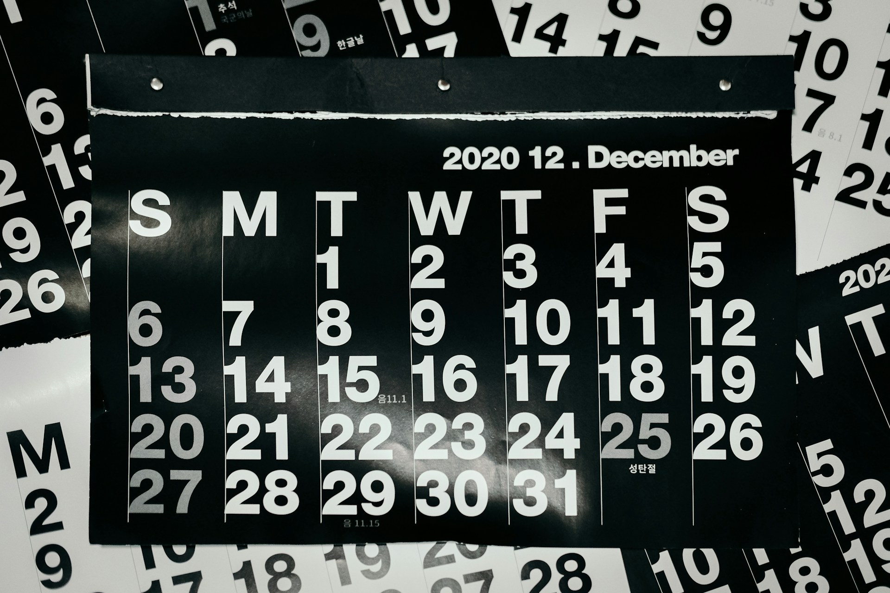

오늘은 한 해의 각 달을 나타내는 15개의 영어 단어와 예문을 함께 알아볼 거예요. 각 달에 대한 발음과 관련 표현, 그리고 예문도 함께 살펴볼 거예요. 이 표현들을 익히면 월별 관련 영어 대화나 일정을 이해하는 데 큰 도움이 될 거예요.

## 1. 1월 (January)

### 🗣️ 발음

- 발음기호: /ˈdʒæn.ju.er.i/
- 한국어 발음: 재뉴어리

### 💭 관련 표현

- New Year's Day: 새해 첫날
- January sales: 1월 세일

### 📝 예문으로 연습하기!

1. "January is a time for new beginnings and resolutions."

   "1월은 새로운 시작과 결심을 위한 시간이야."

2. "I always [look forward to](/blog/in-english/224.look-forward-to/) the January sales."

   "나는 항상 1월 세일을 기대해요."

## 2. 2월 (February)

### 🗣️ 발음

- 발음기호: /ˈfeb.ruː.er.i/
- 한국어 발음: 페브루어리

### 💭 관련 표현

- Valentine's Day: 발렌타인 데이
- Leap year: 윤년

### 📝 예문으로 연습하기!

1. "February <a href="/blog/in-english/329.be-known-for/">is known for</a> Valentine's Day celebrations."

   "2월은 발렌타인 데이 축제로 유명해."

2. "This year is a leap year, so February has 29 days."

   "올해는 윤년이라서 2월이 29일까지 있어요."

## 3. 3월 (March)

### 🗣️ 발음

- 발음기호: /mɑːrtʃ/
- 한국어 발음: 마치

### 💭 관련 표현

- March equinox: 춘분
- Spring break: 봄 방학

### 📝 예문으로 연습하기!

1. "March marks the beginning of spring in many countries."

   "3월은 많은 나라에서 봄의 시작을 알리는 달이야."

2. "Students look forward to spring break in March."

   "학생들은 3월의 봄 방학을 기대해요."

## 4. 4월 (April)

### 🗣️ 발음

- 발음기호: /ˈeɪ.pril/
- 한국어 발음: 에이프릴

### 💭 관련 표현

- April Fool's Day: 만우절
- Cherry blossoms: 벚꽃

### 📝 예문으로 연습하기!

1. "April Fool's Day is celebrated with pranks and jokes."

   "만우절은 장난과 농담으로 기념해요."

2. "The cherry blossoms bloom beautifully in April."

   "4월에 벚꽃이 아름답게 핀다."

## 5. 5월 (May)

### 🗣️ 발음

- 발음기호: /meɪ/
- 한국어 발음: 메이

### 💭 관련 표현

- May Day: 노동절
- Flower festival: 꽃 축제

### 📝 예문으로 연습하기!

1. "May is a lovely month for outdoor activities."

   "5월은 야외 활동을 즐기기 좋은 예쁜 달이야."

2. "Many flower festivals take place in May."

   "5월에는 많은 꽃 축제가 열려요."

## 6. 6월 (June)

### 🗣️ 발음

- 발음기호: /dʒuːn/
- 한국어 발음: 준

### 💭 관련 표현

- Summer solstice: 하지
- Graduation season: 졸업 시즌

### 📝 예문으로 연습하기!

1. "June is when summer officially begins."

   "6월은 여름이 공식적으로 시작되는 달이야."

2. "Many students graduate in June."

   "많은 학생들이 6월에 졸업해요."

## 7. 7월 (July)

### 🗣️ 발음

- 발음기호: /dʒʊˈlaɪ/
- 한국어 발음: 줄라이

### 💭 관련 표현

- Independence Day: 독립 기념일
- Summer vacation: 여름 방학

### 📝 예문으로 연습하기!

1. "July is famous for Independence Day celebrations in the USA."

   "7월은 미국에서 독립 기념일 축제로 유명해."

2. "Kids love their summer vacation in July."

   "아이들은 7월의 여름 방학을 정말 좋아해."

## 8. 8월 (August)

### 🗣️ 발음

- 발음기호: /ɔːˈɡʌst/
- 한국어 발음: 어거스트

### 💭 관련 표현

- Back to school: 개학
- Summer heat: 여름 더위

### 📝 예문으로 연습하기!

1. "August is [often](/blog/in-english/326.often/) the hottest month of the year."

   "8월은 종종 1년 중 가장 더운 달이야."

2. "Students [prepare](/blog/in-english/371.prepare/) for back to school in late August."

   "학생들은 8월 말에 개학 준비를 해요."

## 9. 9월 (September)

### 🗣️ 발음

- 발음기호: /sɛpˈtɛmbər/
- 한국어 발음: 셉템버

### 💭 관련 표현

- Fall season: 가을 시즌
- Back to school: 학교로 돌아가기

### 📝 예문으로 연습하기!

1. "September brings the beautiful fall season."

   "9월은 아름다운 가을 시즌을 가져와."

2. "Kids go back to school in September."

   "아이들은 9월에 학교로 돌아가요."

## 10. 10월 (October)

### 🗣️ 발음

- 발음기호: /ɒkˈtoʊ.bər/
- 한국어 발음: 옥토버

### 💭 관련 표현

- Halloween: 할로윈
- Pumpkin spice: 호박 향신료

### 📝 예문으로 연습하기!

1. "October is filled with Halloween festivities."

   "10월은 할로윈 축제로 가득 차 있어."

2. "Pumpkin spice lattes are popular in October."

   "호박 향신료 라떼는 10월에 인기 있어."

## 11. 11월 (November)

### 🗣️ 발음

- 발음기호: /noʊˈvɛm.bər/
- 한국어 발음: 노벰버

### 💭 관련 표현

- Thanksgiving: 추수감사절
- Fall harvest: 가을 수확

### 📝 예문으로 연습하기!

1. "November is the month of Thanksgiving celebrations."

   "11월은 추수감사절 축제가 있는 달이야."

2. "Families gather to enjoy a feast in November."

   "가족들은 11월에 잔치를 위해 모여요."

## 12. 12월 (December)

### 🗣️ 발음

- 발음기호: /dɪˈsɛmbər/
- 한국어 발음: 디셈버

### 💭 관련 표현

- Christmas: 크리스마스
- New Year's Eve: 새해 전날

### 📝 예문으로 연습하기!

1. "December is a joyful month filled with holidays."

   "12월은 명절로 가득 찬 기쁜 달이야."

2. "People celebrate Christmas and New Year's Eve in December."

   "사람들은 12월에 크리스마스와 새해 전날을 기념해요."

---

이렇게 1월부터 12월까지의 영어 단어와 예문을 알아봤어요! 이제 각 달에 대한 영어 표현도 자신 있게 사용할 수 있겠죠? 🎉😊 오늘 배운 단어와 예문들을 최소 3번 소리내어 말해보세요. 반복해서 소리내어 말하는 것 만큼 영어학습에 도움되는 건 없답니다!

그럼 다음에 더 유용한 단어와 예문으로 찾아올게요~ 👋
