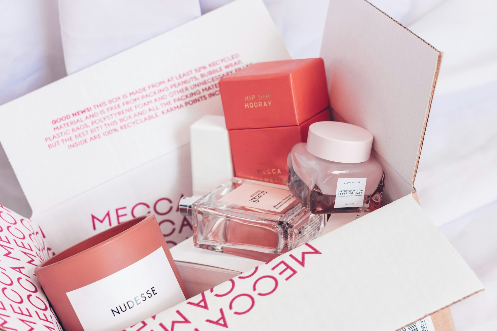

오늘은 화장품과 관련된 기본적인 영어 단어들을 알아볼게요. 각 단어의 발음과 함께 관련 표현, 예문들도 함께 살펴볼 거예요. 이 표현들을 익히고 나면 화장품 관련 영어 대화나 설명을 이해하는 데 큰 도움이 될 거예요. ✨

## 1. 립스틱 (Lipstick)

입술에 색을 입히는 화장품이에요.

### 🗣️ 발음

- 발음기호: /ˈlɪp.stɪk/
- 한국어 발음: 립스틱

### 💭 관련 표현

- matte lipstick: 매트 립스틱
- liquid lipstick: 리퀴드 립스틱
- long-lasting lipstick: 지속력이 좋은 립스틱

### 📝 예문으로 연습하기!

1. "I love wearing bright red lipstick for special occasions."

   "특별한 날에는 선명한 빨간 립스틱을 바르는 걸 좋아해요."

2. "This matte lipstick stays on all day without fading."

   "이 매트 립스틱은 하루 종일 색이 바래지 않아요."

## 2. 마스카라 (Mascara)

속눈썹에 길이와 볼륨을 더해주는 화장품이에요.

### 🗣️ 발음

- 발음기호: /mæˈskær.ə/
- 한국어 발음: 마스카라

### 💭 관련 표현

- waterproof mascara: 방수 마스카라
- volumizing mascara: 볼륨업 마스카라
- lengthening mascara: 길이 증가 마스카라

### 📝 예문으로 연습하기!

1. "I always apply two coats of mascara for a dramatic look."

   "드라마틱한 룩을 위해 마스카라를 두 번 바르는 걸 좋아해요."

2. "This waterproof mascara is [perfect](/blog/in-english/413.perfect/) for hot summer days."

   "이 방수 마스카라는 더운 여름날에 완전 좋아요."

## 3. 파운데이션 (Foundation)

피부 톤을 고르게 해주는 기초 화장품이에요.

### 🗣️ 발음

- 발음기호: /faʊnˈdeɪ.ʃən/
- 한국어 발음: 파운데이션

### 💭 관련 표현

- liquid foundation: 리퀴드 파운데이션
- powder foundation: 파우더 파운데이션
- full coverage foundation: 완전 커버 파운데이션

### 📝 예문으로 연습하기!

1. "I [prefer](/blog/in-english/191.prefer/) using a light foundation for a natural look."

   "자연스러운 룩을 위해 가벼운 파운데이션을 사용하는 걸 좋아해요."

2. "This foundation provides excellent coverage without feeling heavy."

   "이 파운데이션은 무겁지 않으면서도 완벽한 커버력을 제공해요."

## 4. 아이섀도우 (Eyeshadow)

눈꺼풀에 색을 입히는 화장품이에요.

### 🗣️ 발음

- 발음기호: /ˈaɪˌʃæd.oʊ/
- 한국어 발음: 아이섀도우

### 💭 관련 표현

- matte eyeshadow: 매트 아이섀도우
- shimmer eyeshadow: 쉬머 아이섀도우
- eyeshadow palette: 아이섀도우 팔레트

### 📝 예문으로 연습하기!

1. "I love experimenting with different eyeshadow colors for my makeup looks."

   "메이크업을 할 때 다양한 아이섀도우 색상으로 실험하는 걸 좋아해요."

2. "This eyeshadow palette has all the shades I need for a smoky eye."

   "이 아이섀도우 팔레트에는 스모키 아이를 위한 모든 색상이 들어있어요."

## 5. 블러셔 (Blush)

볼에 생기를 더해주는 화장품이에요.

### 🗣️ 발음

- 발음기호: /blʌʃ/
- 한국어 발음: 블러셔

### 💭 관련 표현

- powder blush: 파우더 블러셔
- cream blush: 크림 블러셔
- liquid blush: 리퀴드 블러셔

### 📝 예문으로 연습하기!

1. "A little blush on my cheeks makes me look more awake."

   "볼에 조금의 블러셔를 바르면 더 생기 있어 보여요."

2. "I prefer cream blush for a dewy finish."

   "나는 촉촉한 마무리를 위해 크림 블러셔를 선호해요."

## 6. 향수 (Perfume)

특별한 향기를 주는 액체 화장품이에요.

### 🗣️ 발음

- 발음기호: /pərˈfjuːm/
- 한국어 발음: 퍼퓸

### 💭 관련 표현

- floral perfume: 플로럴 향수
- citrus perfume: 시트러스 향수
- long-lasting perfume: 지속력이 좋은 향수

### 📝 예문으로 연습하기!

1. "I always wear my favorite floral perfume on special occasions."

   "특별한 날에는 내가 가장 좋아하는 플로럴 향수를 항상 뿌려요."

2. "This citrus perfume is refreshing for everyday wear."

   "이 시트러스 향수는 매일 사용하기에 상쾌해요."

## 7. 네일 폴리시 (Nail Polish)

손톱에 색을 입히는 액체 화장품이에요.

### 🗣️ 발음

- 발음기호: /neɪl ˈpɒl.ɪʃ/
- 한국어 발음: 네일 폴리시

### 💭 관련 표현

- gel nail polish: 젤 네일 폴리시
- matte nail polish: 매트 네일 폴리시
- [quick](/blog/in-english/439.quick/)-dry nail polish: 빠르게 마르는 네일 폴리시

### 📝 예문으로 연습하기!

1. "I love painting my nails with bright colors."

   "선명한 색으로 내 손톱을 칠하는 걸 좋아해요."

2. "This quick-dry nail polish saves me so much time."

   "이 빠르게 마르는 네일 폴리시는 내 시간을 많이 절약해줘요."

## 8. 스킨케어 (Skincare)

피부를 관리하는 모든 제품이나 과정을 포함해요.

### 🗣️ 발음

- 발음기호: /ˈskɪn.keər/
- 한국어 발음: 스킨케어

### 💭 관련 표현

- daily skincare routine: 일상적인 스킨케어 루틴
- hydrating skincare: 수분 공급 스킨케어
- anti-aging skincare: 노화 방지 스킨케어

### 📝 예문으로 연습하기!

1. "I follow a strict skincare routine to keep my skin healthy."

   "나는 피부를 건강하게 유지하기 위해 철저한 스킨케어 루틴을 따르고 있어요."

2. "This hydrating skincare product works wonders for dry skin."

   "이 수분 공급 스킨케어 제품은 건조한 피부에 효과가 좋아요."

## 9. 클렌저 (Cleanser)

피부를 깨끗하게 세정하는 제품이에요.

### 🗣️ 발음

- 발음기호: /ˈklɛn.zər/
- 한국어 발음: 클렌저

### 💭 관련 표현

- gel cleanser: 젤 클렌저
- cream cleanser: 크림 클렌저
- foaming cleanser: 폼 클렌저

### 📝 예문으로 연습하기!

1. "I use a gentle cleanser to remove my makeup every night."

   "나는 매일 밤 메이크업을 지우기 위해 부드러운 클렌저를 사용해요."

2. "This foaming cleanser [leaves](/blog/in-english/402.leave/) my skin feeling fresh."

   "이 폼 클렌저는 내 피부를 상쾌하게 만들어줘요."

## 10. 선크림 (Sunscreen)

햇볕으로부터 피부를 보호해주는 제품이에요.

### 🗣️ 발음

- 발음기호: /ˈsʌn.skrin/
- 한국어 발음: 선스크린

### 💭 관련 표현

- [broad](/blog/in-english/443.broad/)-spectrum sunscreen: 광범위 차단 선스크린
- water-resistant sunscreen: 방수 선스크린
- SPF sunscreen: SPF 선스크린

### 📝 예문으로 연습하기!

1. "I never leave the house without applying sunscreen."

   "나는 선크림을 바르지 않고는 집을 나서지 않아요."

2. "This water-resistant sunscreen is perfect for beach days."

   "이 방수 선스크린은 해변에 가기 완전 좋아요."

## 11. 컨실러 (Concealer)

피부의 결점을 가려주는 화장품이에요.

### 🗣️ 발음

- 발음기호: /kənˈsiː.lər/
- 한국어 발음: 컨실러

### 💭 관련 표현

- liquid concealer: 리퀴드 컨실러
- stick concealer: 스틱 컨실러
- full coverage concealer: 완벽한 커버 컨실러

### 📝 예문으로 연습하기!

1. "I use concealer to cover my dark circles under my eyes."

   "나는 눈 밑의 다크서클을 가리기 위해 컨실러를 사용해요."

2. "This full coverage concealer hides all my blemishes."

   "이 완벽한 커버 컨실러는 내 모든 잡티를 가려줘요."

## 12. 팩 (Facial Mask)

피부에 영양을 주거나 수분을 공급하는 제품이에요.

### 🗣️ 발음

- 발음기호: /ˈfeɪ.ʃəl mɑːsk/
- 한국어 발음: 페이셜 마스크

### 💭 관련 표현

- hydrating facial mask: 수분 공급 팩
- clay facial mask: 클레이 팩
- sheet facial mask: 시트 팩

### 📝 예문으로 연습하기!

1. "I love using a hydrating facial mask after a long day."

   "오랜 하루를 보낸 후 수분 공급 팩을 사용하는 걸 좋아해요."

2. "This sheet mask is so refreshing and easy to use."

   "이 시트 마스크는 상쾌하고 사용하기 쉬워요."

## 13. 브로우 펜슬 (Brow Pencil)

눈썹을 그리거나 채우는 데 사용하는 도구예요.

### 🗣️ 발음

- 발음기호: /braʊ ˈpɛn.səl/
- 한국어 발음: 브로우 펜슬

### 💭 관련 표현

- waterproof brow pencil: 방수 브로우 펜슬
- retractable brow pencil: 리트랙터블 브로우 펜슬
- brow gel: 브로우 젤

### 📝 예문으로 연습하기!

1. "A brow pencil helps define my eyebrows perfectly."

   "브로우 펜슬이 내 눈썹을 완벽하게 정의해줘요."

2. "This waterproof brow pencil lasts all day without smudging."

   "이 방수 브로우 펜슬은 하루 종일 번지지 않아요."

## 14. 트리트먼트 (Treatment)

피부나 머리카락의 문제를 해결하기 위한 제품이에요.

### 🗣️ 발음

- 발음기호: /ˈtriːt.mənt/
- 한국어 발음: 트리트먼트

### 💭 관련 표현

- hair treatment: 헤어 트리트먼트
- acne treatment: 여드름 트리트먼트
- [deep](/blog/in-english/428.deep/) conditioning treatment: 깊은 컨디셔닝 트리트먼트

### 📝 예문으로 연습하기!

1. "I use a deep conditioning treatment for my dry hair."

   "나는 내 건조한 머리카락을 위해 깊은 컨디셔닝 트리트먼트를 사용해요."

2. "This acne treatment has really cleared up my skin."

   "이 여드름 트리트먼트 덕분에 내 피부가 정말 좋아졌어요."

## 15. 오일 (Oil)

피부에 수분을 공급하거나 영양을 주는 제품이에요.

### 🗣️ 발음

- 발음기호: /ɔɪl/
- 한국어 발음: 오일

### 💭 관련 표현

- facial oil: 페이셜 오일
- hair oil: 헤어 오일
- [essential](/blog/in-english/446.essential/) oil: 에센셜 오일

### 📝 예문으로 연습하기!

1. "A few drops of facial oil can make my skin glow."

   "페이셜 오일 몇 방울이면 내 피부가 빛나게 해줘요."

2. "I love using hair oil to keep my hair shiny and healthy."

   "내 머리를 윤기 있고 건강하게 유지하기 위해 헤어 오일을 사용하는 걸 좋아해요."

---

이렇게 화장품과 관련된 영어 단어와 예문을 알아봤어요! 이제 화장품에 대해 영어로 말해보는 건 어렵지 않겠죠? 💄😊

오늘 배운 단어와 예문들을 최소 3번 소리내어 말해보세요. 반복해서 소리내어 말하는 것 만큼 영어학습에 도움되는 것은 없어요.

그럼 다음에 더 유용한 단어와 예문들로 찾아올게요~
