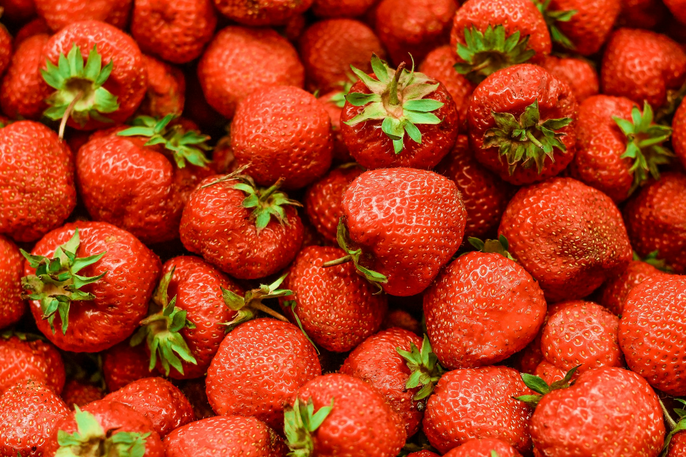

오늘은 다양한 과일에 대한 영어 표현을 알아볼 거예요. 각 과일의 발음과 관련 표현, 예문들도 함께 살펴보면 영어 실력이 쑥쑥 늘어날 거예요! ✨

<!-- engple-horizontal-ad -->

<ins class="adsbygoogle"
     style="display:block"
     data-ad-client="ca-pub-1465612013356152"
     data-ad-slot="2106896038"
     data-ad-format="auto"
     data-full-width-responsive="true"></ins>

## 1. 사과 (Apple)

사과는 가장 인기 있는 과일 중 하나로, 다양한 요리에 사용되기도 해요.

### 🗣️ 발음

- 발음기호: /ˈæp.əl/
- 한국어 발음: 애플

### 💭 관련 표현

- green apple: 그린 사과
- apple pie: 사과 파이
- apple juice: 사과 주스

### 📝 예문으로 연습하기!

1. "I love eating a fresh apple every day."

   "나는 매일 신선한 사과를 먹는 걸 좋아해요."

2. "She made a delicious apple pie for dessert."

   "그녀는 디저트로 맛있는 사과 파이를 만들었어요."

## 2. 바나나 (Banana)

바나나는 간편하게 먹을 수 있는 과일로, 에너지를 주는 간식이에요.

### 🗣️ 발음

- 발음기호: /bəˈnæn.ə/
- 한국어 발음: 바나나

### 💭 관련 표현

- ripe banana: 잘 익은 바나나
- banana smoothie: 바나나 스무디
- banana bread: 바나나 브레드

### 📝 예문으로 연습하기!

1. "I like to add banana slices to my cereal."

   "나는 시리얼에 바나나 조각을 추가하는 걸 좋아해요."

2. "Banana bread is my favorite snack."

   "바나나 브레드는 내가 가장 좋아하는 간식이에요."

## 3. 오렌지 (Orange)

오렌지는 비타민 C가 풍부한 과일로, 주스로 많이 마셔요.

### 🗣️ 발음

- 발음기호: /ˈɔːr.ɪndʒ/
- 한국어 발음: 오렌지

### 💭 관련 표현

- orange juice: 오렌지 주스
- blood orange: 블러드 오렌지
- orange peel: 오렌지 껍질

### 📝 예문으로 연습하기!

1. "I drink orange juice every morning for breakfast."

   "나는 아침마다 오렌지 주스를 마셔요."

2. "She loves the sweet taste of fresh oranges."

   "그녀는 신선한 오렌지의 달콤한 맛을 좋아해요."

## 4. 포도 (Grape)

포도는 간편하게 먹을 수 있는 작은 과일로, 다양한 종류가 있어요.

### 🗣️ 발음

- 발음기호: /ɡreɪp/
- 한국어 발음: 그레이프

### 💭 관련 표현

- grape juice: 포도 주스
- seedless grapes: 씨 없는 포도
- dried grapes: 건포도

### 📝 예문으로 연습하기!

1. "I love snacking on grapes while watching movies."

   "나는 영화를 보면서 포도를 간식으로 먹는 걸 좋아해요."

2. "Grapes are a great source of antioxidants."

   "포도는 항산화제가 풍부한 과일이에요."

## 5. 딸기 (Strawberry)

딸기는 달콤하고 상큼한 맛으로 많은 사람들이 좋아하는 과일이에요.

### 🗣️ 발음

- 발음기호: /ˈstrɔːˌbɛr.i/
- 한국어 발음: 스트로베리

### 💭 관련 표현

- fresh strawberries: 신선한 딸기
- strawberry jam: 딸기 잼
- chocolate-covered strawberries: 초콜릿 딸기

### 📝 예문으로 연습하기!

1. "I enjoy making smoothies with fresh strawberries."

   "나는 신선한 딸기로 스무디를 만드는 걸 좋아해요."

2. "Chocolate-covered strawberries are my favorite dessert."

   "초콜릿 딸기는 내가 가장 좋아하는 디저트예요."

## 6. 수박 (Watermelon)

수박은 여름에 가장 인기 있는 과일로, 시원하고 수분이 많아요.

### 🗣️ 발음

- 발음기호: /ˈwɔː.təˌmɛl.ən/
- 한국어 발음: 워터멜론

### 💭 관련 표현

- sliced watermelon: 썰어진 수박
- watermelon juice: 수박 주스
- seedless watermelon: 씨 없는 수박

### 📝 예문으로 연습하기!

1. "Watermelon is perfect for hot summer days."

   "수박은 더운 여름 날에 완벽해요."

2. "I like to eat sliced watermelon at picnics."

   "나는 소풍에서 썰어진 수박을 먹는 걸 좋아해요."

## 7. 키위 (Kiwi)

키위는 독특한 맛과 식감으로 많은 사람들에게 사랑받는 과일이에요.

### 🗣️ 발음

- 발음기호: /ˈkiː.wi/
- 한국어 발음: 키위

### 💭 관련 표현

- green kiwi: 그린 키위
- kiwi fruit salad: 키위 과일 샐러드
- dried kiwi: 건조 키위

### 📝 예문으로 연습하기!

1. "I like to add kiwi to my fruit salad."

   "나는 과일 샐러드에 키위를 추가하는 걸 좋아해요."

2. "The kiwi's green flesh is very refreshing."

   "키위의 초록색 과육은 정말 상쾌해요."

<!-- engple-horizontal-ad -->

<ins class="adsbygoogle"
     style="display:block"
     data-ad-client="ca-pub-1465612013356152"
     data-ad-slot="2106896038"
     data-ad-format="auto"
     data-full-width-responsive="true"></ins>

## 8. 복숭아 (Peach)

복숭아는 달콤하고 부드러운 과육으로 여름 과일로 인기가 많아요.

### 🗣️ 발음

- 발음기호: /piːtʃ/
- 한국어 발음: 피치

### 💭 관련 표현

- ripe peach: 잘 익은 복숭아
- peach pie: 복숭아 파이
- peach jam: 복숭아 잼

### 📝 예문으로 연습하기!

1. "I love the sweetness of a ripe peach in summer."

   "나는 여름에 잘 익은 복숭아의 달콤함을 좋아해요."

2. "She baked a delicious peach pie for dessert."

   "그녀는 디저트로 맛있는 복숭아 파이를 구웠어요."

## 9. 망고 (Mango)

망고는 열대 과일로, 달콤하고 즙이 많아 많은 사랑을 받아요.

### 🗣️ 발음

- 발음기호: /ˈmæŋ.ɡoʊ/
- 한국어 발음: 망고

### 💭 관련 표현

- ripe mango: 잘 익은 망고
- mango smoothie: 망고 스무디
- dried mango: 건조 망고

### 📝 예문으로 연습하기!

1. "Mangoes are my favorite fruit during summer."

   "망고는 여름에 내가 가장 좋아하는 과일이에요."

2. "I like to make a mango smoothie for breakfast."

   "나는 아침에 망고 스무디를 만드는 걸 좋아해요."

## 10. 파인애플 (Pineapple)

파인애플은 독특한 맛과 향기로 많은 과일 요리에 사용돼요.

### 🗣️ 발음

- 발음기호: /ˈpaɪ.næp.əl/
- 한국어 발음: 파인애플

### 💭 관련 표현

- fresh pineapple: 신선한 파인애플
- pineapple juice: 파인애플 주스
- grilled pineapple: 구운 파인애플

### 📝 예문으로 연습하기!

1. "I love adding grilled pineapple to my burgers."

   "나는 내 버거에 구운 파인애플을 추가하는 걸 좋아해요."

2. "Fresh pineapple juice is so refreshing."

   "신선한 파인애플 주스는 정말 상쾌해요."

## 11. 체리 (Cherry)

체리는 작고 달콤한 과일로, 여름철에 많이 수확돼요.

### 🗣️ 발음

- 발음기호: /ˈtʃer.i/
- 한국어 발음: 체리

### 💭 관련 표현

- fresh cherries: 신선한 체리
- cherry pie: 체리 파이
- cherry blossom: 벚꽃

### 📝 예문으로 연습하기!

1. "I love eating fresh cherries in the summer."

   "나는 여름에 신선한 체리를 먹는 걸 좋아해요."

2. "Cherry pie is a classic dessert for special occasions."

   "체리 파이는 특별한 날에 꼭 먹는 클래식 디저트예요."

## 12. 자두 (Plum)

자두는 달콤하고 즙이 많은 과일로, 다양한 색상이 있어요.

### 🗣️ 발음

- 발음기호: /plʌm/
- 한국어 발음: 플럼

### 💭 관련 표현

- ripe plum: 잘 익은 자두
- dried plum: 건조 자두
- plum jam: 자두 잼

### 📝 예문으로 연습하기!

1. "I enjoy snacking on ripe plums during the summer."

   "나는 여름에 잘 익은 자두를 간식으로 먹는 걸 좋아해요."

2. "Dried plums are often used in baking."

   "건조 자두는 종종 베이킹에 사용돼요."

## 13. 석류 (Pomegranate)

석류는 독특한 맛과 모양으로, 건강에 좋은 과일로 알려져 있어요.

### 🗣️ 발음

- 발음기호: /ˈpɒm.ɪ.ɡræn.ɪt/
- 한국어 발음: 포메그라네이트

### 💭 관련 표현

- pomegranate juice: 석류 주스
- fresh pomegranate: 신선한 석류
- pomegranate seeds: 석류 씨

### 📝 예문으로 연습하기!

1. "Pomegranate juice is rich in antioxidants."

   "석류 주스는 항산화제가 풍부해요."

2. "I love adding pomegranate seeds to my salads."

   "나는 샐러드에 석류 씨를 추가하는 걸 좋아해요."

## 14. 코코넛 (Coconut)

코코넛은 열대 과일로, 다양한 요리와 음료에 사용돼요.

### 🗣️ 발음

- 발음기호: /ˈkoʊ.kə.nʌt/
- 한국어 발음: 코코넛

### 💭 관련 표현

- coconut water: 코코넛 워터
- shredded coconut: 갈은 코코넛
- coconut milk: 코코넛 밀크

### 📝 예문으로 연습하기!

1. "I enjoy drinking coconut water after a workout."

   "나는 운동 후에 코코넛 워터를 마시는 걸 좋아해요."

2. "Shredded coconut is a great topping for desserts."

   "갈은 코코넛은 디저트의 훌륭한 토핑이에요."

## 15. 감 (Persimmon)

감은 달콤하고 부드러운 과일로, 가을에 많이 수확돼요.

### 🗣️ 발음

- 발음기호: /pərˈsɪm.ən/
- 한국어 발음: 퍼시먼

### 💭 관련 표현

- ripe persimmon: 잘 익은 감
- dried persimmon: 건조 감
- persimmon pudding: 감 푸딩

### 📝 예문으로 연습하기!

1. "I love eating ripe persimmons in the fall."

   "나는 가을에 잘 익은 감을 먹는 걸 좋아해요."

2. "Dried persimmons make a great snack."

   "건조 감은 훌륭한 간식이에요."

---

이렇게 과일과 관련된 영어 단어와 예문을 알아봤어요! 이제 과일에 대해 영어로 말해보는 건 어렵지 않겠죠? 🍉🍓😊

오늘 배운 단어와 예문들을 최소 3번 소리내어 말해보세요. 반복해서 소리내어 말하는 것 만큼 영어학습에 도움되는 것은 없어요.

그럼 다음에 더 유용한 단어와 예문들로 찾아올게요~ 👋
