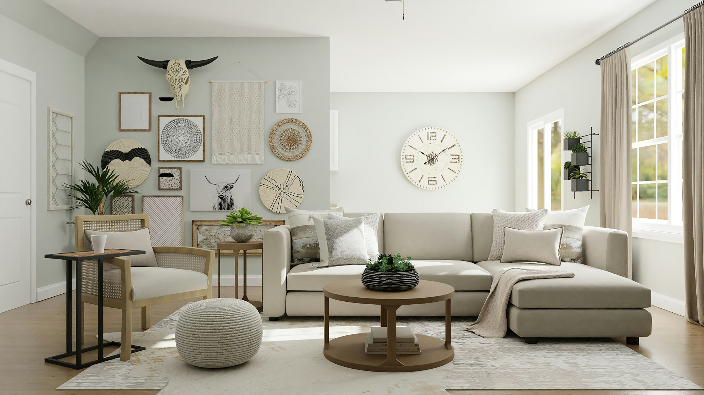

주방에서 사용하는 가구와 관련된 영어 단어를 알아볼까요? 🍽️ 오늘은 테이블(table), 의자(chair), 소파(sofa) 등 기본적인 가구들의 영어 표현을 배워보려고 해요. 각 단어의 발음과 관련 표현, 예문도 함께 살펴보면 대화에 큰 도움이 될 거예요! ✨

## 1. 테이블 (Table)

음식이나 물건을 올려놓고 사용하는 평평한 가구예요.

### 🗣️ 발음

- 발음기호: /ˈteɪ.bəl/
- 한국어 발음: 테이블

### 💭 관련 표현

- dining table: 식탁
- coffee table: 커피 테이블
- study table: 공부 테이블

### 📝 예문으로 연습하기!

1. "We set the table for dinner every evening."

   "매일 저녁에 저녁식사를 위해 테이블을 차려요."

2. "This table is [perfect](/blog/in-english/413.perfect/) for my small apartment."

   "이 테이블은 내 작은 아파트에 딱이에요."

## 2. 의자 (Chair)

앉는 데 사용하는 가구로, 다양한 디자인과 기능이 있어요.

### 🗣️ 발음

- 발음기호: /tʃeə/
- 한국어 발음: 체어

### 💭 관련 표현

- office chair: 사무용 의자
- rocking chair: 흔들의자
- dining chair: 식탁 의자

### 📝 예문으로 연습하기!

1. "I bought a new office chair for my workspace."

   "내 작업 공간을 위해 새 사무용 의자를 샀어요."

2. "This chair is so comfortable for [reading](/blog/in-english/436.read/)."

   "이 의자는 책 읽기에 너무 편해요."

## 3. 소파 (Sofa)

편안하게 앉거나 누울 수 있는 큰 가구예요.

### 🗣️ 발음

- 발음기호: /ˈsəʊ.fə/
- 한국어 발음: 소파

### 💭 관련 표현

- sectional sofa: 분할형 소파
- leather sofa: 가죽 소파
- sleeper sofa: 침대 소파

### 📝 예문으로 연습하기!

1. "I love relaxing on the sofa after a long day."

   "긴 하루가 끝난 후 소파에서 쉬는 걸 정말 좋아해요."

2. "We need a bigger sofa for our living room."

   "우리 거실에 더 큰 소파가 필요해요."

## 4. 책장 (Bookshelf)

책이나 물건을 정리해 두는 데 사용하는 가구예요.

### 🗣️ 발음

- 발음기호: /ˈbʊk.ʃelf/
- 한국어 발음: 북셀프

### 💭 관련 표현

- wall bookshelf: 벽장 책장
- corner bookshelf: 코너 책장
- adjustable bookshelf: 조절 가능한 책장

### 📝 예문으로 연습하기!

1. "I [organized](/blog/in-english/355.organize/) all my novels on the bookshelf."

   "내 소설들을 책장에서 정리했어요."

2. "This bookshelf has enough space for all my books."

   "이 책장은 내 모든 책을 담기에 충분한 공간이 있어요."

## 5. 장식장 (Cabinet)

음식, 장식품 등을 보관하는 데 사용하는 가구예요.

### 🗣️ 발음

- 발음기호: /ˈkæb.ɪ.nət/
- 한국어 발음: 캐비닛

### 💭 관련 표현

- kitchen cabinet: 주방 캐비닛
- display cabinet: 전시 캐비닛
- medicine cabinet: 약장

### 📝 예문으로 연습하기!

1. "I store my dishes in the kitchen cabinet."

   "주방 캐비닛에 내 접시를 보관해요."

2. "The display cabinet showcases my collectibles."

   "전시 캐비닛은 내 수집품을 보여줘요."

## 6. 서랍 (Drawer)

작은 물건을 보관하는 데 사용하는 가구의 일부분이에요.

### 🗣️ 발음

- 발음기호: /drɔː.ər/
- 한국어 발음: 드로어

### 💭 관련 표현

- desk drawer: 책상 서랍
- kitchen drawer: 주방 서랍
- bedside drawer: 침대 옆 서랍

### 📝 예문으로 연습하기!

1. "I keep my stationery in the desk drawer."

   "필기구는 책상 서랍에 보관해요."

2. "Make sure to close the kitchen drawer [properly](/blog/in-english/422.properly/)."

   "주방 서랍을 제대로 닫는 거 잊지 마세요."

## 7. 침대 (Bed)

잠을 자는 데 사용하는 가구로, 다양한 크기와 스타일이 있어요.

### 🗣️ 발음

- 발음기호: /bɛd/
- 한국어 발음: 베드

### 💭 관련 표현

- king-size bed: 킹사이즈 침대
- bunk bed: 이층 침대
- water bed: 수조 침대

### 📝 예문으로 연습하기!

1. "I love my new king-size bed for extra comfort."

   "내 새로운 킹사이즈 침대가 너무 편해요."

2. "The kids sleep in the bunk bed."

   "아이들은 이층 침대에서 자요."

## 8. 테이블보 (Tablecloth)

테이블 위에 덮어 사용하는 직물로, 장식과 보호의 역할을 해요.

### 🗣️ 발음

- 발음기호: /ˈteɪ.bəl.klɒθ/
- 한국어 발음: 테이블클로스

### 💭 관련 표현

- cotton tablecloth: 면 테이블보
- waterproof tablecloth: 방수 테이블보
- decorative tablecloth: 장식용 테이블보

### 📝 예문으로 연습하기!

1. "I bought a new decorative tablecloth for the dining table."

   "식탁을 위해 새 장식용 테이블보를 샀어요."

2. "Make sure to clean the tablecloth after dinner."

   "저녁식사 후 테이블보를 꼭 청소해 주세요."

## 9. 러그 (Rug)

바닥에 깔아서 공간을 따뜻하고 아늑하게 만드는 직물이에요.

### 🗣️ 발음

- 발음기호: /rʌɡ/
- 한국어 발음: 러그

### 💭 관련 표현

- area rug: 지역 러그
- shag rug: 숱이 많은 러그
- outdoor rug: 야외 러그

### 📝 예문으로 연습하기!

1. "The area rug adds a [cozy](/blog/in-english/408.cozy/) feel to the living room."

   "지역 러그가 거실에 아늑한 느낌을 더해줘요."

2. "Make sure to vacuum the rug regularly."

   "러그는 정기적으로 청소해 주세요."

## 10. 수납장 (Storage)

물건을 정리하고 보관하는 데 사용하는 가구예요.

### 🗣️ 발음

- 발음기호: /ˈstɔː.rɪdʒ/
- 한국어 발음: 스토리지

### 💭 관련 표현

- storage cabinet: 수납 캐비닛
- storage box: 수납 상자
- under-bed storage: 침대 아래 수납

### 📝 예문으로 연습하기!

1. "I use a storage box to keep my seasonal clothes."

   "계절 옷을 보관하기 위해 수납 상자를 사용해요."

2. "The under-bed storage is perfect for shoes."

   "침대 아래 수납은 신발 보관에 완전 좋아요."

## 11. 의자커버 (Chair Cover)

의자를 보호하고 장식하는 데 사용하는 커버예요.

### 🗣️ 발음

- 발음기호: /tʃeə kʌvər/
- 한국어 발음: 체어커버

### 💭 관련 표현

- elastic chair cover: 신축성 있는 의자커버
- decorative chair cover: 장식용 의자커버
- fitted chair cover: 맞춤형 의자커버

### 📝 예문으로 연습하기!

1. "I put a decorative chair cover on the kitchen chairs."

   "주방 의자에 장식용 의자커버를 올렸어요."

2. "The elastic chair cover fits perfectly."

   "신축성 있는 의자커버가 완벽하게 맞아요."

## 12. 옷장 (Wardrobe)

옷과 액세서리를 보관하는 데 사용하는 큰 가구예요.

### 🗣️ 발음

- 발음기호: /ˈwɔː.droʊb/
- 한국어 발음: 워드로브

### 💭 관련 표현

- built-in wardrobe: 붙박이 옷장
- freestanding wardrobe: 독립형 옷장
- sliding wardrobe: 슬라이딩 옷장

### 📝 예문으로 연습하기!

1. "I organized my clothes in the wardrobe."

   "옷을 옷장에 정리했어요."

2. "This built-in wardrobe saves a lot of space."

   "이 붙박이 옷장은 공간을 많이 절약해줘요."

## 13. 화장대 (Vanity)

화장과 관련된 물건을 보관하고 사용할 수 있는 가구예요.

### 🗣️ 발음

- 발음기호: /ˈvæn.ɪ.ti/
- 한국어 발음: 뱀어티

### 💭 관련 표현

- makeup vanity: 화장용 화장대
- vanity mirror: 화장대 거울
- double vanity: 이중 화장대

### 📝 예문으로 연습하기!

1. "I love my new makeup vanity with a big mirror."

   "큰 거울이 달린 새 화장대가 너무 좋아요."

2. "The double vanity is perfect for sharing."

   "이중 화장대는 공유하기에 완전 좋아요."

## 14. 빈백 (Bean Bag)

편하게 앉거나 누울 수 있도록 부드러운 재질로 만들어진 가구예요.

### 🗣️ 발음

- 발음기호: /biːn bæɡ/
- 한국어 발음: 빈백

### 💭 관련 표현

- outdoor bean bag: 야외 빈백
- giant bean bag: 대형 빈백
- colorful bean bag: 다채로운 빈백

### 📝 예문으로 연습하기!

1. "I love lounging on my giant bean bag while watching movies."

   "영화 볼 때 대형 빈백에 누워 있는 게 너무 좋아요."

2. "The colorful bean bags brighten up the room."

   "다채로운 빈백이 방을 밝게 해줘요."

## 15. 식탁 (Dining Table)

식사를 함께 하는 데 사용하는 테이블이에요.

### 🗣️ 발음

- 발음기호: /ˈdaɪ.nɪŋ ˈteɪ.bəl/
- 한국어 발음: 다이닝 테이블

### 💭 관련 표현

- extendable dining table: 확장 가능한 식탁
- round dining table: 둥근 식탁
- wooden dining table: 나무 식탁

### 📝 예문으로 연습하기!

1. "We gather around the dining table for family meals."

   "가족 식사를 위해 다이닝 테이블에 모여요."

2. "This extendable dining table is great for parties."

   "이 확장 가능한 식탁은 파티에 딱이에요."

---

이렇게 가구와 관련된 영어 단어와 예문을 알아봤어요! 이제 가구에 대해 영어로 말하는 건 어렵지 않겠죠? 🛋️😊

오늘 배운 단어와 예문들을 최소 3번 소리내어 말해보세요. 반복해서 소리내어 말하는 것 만큼 영어학습에 도움되는 것은 없어요.

그럼 다음에 더 유용한 단어와 예문들로 찾아올게요~
