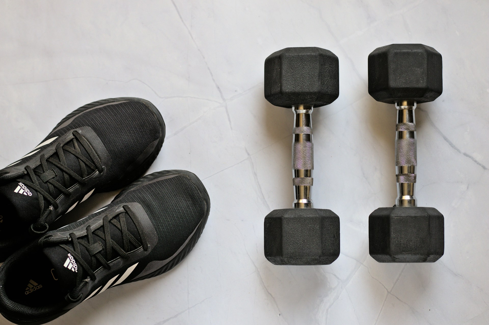

운동을 할 때 자주 사용되는 도구와 표현들은 무엇일까요? 💪 오늘은 덤벨(dumbbell), 벤치 프레스(bench press), 러닝머신(treadmill), 스쿼트(squat), 줄넘기(jump rope)와 같은 운동 관련 영어 표현을 알아볼게요. 운동을 좋아하는 분들에게 유용한 단어들이니 잘 따라와 주세요! ✨

<!-- engple-horizontal-ad -->

<ins class="adsbygoogle"
     style="display:block"
     data-ad-client="ca-pub-1465612013356152"
     data-ad-slot="2106896038"
     data-ad-format="auto"
     data-full-width-responsive="true"></ins>

## 1. 덤벨 (Dumbbell)

운동을 할 때 주로 사용하는 작은 운동 도구로, 근육을 강화하는 데 도움을 줘요.

### 🗣️ 발음

발음기호: /ˈdʌm.bel/

### 💭 관련 표현

- adjustable dumbbell: 조절 가능한 덤벨
- lightweight dumbbell: 가벼운 덤벨
- heavy dumbbell: 무거운 덤벨

### 📝 예문으로 연습하기!

1. "I lift dumbbells to strengthen my arms."

   "팔을 강화하기 위해 덤벨을 들어요."

2. "You can start with lightweight dumbbells to build your strength."

   "힘을 기르기 위해 가벼운 덤벨로 시작할 수 있어요."

## 2. 벤치 프레스 (Bench Press)

가슴 근육을 강화하기 위한 대표적인 운동이자 기구예요.

### 🗣️ 발음

발음기호: /bɛnʧ prɛs/

### 💭 관련 표현

- flat bench press: 평평한 벤치 프레스
- incline bench press: 경사 벤치 프레스
- barbell bench press: 바벨 벤치 프레스

### 📝 예문으로 연습하기!

1. "I usually do bench presses at the gym."

   "저는 보통 체육관에서 벤치 프레스를 해요."

2. "The incline bench press targets the upper chest."

   "경사 벤치 프레스는 윗가슴을 목표로 해요."

## 3. 러닝머신 (Treadmill)

실내에서 달리거나 걸을 수 있는 기계예요.

### 🗣️ 발음

발음기호: /ˈtrɛd.mɪl/

### 💭 관련 표현

- electric treadmill: 전기 러닝머신
- manual treadmill: 수동 러닝머신
- incline treadmill: 경사 러닝머신

### 📝 예문으로 연습하기!

1. "I run on the treadmill for 30 minutes every day."

   "저는 매일 30분 동안 트레드밀에서 뛰어요."

2. "The treadmill has various speed settings."

   "트레드밀은 다양한 속도 설정이 있어요."

## 4. 스쿼트 (Squat)

하체 근육을 강화하는 데 효과적인 운동이에요.

### 🗣️ 발음

발음기호: /skwɑːt/

### 💭 관련 표현

- bodyweight squat: 자기 체중 스쿼트
- weighted squat: 중량 스쿼트
- squat variation: 스쿼트 변형

### 📝 예문으로 연습하기!

1. "Squats are great for building leg strength."

   "스쿼트는 다리 힘을 기르기에 좋아요."

2. "I do 3 sets of 10 squats every workout."

   "저는 매 운동마다 10회의 스쿼트를 3세트 해요."

## 5. 줄넘기 (Jump Rope)

유산소 운동으로 많이 사용되는 도구예요.

### 🗣️ 발음

발음기호: /dʒʌmp roʊp/

### 💭 관련 표현

- speed jump rope: 스피드 줄넘기
- weighted jump rope: 중량 줄넘기
- portable jump rope: 휴대용 줄넘기

### 📝 예문으로 연습하기!

1. "Jump rope is a fun way to get cardio exercise."

   "줄넘기는 유산소 운동을 즐겁게 할 수 있는 방법이에요."

2. "I like to use a weighted jump rope for added resistance."

   "저는 저항을 더하기 위해 중량 줄넘기를 사용하는 걸 좋아해요."

---

이렇게 다양한 운동과 관련된 영어 단어와 예문을 알아봤어요! 이제 운동에 대해 영어로 이야기하는 건 어렵지 않겠죠? 💪🏋️‍♀️ 오늘 배운 단어와 예문들을 최소 3번 소리내어 말해보세요. 반복해서 소리내어 말하는 것 만큼 영어학습에 도움되는 것은 없어요.

그럼 다음에 더 유용한 단어와 예문들로 찾아올게요~
