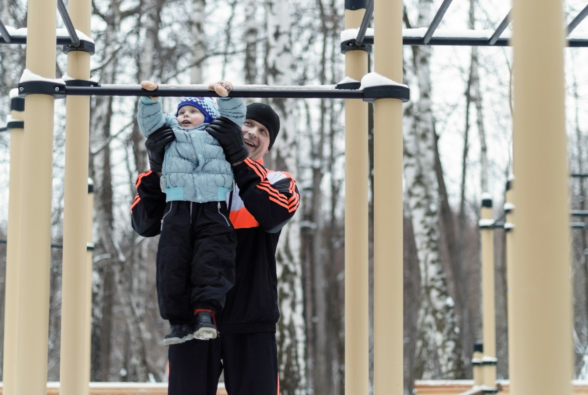

운동기구를 영어로 알아보기 2편입니다! 🏋️‍♂️ 오늘은 폼 롤러 (Foam Roller), 케틀벨(kettlebell), 풀업 바(pull-up bar), 운동 볼(exercise ball), 저항 밴드(resistance band) 등 다양한 운동 용어를 함께 배워볼게요! 운동을 하며 활용할 수 있는 표현들이니 잘 기억해 주세요. ✨

<!-- engple-horizontal-ad -->

<ins class="adsbygoogle"
     style="display:block"
     data-ad-client="ca-pub-1465612013356152"
     data-ad-slot="2106896038"
     data-ad-format="auto"
     data-full-width-responsive="true"></ins>

## 1. 폼 롤러 (Foam Roller)

근육을 이완하고 마사지하는 데 사용하는 도구예요.

### 🗣️ 발음

발음기호: /foʊm ˈroʊ.lər/

### 💭 관련 표현

- high-density foam roller: 고밀도 폼 롤러
- travel foam roller: 여행용 폼 롤러
- vibrating foam roller: 진동 폼 롤러

### 📝 예문으로 연습하기!

1. "I use a foam roller to relieve muscle soreness."

   "저는 근육 통증을 완화하기 위해 폼 롤러를 사용해요."

2. "The foam roller is great for post-workout recovery."

   "폼 롤러는 운동 후 회복에 훌륭해요."

## 2. 케틀벨 (Kettlebell)

근력 운동을 위한 독특한 형태의 덤벨이에요.

### 🗣️ 발음

발음기호: /ˈkɛt.əl.bɛl/

### 💭 관련 표현

- cast iron kettlebell: 주철 케틀벨
- adjustable kettlebell: 조절 가능한 케틀벨
- competition kettlebell: 대회용 케틀벨

### 📝 예문으로 연습하기!

1. "Kettlebells are great for strength training."

   "케틀벨은 근력 훈련에 좋아요."

2. "I [prefer](/blog/in-english/191.prefer/) using a heavier kettlebell for my workouts."

   "저는 운동할 때 더 무거운 케틀벨을 사용하는 걸 선호해요."

## 3. 철봉 / 풀업 바 (Pull-up Bar)

풀업 운동을 할 때 사용하는 기구예요.

### 🗣️ 발음

발음기호: /pʊl ʌp bɑːr/

### 💭 관련 표현

- doorway pull-up bar: 문틀형 청볼
- ceiling-mounted pull-up bar: 천장 고정형 철봉
- adjustable pull-up bar: 조절 가능한 풀업 바

### 📝 예문으로 연습하기!

1. "I installed a pull-up bar in my home gym."

   "저는 집에 철봉을 설치했어요."

2. "Pull-up bars are excellent for upper body strength."

   "풀업 바는 상체 근력을 기르기에 훌륭해요."

## 4. 밸런스볼 / 짐볼 (Exercise Ball)

균형과 근력 훈련에 사용되는 큰 공이에요.

### 🗣️ 발음

발음기호: /ˈɛk.sɚ.saɪz bɔːl/

### 💭 관련 표현

- stability exercise ball: 안정성 짐볼
- inflatable exercise ball: 공기 주입식 짐볼
- exercise ball chair: 짐볼 의자

### 📝 예문으로 연습하기!

1. "I use an exercise ball for my core workouts."

   "저는 코어 운동을 위해 짐볼을 사용해요."

2. "The exercise ball helps improve my balance."

   "밴ㄹ런스 볼은 제 균형을 향상시키는 데 도움을 줘요."

## 5. 스트레칭 밴드 (Resistance Band)

근력 운동과 스트레칭을 도와주는 밴드예요.

### 🗣️ 발음

발음기호: /rɪˈzɪstəns bænd/

### 💭 관련 표현

- heavy resistance band: 무거운 스트레칭 밴드
- light resistance band: 가벼운 스트레칭 밴드
- loop resistance band: 루프 스트레칭 밴드

### 📝 예문으로 연습하기!

1. "I use a resistance band for my leg workouts."

   "저는 다리 운동을 위해 스트레칭 밴드를 사용해요."

2. "Resistance bands are great for <a href="/blog/topic/014/#2-%EC%8A%A4%ED%8A%B8%EB%A0%88%EC%B9%AD-stretch">stretching</a> and strength training."

   "스트레칭 밴드는 스트레칭과 근력 훈련에 좋아요."

---

이렇게 운동 기구 영어 표현 2편도 마무리했어요! 1편에서 배운 덤벨, 벤치프레스, 러닝머신에 이어 오늘은 풀업 바, 밸런스볼, 스트레칭 밴드까지 알아봤네요. 🏋️‍♀️ 오늘도 배운 단어와 예문들을 최소 3번 소리내어 말해보세요. 반복 학습이 영어 실력 향상의 지름길이에요!

다음에는 또 다른 유용한 운동 관련 영어 표현들로 찾아올게요~ 그때까지 오늘 배운 표현들 열심히 연습해보세요!
