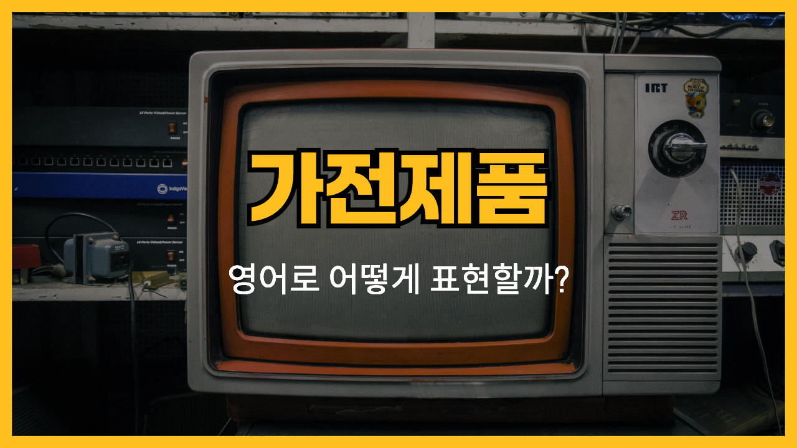

집에서 매일 사용하는 가전제품들! 📺 영어로는 어떻게 표현할까요? 오늘은 에어컨(Air Conditioner), 세탁기(Washing Machine), 냉장고(Refrigerator) 등 우리 생활에 꼭 필요한 가전제품들의 영어 표현을 알아볼게요.각 제품의 발음과 함께 관련 표현, 예문들도 함께 살펴볼 거예요.

이 표현들을 익히고 나면 가전제품 관련 영어 대화나 설명서를 이해하는 데 큰 도움이 될 거예요.

## 1. 에어컨 (Air Conditioner)

실내 온도를 시원하게 유지해주는 필수 가전제품이에요.

### 🗣️ 발음

발음기호: /ˌer kənˈdɪʃənər/

### 💭 관련 표현

- remote control: 리모컨
- air conditioning: 냉방
- energy-efficient: 에너지 효율적인

### 📝 예문으로 연습하기!

1. "Can you [turn on](/blog/in-english/310.turn-on/) the air conditioner? It's so hot in here."

   "에어컨 좀 켜줄래요? 여기 너무 더워요."

2. "We should buy an energy-[efficient](/blog/in-english/286.efficient/) air conditioner to save electricity."

   "전기를 절약하기 위해 에너지 효율적인 에어컨을 사야 해요."

## 2. 세탁기 (Washing Machine)

옷을 깨끗하게 세탁해주는 편리한 가전제품이에요.

### 🗣️ 발음

발음기호: /ˈwɑːʃɪŋ məˈʃiːn/

### 💭 관련 표현

- laundry detergent: 세탁 세제
- spin cycle: 탈수 코스
- front-loading: 드럼 세탁기

### 📝 예문으로 연습하기!

1. "I need to [do the laundry](/blog/in-english/162.do-the-laundry/). The washing machine is full."

   "빨래해야겠어요. 세탁기가 꽉 찼어요."

2. "This washing machine has a quick wash cycle."

   "이 세탁기에는 빠른 세탁 코스가 있어요."

## 3. 냉장고 (Refrigerator)

음식을 신선하게 보관해주는 없어서는 안 될 가전제품이에요.

### 🗣️ 발음

발음기호: /rɪˈfrɪdʒəreɪtər/

### 💭 관련 표현

- freezer: 냉동실
- shelf: 선반
- temperature control: 온도 조절

### 📝 예문으로 연습하기!

1. "The refrigerator is almost [empty](/blog/in-english/404.empty/). We need to go grocery shopping."

   "냉장고가 거의 비었어요. 장 보러 가야 해요."

2. "Don't [forget](/blog/in-english/023.forget/) to put the leftovers in the refrigerator."

   "남은 음식 냉장고에 넣는 거 잊지 마세요."

## 4. 텔레비전 (Television)

다양한 프로그램을 시청할 수 있는 엔터테인먼트 기기예요.

### 🗣️ 발음

발음기호: /ˈtelɪvɪʒən/

### 💭 관련 표현

- remote control: 리모컨
- channel: 채널
- volume: 음량

### 📝 예문으로 연습하기!

1. "What's on television tonight?"

   "오늘 밤에 텔레비전에서 뭐 해요?"

2. "The television is too [loud](/blog/in-english/311.loud/). Can you turn it down?"

   "텔레비전 소리가 너무 커요. 좀 줄여줄래요?"

## 5. 진공 청소기 (Vacuum Cleaner)

바닥을 깨끗하게 청소해주는 편리한 가전제품이에요.

### 🗣️ 발음

발음기호: /ˈvækjuːm ˈkliːnər/

### 💭 관련 표현

- dust bag: 먼지 봉투
- nozzle: 흡입구
- power cord: 전원 코드

### 📝 예문으로 연습하기!

1. "I need to vacuum the living room. It's very dusty."

   "거실 청소기로 밀어야겠어요. 먼지가 너무 많아요."

2. "This vacuum cleaner has strong suction power."

   "이 진공 청소기는 흡입력이 강해요."

---

이렇게 가전제품과 관련된 영어 단어와 예문을 알아봤어요! 이제 가전제품에 대해 영어로 말하는 것이 더 편해졌을 거예요. 🏡

오늘 배운 단어와 예문들을 최소 3번 소리내어 말해보세요. 반복해서 소리내어 말하는 것 만큼 영어학습에 도움되는 것은 없어요!

그럼 다음에 더 유용한 단어와 예문들로 찾아올게요~
