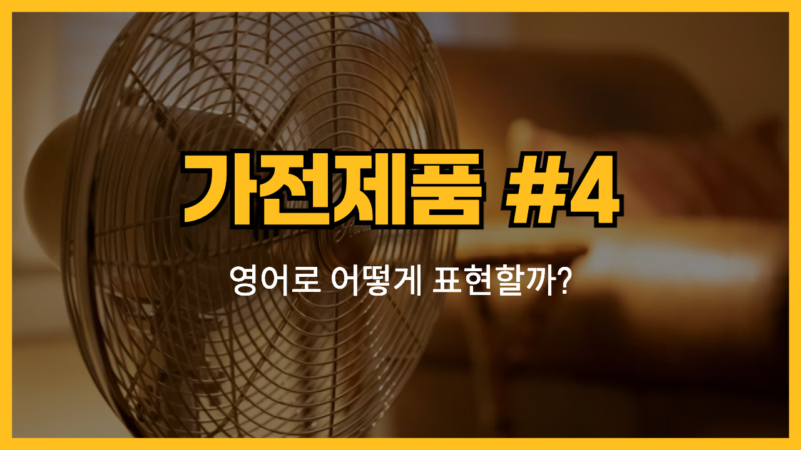

네번째 가전제품 시리즈를 살펴봅시다! 오늘은 오븐(oven), 히터(heater), 선풍기(fan), 스팀 청소기(steam cleaner), 가습기(humidifier)와 같은 가전제품들의 영어 표현과 예문을 살펴볼게요. 각 기기의 발음과 예문을 통해 영어 사용에 익숙해지는 기회를 가져보세요!

<!-- engple-horizontal-ad -->

<ins class="adsbygoogle"
     style="display:block"
     data-ad-client="ca-pub-1465612013356152"
     data-ad-slot="2106896038"
     data-ad-format="auto"
     data-full-width-responsive="true"></ins>

## 1. 오븐 (Oven)

음식을 구워내는 데 사용하는 가전제품이에요.

### 🗣️ 발음

발음기호: /ˈʌv.ən/

### 💭 관련 표현

- electric oven: 전기 오븐
- convection oven: 컨벡션 오븐
- built-in oven: 내장형 오븐

### 📝 예문으로 연습하기!

1. "I baked a cake in the oven yesterday."

   "어제 오븐에서 케이크를 구웠어요."

2. "The oven [takes about 10 minutes](/blog/in-english/010.take-a-while/) to preheat."

   "오븐은 예열하는 데 약 10분이 걸려요."

## 2. 히터 (Heater)

공기를 따뜻하게 만드는 데 사용하는 기계예요.

### 🗣️ 발음

발음기호: /ˈhiː.tər/

### 💭 관련 표현

- electric heater: 전기 히터
- portable heater: 이동식 히터
- gas heater: 가스 히터

### 📝 예문으로 연습하기!

1. "I [turned on](/blog/in-english/310.turn-on/) the heater because it was very cold."

   "너무 추워서 히터를 켰어요."

2. "This heater warms up the room quickly."

   "이 히터는 방을 빠르게 따뜻하게 해요."

## 3. 선풍기 (Fan)

공기를 순환시켜서 시원하게 해주는 기계예요.

### 🗣️ 발음

발음기호: /fæn/

### 💭 관련 표현

- table fan: 탁상용 선풍기
- ceiling fan: 천장 선풍기
- exhaust fan: 배기 팬

### 📝 예문으로 연습하기!

1. "I use a fan to stay cool in summer."

   "여름에 시원하게 있으려고 선풍기를 사용해요."

2. "The ceiling fan helps circulate the air."

   "천장 선풍기는 공기를 순환시키는 데 도움을 줘요."

## 4. 스팀 청소기 (Steam Cleaner)

스팀을 이용해 바닥이나 표면을 청소하는 기계예요.

### 🗣️ 발음

발음기호: /stiːm ˈkliː.nər/

### 💭 관련 표현

- handheld steam cleaner: 핸드형 스팀 청소기
- multi-purpose steam cleaner: 다목적 스팀 청소기
- steam cleaning: 스팀 청소

### 📝 예문으로 연습하기!

1. "I cleaned the tiles with a steam cleaner."

   "타일을 스팀 청소기로 청소했어요."

2. "The steam cleaner removes [tough](/blog/in-english/183.tough/) stains easily."

   "스팀 청소기는 힘든 얼룩도 쉽게 제거해요."

## 5. 가습기 (Humidifier)

공기 중의 습도를 높여주는 기계예요.

### 🗣️ 발음

발음기호: /hjuːˈmɪd.ɪ.faɪ.ər/

### 💭 관련 표현

- cool mist humidifier: 차가운 안개 가습기
- warm mist humidifier: 따뜻한 안개 가습기
- ultrasonic humidifier: 초음파 가습기

### 📝 예문으로 연습하기!

1. "The humidifier helps with dry skin in winter."

   "가습기는 겨울철 건조한 피부에 도움이 돼요."

2. "I keep the humidifier running at night."

   "저는 밤에 가습기를 켜놓고 자요."

---

이렇게 다양한 가전제품과 관련된 영어 단어와 예문을 알아봤어요! 😃

오늘 배운 단어와 예문들을 최소 3번 소리내어 말해보세요. 반복해서 소리내어 말하는 것 만큼 영어학습에 도움되는 것은 없어요!

그럼 다음에 더 유용한 단어와 예문들로 찾아올게요~
