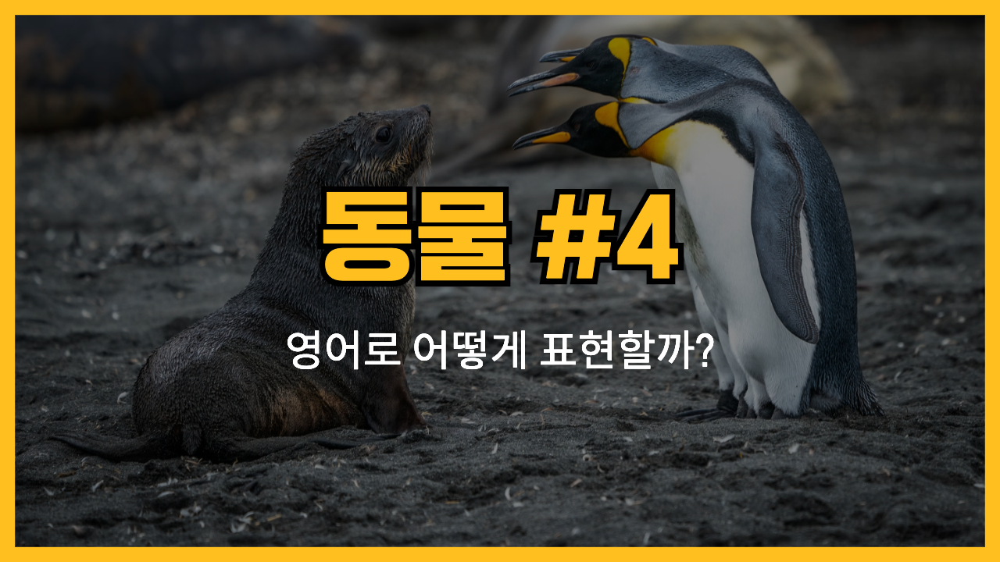

오늘은 동물 관련 영어표현 네번째 시간이에요. 다양한 동물들을 영어로 어떻게 표현하는지 알아봅시다. 오리(duck), 양(sheep), 염소(goat), 닭(chicken), 펭귄(penguin)와 같은 동물들을 영어로 표현하는 방법에 대해 알아볼거에요. 각 동물의 발음과 예문을 통해 영어 표현을 익혀볼게요! ✨

<!-- engple-horizontal-ad -->

<ins class="adsbygoogle"
     style="display:block"
     data-ad-client="ca-pub-1465612013356152"
     data-ad-slot="2106896038"
     data-ad-format="auto"
     data-full-width-responsive="true"></ins>

## 1. 오리 (Duck)

물가에서 사는 조류로, 종종 수영을 잘 해요.

### 🗣️ 발음

발음기호: /dʌk/

### 💭 관련 표현

- wild duck: 야생 오리
- duck pond: 오리 연못

### 📝 예문으로 연습하기!

1. "The duck is swimming in the pond."

   "오리가 연못에서 수영하고 있어요."

2. "I saw a mother duck with her ducklings."

   "어미 오리와 오리 새끼들을 봤어요."

## 2. 양 (Sheep)

양모를 제공하는 가축으로, 보통 풀을 먹고 살아가요.

### 🗣️ 발음

발음기호: /ʃiːp/

### 💭 관련 표현

- black sheep: 흑양
- sheepdog: 양치기 개

### 📝 예문으로 연습하기!

1. "The sheep are grazing in the field."

   "양들이 들판에서 풀을 뜯고 있어요."

2. "I love the sound of sheep bleating."

   "양들이 울부짖는 소리가 좋아요."

## 3. 염소 (Goat)

산이나 언덕에서 자주 발견되는 동물로, 털이 길고 뿔이 있어요.

### 🗣️ 발음

발음기호: /ɡoʊt/

### 💭 관련 표현

- baby goat: 새끼 염소
- dairy goat: 유제품을 만드는 염소

### 📝 예문으로 연습하기!

1. "The goat climbed to the top of the hill."

   "염소가 언덕 꼭대기로 올라갔어요."

2. "I saw a baby goat playing in the yard."

   "마당에서 새끼 염소가 노는 걸 봤어요."

## 4. 닭 (Chicken)

가금류로, 주로 알을 낳고 고기를 위해 사육돼요.

### 🗣️ 발음

발음기호: /ˈtʃɪk.ɪn/

### 💭 관련 표현

- free-range chicken: 방목 닭
- chicken coop: 닭장

### 📝 예문으로 연습하기!

1. "The chicken is laying eggs in the coop."

   "닭이 닭장에서 알을 낳고 있어요."

2. "We had roasted chicken for dinner."

   "저녁으로 구운 닭고기를 먹었어요."

## 5. 펭귄 (Penguin)

추운 지역에서 사는 새로, 수영을 잘 하지만 날지는 못해요.

### 🗣️ 발음

발음기호: /ˈpɛŋ.ɡwɪn/

### 💭 관련 표현

- emperor penguin: 황제 펭귄
- penguin colony: 펭귄 집단

### 📝 예문으로 연습하기!

1. "The penguin waddles when it walks."

   "펭귄은 걸을 때 엉금엉금 기어가요."

2. "I saw a documentary about penguins in Antarctica."

   "남극에서 펭귄에 대한 다큐멘터리를 봤어요."

---

이렇게 동물들과 관련된 영어 단어와 예문을 알아봤어요! 이제 더 많은 동물들을 영어로 표현하는 데 자신감이 생길 거예요. 🦙🐓

오늘 배운 단어와 예문을 최소 3번 소리내어 말해보세요. 반복해서 말하는 것이 영어 학습에 큰 도움이 될 거예요!

그럼 다음에 더 유용한 단어와 예문들로 찾아올게요~
