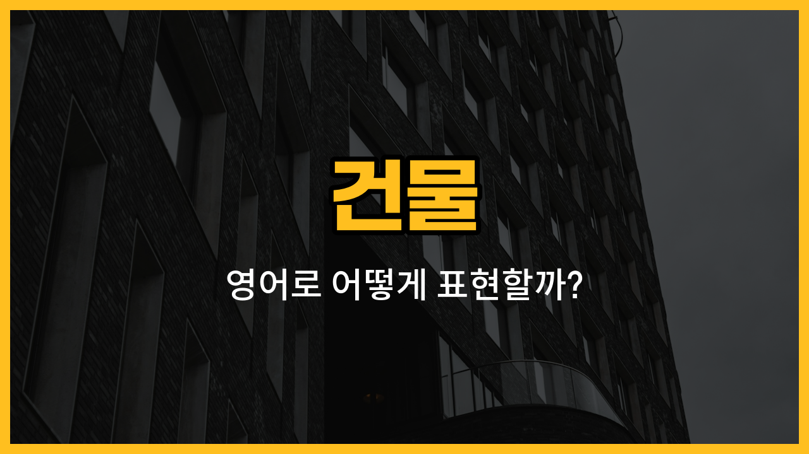

오늘은 영어로 자주 쓰이는 건물 이름들을 배워볼 거예요! 우리가 일상에서 자주 가는 주요 장소들인 학교, 병원, 도서관, 은행, 우체국, 박물관, 극장 등의 영어 단어와 발음, 그리고 실생활 예문까지 함께 익혀볼게요.

## 1. 학교 (School)

학생들이 공부하는 곳이에요.

### 🗣️ 발음
- 발음기호: /skuːl/
- 한국어 발음: 스쿨

### 💭 관련 표현
- elementary school: 초등학교
- high school: 고등학교

### 📝 예문으로 연습하기!
1. "My sister goes to school every morning."

   "내 여동생은 매일 아침 학교에 가요."

2. "There is a big playground at the school."

   "학교에 큰 운동장이 있어요."

## 2. 병원 (Hospital)

아프거나 다쳤을 때 치료를 받는 곳이에요.

### 🗣️ 발음
- 발음기호: /ˈhɑːspɪtl/
- 한국어 발음: 하스피틀

### 💭 관련 표현
- general hospital: 종합병원
- children's hospital: 어린이병원

### 📝 예문으로 연습하기!
1. "She works at the hospital as a nurse."

   "그녀는 병원에서 간호사로 일해요."

2. "I visited my friend in the hospital."

   "저는 병원에 있는 친구를 방문했어요."

## 3. 도서관 (Library)

책을 빌리거나 공부할 수 있는 곳이에요.

### 🗣️ 발음
- 발음기호: /ˈlaɪbreri/
- 한국어 발음: 라이브러리

### 💭 관련 표현
- public library: 공공도서관
- university library: 대학도서관

### 📝 예문으로 연습하기!
1. "I study at the library after school."

   "저는 방과 후에 도서관에서 공부해요."

2. "The library has many interesting books."

   "도서관에는 재미있는 책이 많아요."

## 4. 은행 (Bank)

돈을 맡기거나 찾는 곳이에요.

### 🗣️ 발음
- 발음기호: /bæŋk/
- 한국어 발음: 뱅크

### 💭 관련 표현
- open a bank account: 은행 계좌를 개설하다
- withdraw money: 돈을 인출하다

### 📝 예문으로 연습하기!
1. "I need to go to the bank today."

   "오늘 은행에 가야 해요."

2. "She works at a bank downtown."

   "그녀는 시내 은행에서 일해요."

## 5. 우체국 (Post Office)

편지나 소포를 보내고 받는 곳이에요.

### 🗣️ 발음
- 발음기호: /poʊst ˈɑːfɪs/
- 한국어 발음: 포스트 오피스

### 💭 관련 표현
- send a package: 소포를 보내다
- buy stamps: 우표를 사다

### 📝 예문으로 연습하기!
1. "My mom went to the post office this morning."

   "엄마가 오늘 아침에 우체국에 다녀왔어요."

2. "I mailed a letter at the post office."

   "저는 우체국에서 편지를 보냈어요."

## 6. 박물관 (Museum)

역사, 예술, 과학 등 다양한 전시물을 볼 수 있는 곳이에요.

### 🗣️ 발음
- 발음기호: /mjuˈziːəm/
- 한국어 발음: 뮤지엄

### 💭 관련 표현
- art museum: 미술관
- history museum: 역사박물관

### 📝 예문으로 연습하기!
1. "We visited the museum last weekend."

   "우리는 지난 주말에 박물관에 갔어요."

2. "There are dinosaur bones in the museum."

   "박물관에 공룡 뼈가 있어요."

## 7. 극장 (Theater)

영화나 공연을 볼 수 있는 곳이에요.

### 🗣️ 발음
- 발음기호: /ˈθiːətər/
- 한국어 발음: 띠어터

### 💭 관련 표현
- movie theater: 영화관
- play theater: 연극 공연장

### 📝 예문으로 연습하기!
1. "Let's watch a movie at the theater."

   "극장에서 영화 보자고요."

2. "The theater is near the subway station."

   "극장은 지하철역 근처에 있어요."

---

오늘은 일상에서 자주 볼 수 있는 건물들의 영어 이름과 예문을 배워봤어요! 여러 번 따라 읽어보고, 실제로 영어로 말해보는 연습을 해보세요. 다음에도 더 유용한 영어 단어로 찾아올게요~
