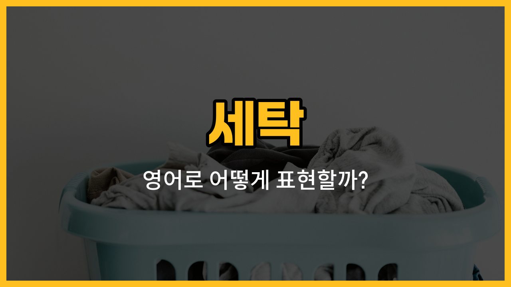

오늘은 집안일 중에서도 자주 하게 되는 '세탁'과 관련된 영어 단어들을 배워볼 거예요! 세탁할 때 꼭 필요한 도구나 제품들을 영어로 어떻게 말하는지, 그리고 실제로 어떻게 쓸 수 있는지 예문과 함께 살펴볼게요.

## 1. 빨래집게 (Clothespin)

빨래를 널 때 옷이 바람에 날아가지 않게 집어주는 작은 도구예요.

### 🗣️ 발음
- 발음기호: /ˈkloʊðzˌpɪn/
- 한국어 발음: 클로즈핀

### 💭 관련 표현
- wooden clothespin: 나무 빨래집게
- plastic clothespin: 플라스틱 빨래집게

### 📝 예문으로 연습하기!

1. "I used a clothespin to hang my socks."

   "양말을 널 때 빨래집게를 사용했어요."

2. "Don't lose the clothespins after you finish laundry."

   "세탁 후에 빨래집게를 잃어버리지 마세요."

## 2. 빨래줄 (Clothesline)

세탁한 옷을 널어서 말릴 때 사용하는 줄이에요.

### 🗣️ 발음
- 발음기호: /ˈkloʊðzˌlaɪn/
- 한국어 발음: 클로즈라인

### 💭 관련 표현
- hang on the clothesline: 빨래줄에 널다
- outdoor clothesline: 야외 빨래줄

### 📝 예문으로 연습하기!

1. "She hung her shirts on the clothesline."

   "그녀는 셔츠를 빨래줄에 널었어요."

2. "The wind blew the clothes off the clothesline."

   "바람 때문에 옷이 빨래줄에서 떨어졌어요."

## 3. 섬유탈취제 (Fabric Refresher)

옷이나 섬유 제품에서 냄새를 없애주는 스프레이예요.

### 🗣️ 발음
- 발음기호: /ˈfæbrɪk rɪˈfrɛʃər/
- 한국어 발음: 패브릭 리프레셔

### 💭 관련 표현
- spray fabric refresher: 섬유탈취제를 뿌리다
- odor remover: 냄새 제거제

### 📝 예문으로 연습하기!

1. "I spray fabric refresher on my clothes after washing."

   "세탁 후에 옷에 섬유탈취제를 뿌려요."

2. "This fabric refresher makes everything smell fresh."

   "이 섬유탈취제 덕분에 모든 게 상쾌하게 냄새나요."

## 4. 표백제 (Bleach)

옷의 얼룩이나 색을 빼거나 소독할 때 쓰는 강한 세정제예요.

### 🗣️ 발음
- 발음기호: /bliːtʃ/
- 한국어 발음: 블리치

### 💭 관련 표현
- liquid bleach: 액체 표백제
- color-safe bleach: 색상 안전 표백제

### 📝 예문으로 연습하기!

1. "Be careful when using bleach on white clothes."

   "흰 옷에 표백제를 사용할 때는 조심하세요."

2. "Don't mix bleach with other cleaners."

   "표백제를 다른 세제와 섞지 마세요."

## 5. 건조기 (Dryer)

세탁한 옷을 빠르게 말려주는 전자제품이에요.

### 🗣️ 발음
- 발음기호: /ˈdraɪər/
- 한국어 발음: 드라이어

### 💭 관련 표현
- tumble dryer: 회전식 건조기
- dryer sheet: 건조기 시트

### 📝 예문으로 연습하기!

1. "I put my jeans in the dryer."

   "청바지를 건조기에 넣었어요."

2. "The dryer makes laundry days much easier."

   "건조기 덕분에 세탁날이 훨씬 쉬워졌어요."

## 6. 얼룩제거제 (Stain Remover)

옷에 묻은 얼룩을 없애주는 세탁용 제품이에요.

### 🗣️ 발음
- 발음기호: /steɪn rɪˈmuːvər/
- 한국어 발음: 스테인 리무버

### 💭 관련 표현
- spray stain remover: 스프레이형 얼룩제거제
- pen stain remover: 펜 타입 얼룩제거제

### 📝 예문으로 연습하기!

1. "I used a stain remover on my shirt."

   "셔츠에 얼룩제거제를 썼어요."

2. "Stain remover works well on coffee stains."

   "얼룩제거제는 커피 얼룩에 효과가 좋아요."

---

오늘 배운 세탁 관련 영어 단어들, 꼭 여러 번 소리 내어 따라해 보세요! 다음에는 더 유용한 생활 영어로 돌아올게요~
