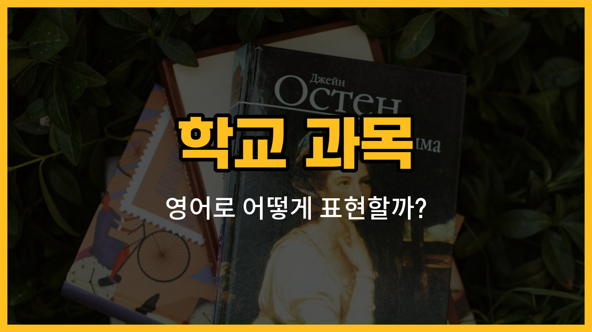

학교에서 배우는 다양한 과목들을 영어로 어떻게 말하는지 궁금하신가요? 오늘은 학교 생활에서 꼭 필요한 주요 과목들의 영어 표현을 알려드릴게요. 각 과목의 발음, 의미, 그리고 실생활에서 쓸 수 있는 예문까지 함께 준비했으니, 재미있게 따라와 주세요!

## 1. 국어 (Korean)

한국어와 문학 등 우리말과 관련된 내용을 배우는 과목이에요.

### 🗣️ 발음
- 발음기호: /ˈkɔː.ri.ən/
- 한국어 발음: 코리언

### 📝 예문으로 연습하기!
1. "Korean is my favorite subject."

   "국어가 제가 가장 좋아하는 과목이에요."

2. "We read poems in Korean class."

   "국어 시간에 시를 읽어요."

## 2. 영어 (English)

영어 읽기, 쓰기, 듣기, 말하기를 배우는 과목이에요.

### 🗣️ 발음
- 발음기호: /ˈɪŋ.glɪʃ/
- 한국어 발음: 잉글리쉬

### 📝 예문으로 연습하기!
1. "I have English class every Monday."

   "저는 매주 월요일마다 영어 수업이 있어요."

2. "We practice speaking in English class."

   "영어 시간에 말하기 연습을 해요."

## 3. 수학 (Math)

숫자, 계산, 공식 등 수와 관련된 내용을 배우는 과목이에요.

### 🗣️ 발음
- 발음기호: /mæθ/
- 한국어 발음: 매쓰

### 📝 예문으로 연습하기!
1. "Math is sometimes difficult for me."

   "수학은 가끔 저에게 어려워요."

2. "We solved [problems](/blog/in-english/1370.problem/) in math class."

   "수학 시간에 문제를 풀었어요."

## 4. 과학 (Science)

자연 현상, 생물, 화학, 물리 등 과학적인 내용을 배우는 과목이에요.

### 🗣️ 발음
- 발음기호: /ˈsaɪ.əns/
- 한국어 발음: 사이언스

### 📝 예문으로 연습하기!
1. "We did an experiment in science class."

   "과학 시간에 실험을 했어요."

2. "Science explains how things work."

   "과학은 사물이 어떻게 작동하는지 설명해줘요."

## 5. 사회 (Social Studies)

역사, 지리, 경제, 정치 등 사회와 관련된 내용을 배우는 과목이에요.

### 🗣️ 발음
- 발음기호: /ˈsoʊ.ʃəl ˈstʌd.iz/
- 한국어 발음: 소셜 스터디즈

### 📝 예문으로 연습하기!
1. "We learned about world maps in social studies."

   "사회 시간에 세계 지도를 배웠어요."

2. "Social studies teaches us about history."

   "사회 과목은 역사에 대해 가르쳐줘요."

## 6. 미술 (Art)

그림 그리기, 만들기 등 창의적인 활동을 하는 과목이에요.

### 🗣️ 발음
- 발음기호: /ɑːrt/
- 한국어 발음: 아트

### 📝 예문으로 연습하기!
1. "We painted pictures in [art](/blog/in-english/1393.art/) class."

   "미술 시간에 그림을 그렸어요."

2. "Art class is very [fun](/blog/in-english/1376.fun/)."

   "미술 수업은 정말 재미있어요."

## 7. 음악 (Music)

노래 부르기, 악기 연주하기 등 음악과 관련된 내용을 배우는 과목이에요.

### 🗣️ 발음
- 발음기호: /ˈmjuː.zɪk/
- 한국어 발음: 뮤직

### 📝 예문으로 연습하기!
1. "I play the piano in music class."

   "음악 시간에 피아노를 쳐요."

2. "Music makes me happy."

   "음악은 저를 행복하게 해줘요."

---

오늘은 학교에서 자주 배우는 주요 과목들의 영어 표현과 예문을 알아봤어요! 수업시간이나 외국 친구와 대화할 때 꼭 한 번 써보세요. 다음에도 더 유용한 영어 단어로 찾아올게요~
