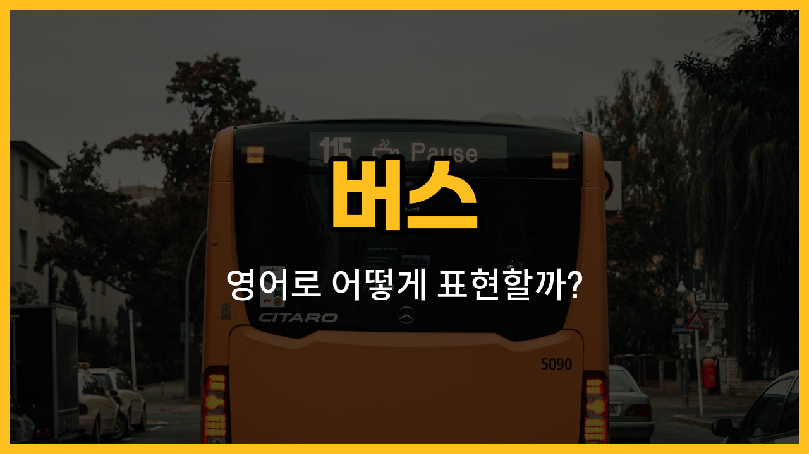

버스를 이용할 때 자주 듣게 되는 영어 단어들을 함께 배워볼까요? 오늘은 정류장(bus [stop](/blog/in-english/1240.stop/)), 노선(route), 기사(driver), 차표(ticket), 승차권(boarding pass) 등 버스와 관련된 필수 단어들을 소개할게요. 각각의 단어가 실제로 어떻게 쓰이는지 예문과 함께 익혀보세요!

## 1. 정류장 (Bus stop)

버스를 타거나 내릴 수 있도록 지정된 장소예요. 우리말로는 '버스 정류장'이라고 해요.

### 🗣️ 발음
- 발음기호: /bʌs stɑːp/
- 한국어 발음: 버스 스탑

### 💭 관련 표현
- next bus stop: 다음 정류장
- bus stop sign: 정류장 표지판

### 📝 예문으로 연습하기!

1. "Where is the nearest bus stop?"

   "가장 가까운 버스 정류장이 어디에 있어요?"

2. "[Let](/blog/in-english/1112.let/)’s get off at the next bus stop."

   "다음 정류장에서 내리자고 해요."

## 2. 노선 (Route)

버스가 다니는 길이나 경로를 뜻해요. 여러 노선이 있어서 목적지에 따라 골라 타야 해요.

### 🗣️ 발음
- 발음기호: /ruːt/ 또는 /raʊt/
- 한국어 발음: 루트

### 💭 관련 표현
- bus route: 버스 노선
- route map: 노선도

### 📝 예문으로 연습하기!

1. "Which route goes to the city center?"

   "어떤 노선이 시내로 가요?"

2. "Check the route before you [get on](/blog/in-english/557.get-on/) the bus."

   "버스 타기 전에 노선을 확인해요."

## 3. 기사 (Driver)

버스를 운전하는 분을 말해요. 영어로는 'driver'라고 해요.

### 🗣️ 발음
- 발음기호: /ˈdraɪvər/
- 한국어 발음: 드라이버

### 💭 관련 표현
- bus driver: 버스 기사
- friendly driver: 친절한 기사님

### 📝 예문으로 연습하기!

1. "The driver greeted everyone with a smile."

   "기사님이 모두에게 웃으며 인사했어요."

2. "Ask the driver if you’re not [sure](/blog/in-english/1098.sure/) about your stop."

   "정류장이 헷갈리면 기사님께 여쭤보세요."

## 4. 차표 (Ticket)

버스를 타기 위해 구입하는 표예요. 영어로는 'ticket'이라고 해요.

### 🗣️ 발음
- 발음기호: /ˈtɪkɪt/
- 한국어 발음: 티킷

### 💭 관련 표현
- bus ticket: 버스 차표
- one-[way](/blog/in-english/1062.way/) ticket: 편도 차표

### 📝 예문으로 연습하기!

1. "I bought a ticket at the station."

   "저는 역에서 차표를 샀어요."

2. "Don’t [lose](/blog/in-english/457.lose/) your ticket during the trip."

   "여행 중에 차표를 잃어버리지 않게 조심해요."

## 5. 승차권 (Boarding pass)

버스를 탈 때 제시해야 하는 공식적인 증명서예요. 보통 장거리 버스에서 사용해요.

### 🗣️ 발음
- 발음기호: /ˈbɔːrdɪŋ pæs/
- 한국어 발음: 보딩 패스

### 💭 관련 표현
- boarding pass check: 승차권 확인
- print your boarding pass: 승차권을 출력하다

### 📝 예문으로 연습하기!

1. "Please show your boarding pass before you get on."

   "탑승 전에 승차권을 보여주세요."

2. "I lost my boarding pass and had to get a [new](/blog/in-english/1056.new/) one."

   "승차권을 잃어버려서 새로 발급받았어요."

---

오늘 배운 버스 관련 영어 단어들이 실제로 버스를 이용할 때 큰 도움이 될 거예요! 여러 번 소리 내어 연습해보고, 다음에 버스 탈 때 직접 사용해보세요. 다음 시간에도 더 유용한 영어 단어로 만나요~
