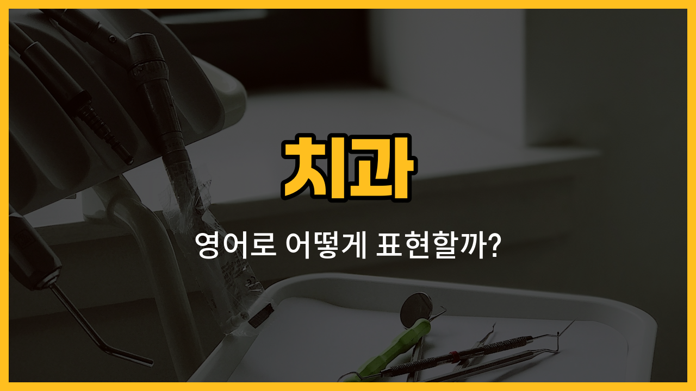

치과에 가면 자주 듣게 되는 영어 단어들이 있어요. 오늘은 이(tooth), 잇몸(gum), 어금니(molar), 앞니(incisor), 사랑니(wisdom tooth)와 같이 치아와 관련된 기본 단어들을 배워볼게요. 각각의 단어 발음, 뜻, 그리고 실제로 쓸 수 있는 자연스러운 예문까지 함께 익혀보세요!

## 1. 이 (tooth)

입 안에 있는 단단한 부분으로, 음식을 씹거나 자를 때 꼭 필요해요. 보통 한 개의 이를 tooth라고 해요.

### 🗣️ 발음
- 발음기호: /tuːθ/
- 한국어 발음: 투스

### 💭 관련 표현
- baby tooth: 젖니
- toothache: 치통
- [lose](/blog/in-english/457.lose/) a tooth: 이를 잃다

### 📝 예문으로 연습하기!

1. "I have a toothache and need to see a dentist."

   "이가 아파서 치과에 가야 해요."

2. "My [little](/blog/in-english/1085.little/) brother lost his first tooth."

   "남동생이 첫 번째 이를 잃었어요."

## 2. 잇몸 (gum)

이는 잇몸(gum)이라는 연한 조직에 박혀 있어요. 잇몸은 치아를 보호하고 지지해주는 역할을 해요.

### 🗣️ 발음
- 발음기호: /ɡʌm/
- 한국어 발음: 검

### 💭 관련 표현
- swollen gum: 부은 잇몸
- gum disease: 잇몸 질환

### 📝 예문으로 연습하기!

1. "My gums bleed when I brush my teeth."

   "양치할 때 잇몸에서 피가 나요."

2. "[Healthy](/blog/in-english/1290.healthy/) gums are [important](/blog/in-english/318.important/) for strong teeth."

   "튼튼한 이를 위해서는 건강한 잇몸이 중요해요."

## 3. 어금니 (molar)

어금니는 뒤쪽에 있는 큰 이로, 음식을 잘게 부수는 데 사용해요.

### 🗣️ 발음
- 발음기호: /ˈmoʊlər/
- 한국어 발음: 몰러

### 💭 관련 표현
- lower molar: 아래 어금니
- upper molar: 위 어금니

### 📝 예문으로 연습하기!

1. "The dentist filled a cavity in my molar."

   "치과에서 어금니 충치를 치료했어요."

2. "I have pain in my lower molar."

   "아래 어금니가 아파요."

## 4. 앞니 (incisor)

앞니는 입 앞쪽에 있는 날카로운 이로, 주로 음식을 자르는 역할을 해요.

### 🗣️ 발음
- 발음기호: /ɪnˈsaɪzər/
- 한국어 발음: 인사이저

### 💭 관련 표현
- front incisor: 앞쪽 앞니
- chipped incisor: 이가 깨진 앞니

### 📝 예문으로 연습하기!

1. "She chipped her incisor while [eating](/blog/in-english/1257.eating/)."

   "그녀는 밥 먹다가 앞니가 깨졌어요."

2. "Incisors [help](/blog/in-english/1084.help/) us bite into [food](/blog/in-english/1308.food/)."

   "앞니는 음식을 베어 먹을 때 도움이 돼요."

## 5. 사랑니 (wisdom tooth)

사랑니는 보통 10대 후반이나 20대 초반에 나는 마지막 어금니예요. 때때로 뽑아야 하는 경우도 많아요.

### 🗣️ 발음
- 발음기호: /ˈwɪzdəm tuːθ/
- 한국어 발음: 위즈덤 투스

### 💭 관련 표현
- wisdom tooth extraction: 사랑니 발치
- impacted wisdom tooth: 매복 사랑니

### 📝 예문으로 연습하기!

1. "I have to get my wisdom tooth removed."

   "사랑니를 뽑아야 해요."

2. "My wisdom tooth is causing a lot of pain."

   "사랑니 때문에 많이 아파요."

---

오늘 배운 치아 관련 영어 단어와 예문들을 자주 소리내어 연습해보세요! 치과에 갈 때나 영어로 치아 건강을 이야기할 때 큰 도움이 될 거예요. 다음에도 더 유용한 영어 단어로 찾아올게요!
