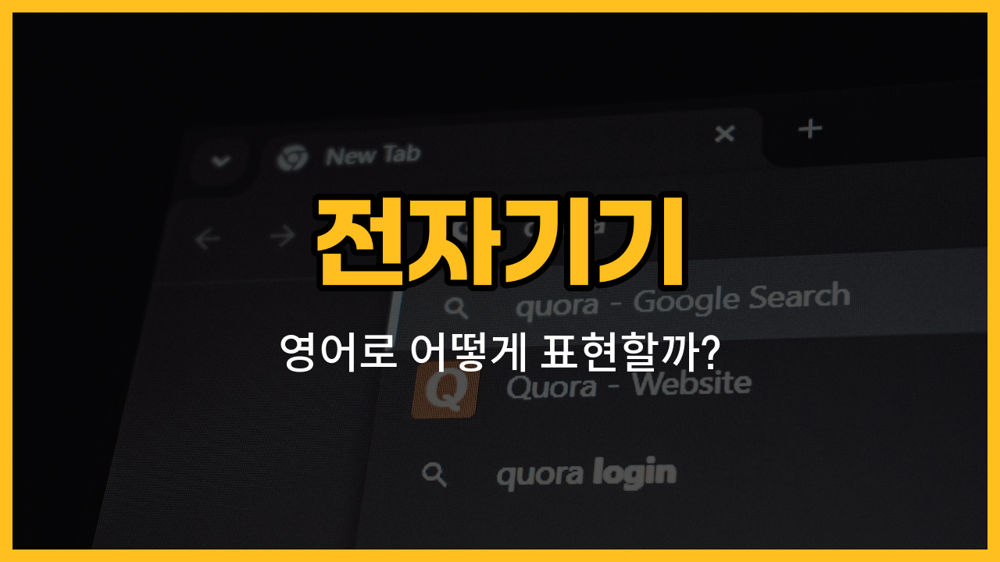

일상에서 자주 사용하는 전자기기들의 영어 표현을 배워볼까요? 오늘은 휴대전화, 태블릿, 카메라, 이어폰, 리모컨의 영어 단어와 그 사용 예문을 알아보아요. 각 단어의 발음과 함께 쉽게 이해할 수 있도록 설명해드릴게요!

## 1. 휴대전화 (Mobile phone)

휴대전화는 언제 어디서나 전화나 문자를 보내고, 인터넷도 할 수 있는 우리 생활에 꼭 필요한 기기예요.

### 🗣️ 발음

- 발음기호: /ˈmoʊ.bəl foʊn/
- 한국어 발음: 모우벌 폰

### 💭 관련 표현

- smartphone: 스마트폰
- cell phone: 셀폰 (미국에서 자주 사용)

### 📝 예문으로 연습하기!

1. "Can I [borrow](/blog/in-english/466.borrow/) your mobile phone for a moment?"

   "잠깐 네 휴대전화 좀 빌려도 될까요?"

2. "My mobile phone battery is almost dead."

   "내 휴대전화 배터리가 거의 다 닳았어요."

## 2. 태블릿 (Tablet)

태블릿은 터치스크린이 있는 얇은 전자기기로, 노트북보다 가볍고, 휴대성이 좋아요. 동영상 시청이나 인터넷 검색, 그림 그리기 등에 많이 사용해요.

### 🗣️ 발음

- 발음기호: /ˈtæb.lɪt/
- 한국어 발음: 태블릿

### 💭 관련 표현

- tablet computer: 태블릿 컴퓨터
- digital tablet: 디지털 태블릿

### 📝 예문으로 연습하기!

1. "She [reads](/blog/in-english/436.read/) e-books on her tablet every [night](/blog/in-english/1110.night/)."

   "그녀는 매일 밤 태블릿으로 전자책을 읽어요."

2. "I [use](/blog/in-english/1079.use/) a tablet to take notes in [class](/blog/in-english/1262.class/)."

   "저는 수업 시간에 태블릿으로 필기해요."

## 3. 카메라 (Camera)

카메라는 사진이나 영상을 찍는 데 사용하는 기기예요. 여행이나 특별한 순간을 기록할 때 꼭 필요하죠.

### 🗣️ 발음

- 발음기호: /ˈkæm.rə/
- 한국어 발음: 캐머러

### 💭 관련 표현

- digital camera: 디지털 카메라
- film camera: 필름 카메라

### 📝 예문으로 연습하기!

1. "I brought my camera to take pictures of the scenery."

   "경치 사진을 찍으려고 카메라를 가져왔어요."

2. "His camera takes really clear photos."

   "그의 카메라는 사진이 정말 선명하게 나와요."

## 4. 이어폰 (Earphones)

이어폰은 귀에 꽂아서 음악을 듣거나 통화를 할 때 사용하는 소형 음향기기예요.

### 🗣️ 발음

- 발음기호: /ˈɪr.foʊnz/
- 한국어 발음: 이어폰즈

### 💭 관련 표현

- wireless earphones: 무선 이어폰
- wired earphones: 유선 이어폰

### 📝 예문으로 연습하기!

1. "I listen to [music](/blog/in-english/1232.music/) with my earphones on the bus."

   "버스에서 이어폰으로 음악을 들어요."

2. "Please use your earphones so you don’t disturb others."

   "다른 사람에게 방해가 되지 않게 이어폰을 사용해 주세요."

## 5. 리모컨 (Remote control)

리모컨은 TV나 에어컨 등 전자기기를 멀리서 조작할 수 있게 해주는 기기예요.

### 🗣️ 발음

- 발음기호: /rɪˈmoʊt kənˈtroʊl/
- 한국어 발음: 리모우트 컨트롤

### 💭 관련 표현

- TV remote control: TV 리모컨
- air conditioner remote: 에어컨 리모컨

### 📝 예문으로 연습하기!

1. "Where is the remote control for the TV?"

   "TV 리모컨이 어디에 있나요?"

2. "You can [change](/blog/in-english/1133.change/) the channel with the remote control."

   "리모컨으로 채널을 바꿀 수 있어요."

---

오늘 배운 전자기기 영어 단어와 예문, 꼭 소리내어 따라 읽어보세요! 실생활에서 자주 쓰이는 표현들이니 익혀두면 정말 유용할 거예요. 다음에도 더 알찬 영어 단어로 찾아올게요~
