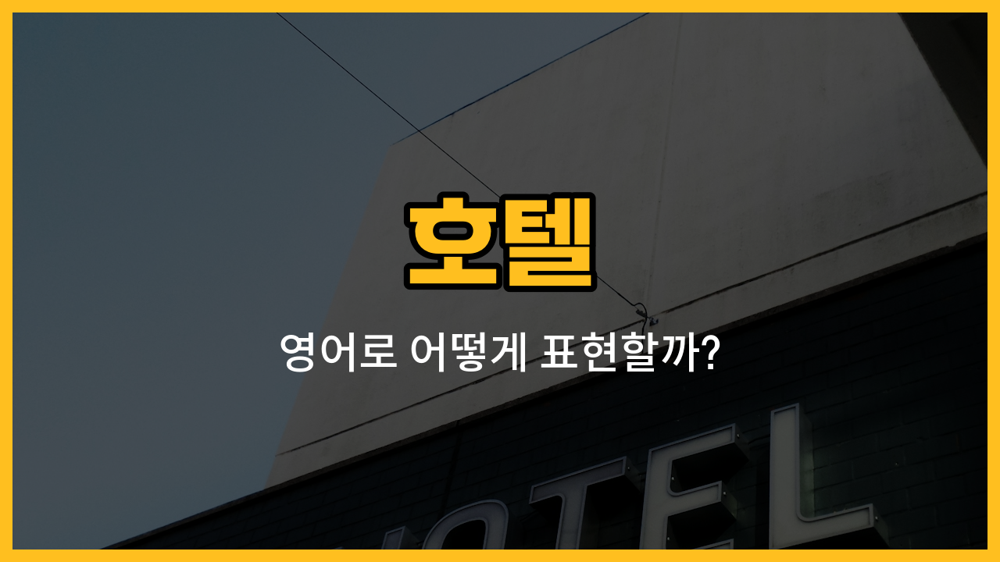

호텔을 이용할 때 꼭 알아두면 좋은 영어 단어들을 소개할게요! 오늘은 호텔에서 자주 사용하는 기본 공간과 관련된 영어 표현들을 배워볼 거예요. 객실, 프런트, 로비, 복도, 엘리베이터와 같은 단어들을 미국식 영어 예문과 함께 익혀보세요.

## 1. 객실 (Room)

호텔에서 머무는 방을 영어로는 "room"이라고 해요. 예약하거나 체크인할 때 자주 쓰는 단어예요.

### 🗣️ 발음
- 발음기호: /ruːm/
- 한국어 발음: 룸

### 💭 관련 표현
- [single](/blog/in-english/1331.single/) room: 싱글룸
- double room: 더블룸
- hotel room: 호텔 객실

### 📝 예문으로 연습하기!

1. "I would like to [book](/blog/in-english/447.book/) a room for two [nights](/blog/in-english/1110.night/)."

   "이틀 동안 객실을 예약하고 싶어요."

2. "Your room is on the fifth floor."

   "고객님의 객실은 5층에 있어요."

## 2. 프런트 (Front Desk)

호텔 입구 근처에서 체크인, 체크아웃 등 여러 서비스를 담당하는 곳이에요. 영어로는 "front desk"라고 해요.

### 🗣️ 발음
- 발음기호: /frʌnt dɛsk/
- 한국어 발음: 프런트 데스크

### 💭 관련 표현
- front desk clerk: 프런트 직원
- go to the front desk: 프런트로 가다

### 📝 예문으로 연습하기!

1. "Please ask the front desk if you need anything."

   "필요한 게 있으면 프런트에 문의하세요."

2. "I [checked](/blog/in-english/1358.check/) in at the front desk."

   "프런트에서 체크인했어요."

## 3. 로비 (Lobby)

호텔 입구를 들어서면 가장 먼저 보이는 넓은 공간이 바로 로비예요. 영어로는 "lobby"라고 해요.

### 🗣️ 발음
- 발음기호: /ˈlɑːbi/
- 한국어 발음: 라비

### 💭 관련 표현
- hotel lobby: 호텔 로비
- [wait](/blog/in-english/1327.wait/) in the lobby: 로비에서 기다리다

### 📝 예문으로 연습하기!

1. "Let's meet in the lobby at 6 p.m."

   "저녁 6시에 로비에서 만나요."

2. "The lobby was very crowded."

   "로비가 아주 붐볐어요."

## 4. 복도 (Hallway)

호텔에서 객실로 가는 길에 지나가는 긴 통로를 영어로 "hallway"라고 해요.

### 🗣️ 발음
- 발음기호: /ˈhɔːlweɪ/
- 한국어 발음: 홀웨이

### 💭 관련 표현
- walk down the hallway: 복도를 따라 걷다
- quiet hallway: 조용한 복도

### 📝 예문으로 연습하기!

1. "Your room is at the [end](/blog/in-english/1093.end/) of the hallway."

   "객실은 복도 끝에 있어요."

2. "The hallway was [long](/blog/in-english/1077.long/) and quiet."

   "복도가 길고 조용했어요."

## 5. 엘리베이터 (Elevator)

호텔에서 층을 오르내릴 때 타는 기계가 바로 엘리베이터예요. 영어로는 "elevator"라고 해요.

### 🗣️ 발음
- 발음기호: /ˈelɪveɪtər/
- 한국어 발음: 엘리베이터

### 💭 관련 표현
- take the elevator: 엘리베이터를 타다
- elevator button: 엘리베이터 버튼

### 📝 예문으로 연습하기!

1. "Let's take the elevator to the tenth floor."

   "엘리베이터 타고 10층으로 가요."

2. "The elevator is out of order."

   "엘리베이터가 고장 났어요."

---

오늘은 호텔에서 꼭 필요한 영어 단어 5가지를 배워봤어요! 실제 호텔을 이용할 때 이 단어들을 떠올리며 연습해보세요. 다음에도 더 유용한 영어 단어로 찾아올게요~
