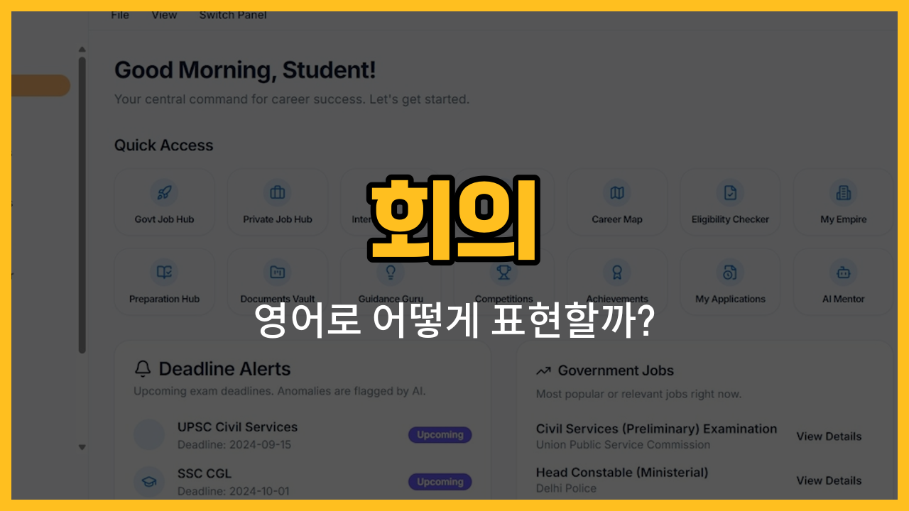

회사나 학교에서 회의를 할 때 자주 쓰는 영어 단어들을 알아볼까요? 오늘은 의제, 참석자, 회의록, 발언권, 토론에 해당하는 영어 단어와 그 뜻, 그리고 실제로 쓸 수 있는 예문까지 함께 공부해 볼 거예요. 회의 영어 표현에 자신감을 가질 수 있도록 하나씩 살펴봐요!

## 1. 의제 (Agenda)

회의에서 다뤄야 할 주제나 순서를 정리한 목록을 말해요.

### 🗣️ 발음
- 발음기호: /əˈdʒendə/
- 한국어 발음: 어젠다

### 💭 관련 표현
- meeting agenda: 회의 의제
- [set](/blog/in-english/1117.set/) the agenda: 의제를 정하다

### 📝 예문으로 연습하기!

1. "Let's [review](/blog/in-english/251.review/) the agenda before we start the meeting."

   "회의를 시작하기 전에 의제를 검토해요."

2. "Who [prepared](/blog/in-english/371.prepare/) the agenda for today's meeting?"

   "오늘 회의 의제는 누가 준비했어요?"

## 2. 참석자 (Participant)

회의나 모임에 참여하는 사람을 의미해요.

### 🗣️ 발음
- 발음기호: /pɑːrˈtɪsɪpənt/
- 한국어 발음: 파티시펀트

### 💭 관련 표현
- meeting [participant](/blog/in-english/706.participant/): 회의 참석자
- active participant: 적극적인 참석자

### 📝 예문으로 연습하기!

1. "Every participant should introduce themselves."

   "모든 참석자가 자기소개를 해야 해요."

2. "There were ten participants in the meeting."

   "회의에 참석자가 열 명 있었어요."

## 3. 회의록 (Minutes)

회의에서 논의된 내용이나 결정을 기록한 문서를 말해요.

### 🗣️ 발음
- 발음기호: /ˈmɪnɪts/
- 한국어 발음: 미닛츠

### 💭 관련 표현
- take the [minutes](/blog/in-english/1365.minutes/): 회의록을 작성하다
- meeting minutes: 회의록

### 📝 예문으로 연습하기!

1. "Who will take the minutes today?"

   "오늘 회의록은 누가 작성해요?"

2. "Please send me the minutes after the meeting."

   "회의 끝나고 회의록을 보내줘요."

## 4. 발언권 (Floor)

회의에서 발언할 수 있는 권리를 뜻해요. 영어로는 "have the floor"처럼 표현해요.

### 🗣️ 발음
- 발음기호: /flɔːr/
- 한국어 발음: 플로어

### 💭 관련 표현
- have the floor: 발언권을 가지다
- give the floor: 발언권을 주다

### 📝 예문으로 연습하기!

1. "You have the floor now."

   "지금 발언권이 있어요."

2. "May I have the floor to ask a [question](/blog/in-english/1336.question/)?"

   "질문하려고 발언권을 얻어도 될까요?"

## 5. 토론 (Discussion)

어떤 주제에 대해 여러 사람이 의견을 나누는 것을 말해요.

### 🗣️ 발음
- 발음기호: /dɪˈskʌʃən/
- 한국어 발음: 디스커션

### 💭 관련 표현
- group discussion: 그룹 토론
- open discussion: 자유 토론

### 📝 예문으로 연습하기!

1. "Let's start the discussion on the first topic."

   "첫 번째 주제에 대한 토론을 시작해요."

2. "The discussion was very [productive](/blog/in-english/287.productive/)."

   "토론이 아주 생산적이었어요."

---

이렇게 회의에서 자주 쓰는 영어 단어들을 알아봤어요! 실제 회의나 영어 수업에서 오늘 배운 단어와 예문을 직접 써보면 더 쉽게 익힐 수 있어요. 다음에도 실생활에 꼭 필요한 영어 단어로 다시 만나요~
