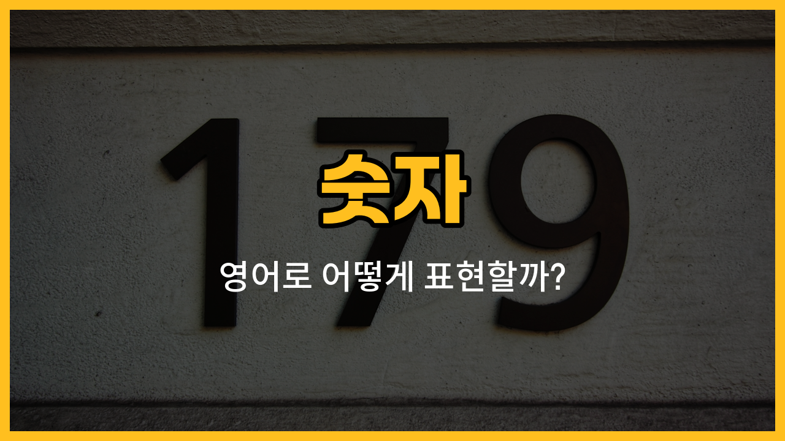

영어 숫자 중에서 8부터 12까지는 일상 대화나 시험, 여행 등에서 자주 쓰이는 기본 단어예요. 오늘은 8(eight), 9(nine), 10(ten), 11(eleven), 12(twelve)의 영어 표현과 발음, 예문을 함께 익혀볼게요!

## 1. 8 (Eight)

숫자 8을 영어로는 eight라고 해요. 발음이 한 음절로 간단해서 외우기 쉬워요.

### 🗣️ 발음

- 발음기호: /eɪt/
- 한국어 발음: 에잇

### 📝 예문으로 연습하기!

1. "There are eight apples on the table."

   "테이블 위에 사과가 여덟 개 있어요."

2. "My [class](/blog/in-english/1262.class/) [starts](/blog/in-english/1127.start/) at eight o’clock."

   "제 수업은 8시에 시작해요."

## 2. 9 (Nine)

숫자 9는 nine이라고 해요. 발음은 나인에 가까워요.

### 🗣️ 발음

- 발음기호: /naɪn/
- 한국어 발음: 나인

### 📝 예문으로 연습하기!

1. "She has nine pencils in her bag."

   "그녀는 가방에 연필을 아홉 자루 가지고 있어요."

2. "I [wake up](/blog/in-english/300.wake-up/) at nine every [morning](/blog/in-english/1351.morning/)."

   "저는 매일 아침 9시에 일어나요."

## 3. 10 (Ten)

숫자 10은 영어로 ten이라고 해요. 시험 점수, 나이, 날짜 등 여러 상황에서 자주 쓰여요.

### 🗣️ 발음

- 발음기호: /ten/
- 한국어 발음: 텐

### 📝 예문으로 연습하기!

1. "There are ten students in the classroom."

   "교실에 학생이 열 명 있어요."

2. "Let’s meet at ten o’clock."

   "10시에 만나요."

## 4. 11 (Eleven)

숫자 11은 eleven이라고 해요. 발음이 조금 길지만 자주 쓰여서 익혀두면 좋아요.

### 🗣️ 발음

- 발음기호: /ɪˈlevən/
- 한국어 발음: 일레븐

### 📝 예문으로 연습하기!

1. "He is eleven [years](/blog/in-english/1066.years/) [old](/blog/in-english/1086.old/)."

   "그는 열한 살이에요."

2. "The [train](/blog/in-english/1147.train/) leaves at eleven."

   "기차가 11시에 출발해요."

## 5. 12 (Twelve)

숫자 12는 twelve라고 해요. 시계나 날짜, 인원수 셀 때 자주 사용해요.

### 🗣️ 발음

- 발음기호: /twɛlv/
- 한국어 발음: 트웰브

### 📝 예문으로 연습하기!

1. "We have twelve cookies for the party."

   "우리는 파티를 위해 쿠키를 열두 개 가지고 있어요."

2. "Lunch is at twelve o’clock."

   "점심은 12시에 먹어요."

---

오늘은 영어 숫자 8부터 12까지를 배워봤어요! 숫자는 영어에서 정말 자주 쓰이니, 예문을 큰 소리로 따라 읽으면서 익혀보세요. 다음에도 더 유용한 영어 단어로 찾아올게요~
