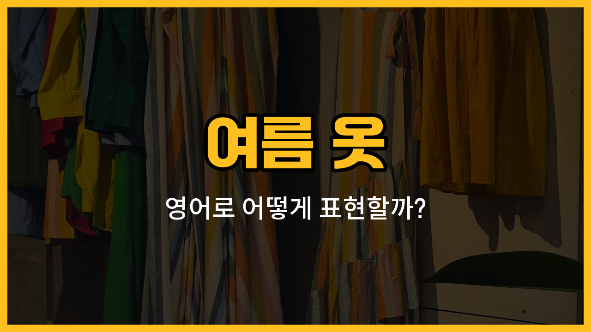

여름이 되면 시원하고 가벼운 옷을 많이 입게 되죠? 오늘은 여름에 자주 입는 옷들인 반팔티, 반바지, 치마, 민소매, 원피스의 영어 표현과 예문을 배워볼 거예요. 실제 미국에서 자주 쓰는 문장들도 함께 연습해 보세요!

## 1. 반팔티 (Short-sleeved shirt)

팔이 짧은, 여름에 가장 많이 입는 티셔츠예요.

### 🗣️ 발음
- 발음기호: /ʃɔːrt sliːvd ʃɜːrt/
- 한국어 발음: 숏-슬리브드 셔츠

### 💭 관련 표현
- white [short](/blog/in-english/1399.short/)-sleeved shirt: 흰색 반팔티
- cotton short-sleeved shirt: 면 반팔티

### 📝 예문으로 연습하기!

1. "I wore a short-sleeved shirt because it was hot."

   "더워서 반팔티를 입었어요."

2. "Do you have this in a short-sleeved shirt?"

   "이거 반팔티로도 있나요?"

## 2. 반바지 (Shorts)

무릎 위까지 오는 짧은 바지로, 여름에 시원하게 입기 좋아요.

### 🗣️ 발음
- 발음기호: /ʃɔːrts/
- 한국어 발음: 숏츠

### 💭 관련 표현
- denim shorts: 청반바지
- sports shorts: 운동용 반바지

### 📝 예문으로 연습하기!

1. "I always wear shorts in the summer."

   "여름에는 항상 반바지를 입어요."

2. "These shorts are very comfortable."

   "이 반바지는 정말 편해요."

## 3. 치마 (Skirt)

여성분들이 많이 입는 허리부터 아래로 퍼지는 옷이에요.

### 🗣️ 발음
- 발음기호: /skɜːrt/
- 한국어 발음: 스커트

### 💭 관련 표현
- [long](/blog/in-english/1077.long/) skirt: 긴 치마
- mini skirt: 미니 치마

### 📝 예문으로 연습하기!

1. "She wore a skirt to the party."

   "그녀는 파티에 치마를 입고 갔어요."

2. "I [like](/blog/in-english/1053.like/) to wear a skirt on hot days."

   "더운 날에는 치마 입는 걸 좋아해요."

## 4. 민소매 (Sleeveless top)

어깨가 드러나는, 팔 부분이 없는 시원한 상의예요.

### 🗣️ 발음
- 발음기호: /ˈsliːvləs tɑːp/
- 한국어 발음: 슬리브리스 탑

### 💭 관련 표현
- white sleeveless top: 흰색 민소매
- cotton sleeveless top: 면 민소매

### 📝 예문으로 연습하기!

1. "She wore a sleeveless top to stay cool."

   "시원하게 입으려고 민소매를 입었어요."

2. "I [packed](/blog/in-english/301.pack/) a sleeveless top for my [trip](/blog/in-english/1150.trip/)."

   "여행 가려고 민소매를 챙겼어요."

## 5. 원피스 (Dress)

상의와 하의가 하나로 이어진 한 벌짜리 옷이에요.

### 🗣️ 발음
- 발음기호: /drɛs/
- 한국어 발음: 드레스

### 💭 관련 표현
- summer dress: 여름 원피스
- floral dress: 꽃무늬 원피스

### 📝 예문으로 연습하기!

1. "She [bought](/blog/in-english/1287.buy/) a new dress for summer."

   "여름을 위해 새 원피스를 샀어요."

2. "This dress is [perfect](/blog/in-english/413.perfect/) for the beach."

   "이 원피스는 해변에 입기 딱이에요."

---

오늘 배운 여름 옷 영어 단어와 예문들을 여러 번 소리내어 연습해 보세요! 실제로 입는 옷을 떠올리며 말하면 더 쉽게 외울 수 있어요. 다음에도 더 유용한 영어 단어로 찾아올게요~
