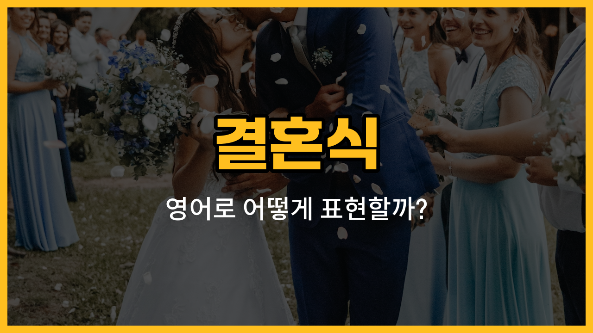

결혼식에서 자주 쓰이는 영어 단어들을 알아볼까요? 오늘은 결혼식 현장에서 꼭 필요한 신랑 신부, 하객, 축가, 부케, 웨딩드레스의 영어 표현을 배워볼게요. 실제 미국식 예문과 함께 연습하면 결혼식 관련 영어 대화가 한결 쉬워질 거예요!

## 1. 신랑 신부 (Bride and groom)

결혼식의 주인공인 신부와 신랑을 영어로는 각각 bride(신부), groom(신랑)이라고 해요. 함께 말할 때는 "bride and groom"이라고 해요.

### 🗣️ 발음

- Bride: 브라이드
- Groom: 그룸

### 💭 관련 표현

- bride-to-be: 예비 신부
- newlyweds: 신혼부부
- the [happy](/blog/in-english/1322.happy/) couple: 행복한 커플

### 📝 예문으로 연습하기!

1. "The bride and groom looked so happy at the ceremony."

   "결혼식에서 신랑 신부가 정말 행복해 보였어요."

2. "Everyone cheered for the bride and groom."

   "모두가 신랑 신부를 위해 환호했어요."

## 2. 하객 (Guest)

결혼식에 초대받아 참석하는 사람을 영어로 guest(게스트)라고 해요. 특히 결혼식에서는 wedding guest라고 자주 써요.

### 🗣️ 발음

- Guest: 게스트

### 💭 관련 표현

- [invited](/blog/in-english/347.invite/) guest: 초대받은 하객
- [special](/blog/in-english/1349.special/) guest: 특별 하객

### 📝 예문으로 연습하기!

1. "There were over one hundred guests at the wedding."

   "결혼식에 하객이 백 명이 넘었어요."

2. "Every guest received a small gift."

   "모든 하객이 작은 선물을 받았어요."

## 3. 축가 (Congratulatory song)

결혼식에서 신랑 신부를 축하하며 부르는 노래를 영어로 congratulatory song(콩그래츄러토리 송)이라고 해요. wedding song(웨딩 송)이라고도 해요.

### 🗣️ 발음

- Congratulatory song: 컨그래츄러토리 송

### 💭 관련 표현

- sing a congratulatory song: 축가를 부르다
- special song: 특별한 노래

### 📝 예문으로 연습하기!

1. "Her [friend](/blog/in-english/1261.friend/) sang a congratulatory song at the wedding."

   "그녀의 친구가 결혼식에서 축가를 불렀어요."

2. "The congratulatory song made everyone emotional."

   "축가 때문에 모두가 감동했어요."

## 4. 부케 (Bouquet)

신부가 들고 있는 꽃다발을 영어로 bouquet(부케)라고 해요. 결혼식에서 신부가 부케를 던지는 전통도 있죠!

### 🗣️ 발음

- Bouquet: 부케이

### 💭 관련 표현

- bridal bouquet: 신부 부케
- bouquet toss: 부케 던지기

### 📝 예문으로 연습하기!

1. "The bride [threw](/blog/in-english/458.throw/) her bouquet to the guests."

   "신부가 하객들에게 부케를 던졌어요."

2. "She caught the bouquet and everyone cheered."

   "그녀가 부케를 받자 모두가 환호했어요."

## 5. 웨딩드레스 (Wedding dress)

결혼식에서 신부가 입는 하얀 드레스를 영어로 wedding dress(웨딩드레스)라고 해요.

### 🗣️ 발음

- Wedding dress: 웨딩드레스

### 💭 관련 표현

- [white](/blog/in-english/1236.white/) wedding dress: 흰 웨딩드레스
- [try](/blog/in-english/1265.try/) on a wedding dress: 웨딩드레스를 입어보다

### 📝 예문으로 연습하기!

1. "She looked beautiful in her wedding dress."

   "그녀는 웨딩드레스를 입고 정말 아름다웠어요."

2. "The wedding dress was handmade."

   "웨딩드레스는 손으로 직접 만든 거였어요."

---

오늘 배운 결혼식 관련 단어와 예문을 소리내어 연습해보세요! 실제 결혼식이나 영어 대화에서 유용하게 쓸 수 있을 거예요. 다음에도 실생활에서 꼭 필요한 영어 단어로 다시 만나요~
