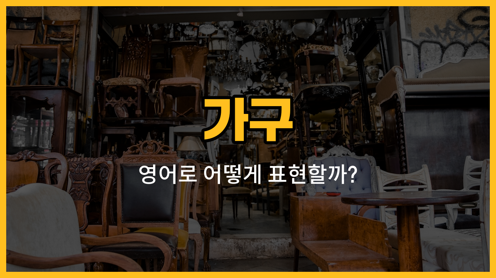

오늘은 집이나 학교에서 자주 볼 수 있는 가구 영어 단어들을 배워볼 거예요. 특히 "책걸상", "옷걸이", "침대 머리판", "화장대 의자", "신발장"처럼 꼭 필요한 가구들을 영어로 어떻게 말하는지, 그리고 예문까지 함께 알아봐요!

## 1. 책걸상 (School desk and chair)

학교에서 공부할 때 사용하는 책상과 의자를 영어로는 "[school](/blog/in-english/1090.school/) desk and chair"라고 해요.

### 🗣️ 발음
- 발음기호: /skuːl dɛsk ənd tʃɛr/
- 한국어 발음: 스쿨 데스크 앤드 체어

### 💭 관련 표현
- student desk: 학생용 책상
- classroom chair: 교실 의자

### 📝 예문으로 연습하기!
1. "Every student has a school desk and chair in the classroom."

   "모든 학생은 교실에 책걸상을 가지고 있어요."

2. "I put my [backpack](/blog/in-english/942.backpack/) under my school desk and chair."

   "저는 책걸상 아래에 가방을 두었어요."

## 2. 옷걸이 (Clothes hanger)

옷을 걸 때 사용하는 도구를 영어로 "clothes hanger"라고 해요.

### 🗣️ 발음
- 발음기호: /kloʊðz ˈhæŋər/
- 한국어 발음: 클로즈 행어

### 💭 관련 표현
- wooden hanger: 나무 옷걸이
- wire hanger: 철사 옷걸이

### 📝 예문으로 연습하기!
1. "Please hang your coat on the clothes hanger."

   "코트를 옷걸이에 걸어주세요."

2. "I [bought](/blog/in-english/1287.buy/) [new](/blog/in-english/1056.new/) clothes hangers for my closet."

   "옷장에 쓸 새 옷걸이를 샀어요."

## 3. 침대 머리판 (Headboard)

침대의 머리 쪽에 세워진 판을 영어로 "headboard"라고 해요.

### 🗣️ 발음
- 발음기호: /ˈhɛdˌbɔːrd/
- 한국어 발음: 헤드보드

### 💭 관련 표현
- wooden headboard: 나무 머리판
- padded headboard: 푹신한 머리판

### 📝 예문으로 연습하기!
1. "I leaned against the headboard while reading."

   "책을 읽으면서 침대 머리판에 기대었어요."

2. "The headboard [makes](/blog/in-english/1209.makes/) my bed [look](/blog/in-english/1078.look/) elegant."

   "침대 머리판 덕분에 침대가 고급스러워 보여요."

## 4. 화장대 의자 (Vanity stool)

화장대 앞에 두고 앉는 작은 의자를 영어로 "vanity stool"이라고 해요.

### 🗣️ 발음
- 발음기호: /ˈvænəti stuːl/
- 한국어 발음: 배너티 스툴

### 💭 관련 표현
- cushioned stool: 쿠션이 있는 의자
- wooden vanity stool: 나무 화장대 의자

### 📝 예문으로 연습하기!
1. "She sat on the vanity stool to do her makeup."

   "그녀는 화장대 의자에 앉아 화장을 했어요."

2. "The vanity stool matches the dressing table."

   "화장대 의자가 화장대와 잘 어울려요."

## 5. 신발장 (Shoe cabinet)

신발을 정리해서 보관하는 가구를 영어로 "shoe cabinet"이라고 해요.

### 🗣️ 발음
- 발음기호: /ʃuː ˈkæbɪnɪt/
- 한국어 발음: 슈 캐비닛

### 💭 관련 표현
- wooden shoe cabinet: 나무 신발장
- shoe rack: 신발 선반

### 📝 예문으로 연습하기!
1. "We keep all our shoes in the shoe cabinet by the door."

   "현관 옆 신발장에 신발을 모두 넣어둬요."

2. "The shoe cabinet [helps](/blog/in-english/1084.help/) keep the hallway tidy."

   "신발장이 복도를 깔끔하게 해줘요."

---

오늘 배운 가구 영어 단어들, 꼭 소리 내어 따라 읽어보세요! 집안이나 학교에서 직접 찾아보면서 연습하면 더 기억에 오래 남아요. 다음에도 실생활에 도움이 되는 영어 단어들로 다시 만나요~
