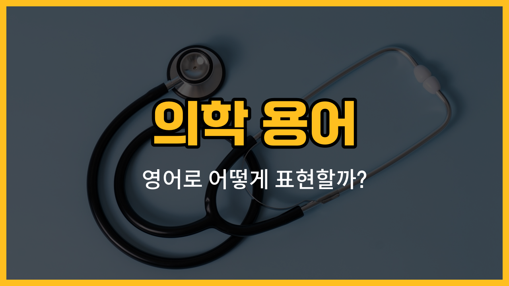

의학 관련 영어 단어는 일상생활에서도 자주 쓰이기 때문에 알아두면 정말 유용해요. 오늘은 병원이나 건강 관련 대화에서 꼭 필요한 의학 용어 다섯 가지를 영어로 배워볼게요. 각각의 단어 뜻과 예문을 통해 실제로 어떻게 쓰이는지도 함께 익혀봐요!

## 1. 진단 (Diagnosis)

진단은 의사가 환자의 건강 상태나 질병을 확인하기 위해 내리는 판단을 말해요.

### 🗣️ 발음
- 발음기호: /ˌdaɪ.əɡˈnoʊ.sɪs/
- 한국어 발음: 다이애그노우시스

### 💭 관련 표현
- early diagnosis: 조기 진단
- make a diagnosis: 진단을 내리다

### 📝 예문으로 연습하기!

1. "The doctor made a diagnosis after several tests."

   "의사 선생님이 여러 검사를 한 후 진단을 내렸어요."

2. "Early diagnosis can [save](/blog/in-english/293.save/) lives."

   "조기 진단이 생명을 구할 수 있어요."

## 2. 증상 (Symptom)

증상은 몸이 아플 때 나타나는 여러 가지 신호나 변화예요.

### 🗣️ 발음
- 발음기호: /ˈsɪmp.təm/
- 한국어 발음: 심텀

### 💭 관련 표현
- [cold](/blog/in-english/1410.cold/) symptoms: 감기 증상
- show symptoms: 증상을 보이다

### 📝 예문으로 연습하기!

1. "What symptoms do you have?"

   "어떤 증상이 있으세요?"

2. "A fever is a common symptom of the flu."

   "열은 독감의 흔한 증상이에요."

## 3. 질병 (Disease)

질병은 몸이나 마음에 생기는 각종 병을 의미해요.

### 🗣️ 발음
- 발음기호: /dɪˈziːz/
- 한국어 발음: 디지즈

### 💭 관련 표현
- chronic disease: 만성 질병
- infectious disease: 전염병

### 📝 예문으로 연습하기!

1. "Heart disease is a [serious](/blog/in-english/146.serious/) [health](/blog/in-english/1210.health/) [problem](/blog/in-english/1370.problem/)."

   "심장 질병은 심각한 건강 문제예요."

2. "Many diseases can be prevented."

   "많은 질병은 예방할 수 있어요."

## 4. 약 (Medicine)

약은 아플 때 먹거나 바르는 치료제예요.

### 🗣️ 발음
- 발음기호: /ˈmed.ɪ.sən/
- 한국어 발음: 메디슨

### 💭 관련 표현
- take medicine: 약을 먹다
- prescription medicine: 처방약

### 📝 예문으로 연습하기!

1. "Don’t forget to take your medicine."

   "약 먹는 거 잊지 마세요."

2. "This medicine will [help](/blog/in-english/1084.help/) reduce your pain."

   "이 약이 통증을 줄여줄 거예요."

## 5. 예방 (Prevention)

예방은 질병이나 문제가 생기지 않도록 미리 조심하고 준비하는 것을 말해요.

### 🗣️ 발음
- 발음기호: /prɪˈven.ʃən/
- 한국어 발음: 프리벤션

### 💭 관련 표현
- disease prevention: 질병 예방
- prevention is better than cure: 예방이 치료보다 낫다

### 📝 예문으로 연습하기!

1. "Prevention is better than cure."

   "예방이 치료보다 나아요."

2. "Washing your hands is [important](/blog/in-english/318.important/) for prevention."

   "손을 씻는 것이 예방에 중요해요."

---

오늘 배운 의학 용어 다섯 가지, 꼭 외워두세요! 병원이나 건강 관련 상황에서 정말 유용하게 쓸 수 있어요. 예문도 여러 번 따라 읽으면서 자연스럽게 익혀보세요. 다음에도 더 실용적인 영어 단어로 찾아올게요~
