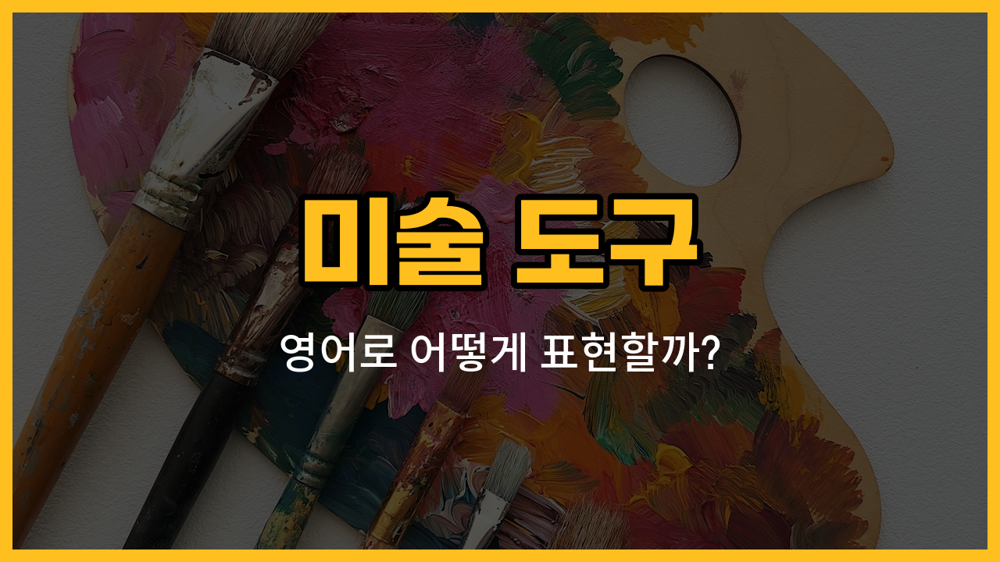

미술 시간이나 취미로 그림을 그릴 때 자주 쓰는 미술 도구들의 영어 표현을 알아볼까요? 오늘은 붓, 물감, 색연필, 크레용, 팔레트의 영어 단어와 예문을 함께 공부해봐요. 실제로 미술 수업이나 미술관, 혹은 해외에서 그림을 살 때도 유용하게 쓸 수 있어요!

## 1. 붓 (Brush)

붓은 그림을 그리거나 색칠할 때 사용하는 도구예요. 영어로는 brush라고 해요.

### 🗣️ 발음
- 발음기호: /brʌʃ/
- 한국어 발음: 브러쉬

### 💭 관련 표현
- paintbrush: 페인트용 붓
- soft brush: 부드러운 붓
- [clean](/blog/in-english/523.clean/) the brush: 붓을 닦다

### 📝 예문으로 연습하기!

1. "She used a small brush to paint the details."

   "그녀는 세부 묘사를 위해 작은 붓을 사용했어요."

2. "Don't [forget](/blog/in-english/023.forget/) to clean your brush after painting."

   "그림을 그린 후에는 꼭 붓을 닦아야 해요."

## 2. 물감 (Paint)

물감은 그림에 색을 입힐 때 쓰는 재료예요. 영어로는 paint라고 해요.

### 🗣️ 발음
- 발음기호: /peɪnt/
- 한국어 발음: 페인트

### 💭 관련 표현
- watercolor paint: 수채화 물감
- oil paint: 유화 물감
- mix the paint: 물감을 섞다

### 📝 예문으로 연습하기!

1. "I bought new paint for my [art](/blog/in-english/1393.art/) class."

   "미술 수업을 위해 새 물감을 샀어요."

2. "Mix the paint to create [different](/blog/in-english/1115.different/) colors."

   "다른 색을 만들려면 물감을 섞어보세요."

## 3. 색연필 (Colored pencil)

색연필은 색칠하거나 그림을 그릴 때 쓰는 연필이에요. 영어로는 colored pencil이라고 해요.

### 🗣️ 발음
- 발음기호: /ˈkʌl.ɚd ˈpɛn.səl/
- 한국어 발음: 컬러드 펜슬

### 💭 관련 표현
- set of colored pencils: 색연필 세트
- sharpen the colored pencil: 색연필을 깎다

### 📝 예문으로 연습하기!

1. "Can I [borrow](/blog/in-english/466.borrow/) a red colored pencil?"

   "빨간색 색연필 좀 빌릴 수 있을까요?"

2. "She drew a rainbow with colored pencils."

   "그녀는 색연필로 무지개를 그렸어요."

## 4. 크레용 (Crayon)

크레용은 어린이들이나 미술 시간에 자주 쓰는 색칠 도구예요. 영어로는 crayon이라고 해요.

### 🗣️ 발음
- 발음기호: /ˈkreɪ.ɑːn/
- 한국어 발음: 크레온

### 💭 관련 표현
- box of crayons: 크레용 한 상자
- wax crayon: 왁스 크레용

### 📝 예문으로 연습하기!

1. "Children [love](/blog/in-english/1074.love/) to draw with crayons."

   "아이들은 크레용으로 그림 그리는 걸 좋아해요."

2. "I [found](/blog/in-english/1083.find/) a blue crayon under the table."

   "테이블 아래에서 파란 크레용을 찾았어요."

## 5. 팔레트 (Palette)

팔레트는 여러 가지 물감을 섞을 때 쓰는 판이에요. 영어로는 palette라고 해요.

### 🗣️ 발음
- 발음기호: /ˈpæl.ət/
- 한국어 발음: 패럿

### 💭 관련 표현
- mixing palette: 물감 섞는 팔레트
- wooden palette: 나무 팔레트

### 📝 예문으로 연습하기!

1. "She mixed colors on her palette."

   "그녀는 팔레트 위에서 색을 섞었어요."

2. "Don't drop the palette!"

   "팔레트를 떨어뜨리지 마세요!"

---

오늘은 미술 시간에 꼭 필요한 도구들의 영어 표현을 배워봤어요. 단어와 예문을 여러 번 소리내어 읽으면서 익혀보세요! 다음에도 더 유용한 영어 단어로 찾아올게요~
