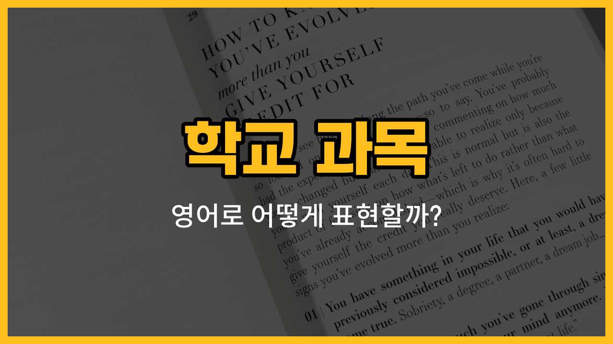

학교에서 배우는 여러 과목 중에서도 오늘은 역사, 지리, 도덕, 기술, 가정 이 다섯 가지 과목의 영어 표현을 알아볼 거예요. 각 과목의 영어 단어와 함께 발음, 의미, 그리고 실제로 쓸 수 있는 예문까지 준비했으니 천천히 따라와 보세요!

## 1. 역사 (History)

과거에 일어난 일이나 사건, 인물에 대해 배우는 과목이에요.

### 🗣️ 발음
- 발음기호: /ˈhɪstəri/
- 한국어 발음: 히스토리

### 💭 관련 표현
- world history: 세계사
- Korean history: 한국사
- history class: 역사 수업

### 📝 예문으로 연습하기!

1. "I have a history test tomorrow."

   "내일 역사 시험이 있어요."

2. "History is my favorite subject."

   "역사는 제가 가장 좋아하는 과목이에요."

## 2. 지리 (Geography)

세계의 지형, 기후, 나라 등에 대해 배우는 과목이에요.

### 🗣️ 발음
- 발음기호: /dʒiˈɑːɡrəfi/
- 한국어 발음: 지아그러피

### 💭 관련 표현
- physical geography: 자연 지리
- world geography: 세계 지리
- geography class: 지리 수업

### 📝 예문으로 연습하기!

1. "We studied [maps](/blog/in-english/535.map/) in geography today."

   "오늘 지리 시간에 지도에 대해 배웠어요."

2. "Geography [helps](/blog/in-english/1084.help/) us [understand](/blog/in-english/1312.understand/) the world."

   "지리를 배우면 세상을 이해하는 데 도움이 돼요."

## 3. 도덕 (Ethics)

옳고 그름, 바람직한 행동 등에 대해 배우는 과목이에요.

### 🗣️ 발음
- 발음기호: /ˈɛθɪks/
- 한국어 발음: 에띡스

### 💭 관련 표현
- ethics class: 도덕 수업
- business ethics: 기업 윤리
- personal ethics: 개인 윤리

### 📝 예문으로 연습하기!

1. "We talked about honesty in ethics class."

   "도덕 시간에 정직함에 대해 이야기했어요."

2. "Ethics teaches us how to be good [people](/blog/in-english/1057.people/)."

   "도덕은 우리가 좋은 사람이 되는 방법을 가르쳐줘요."

## 4. 기술 (Technology)

생활에 필요한 여러 가지 기술이나 기계, 컴퓨터 사용법 등을 배우는 과목이에요.

### 🗣️ 발음
- 발음기호: /tɛkˈnɑːlədʒi/
- 한국어 발음: 테크놀러지

### 💭 관련 표현
- information technology: 정보 기술
- technology class: 기술 수업
- modern technology: 현대 기술

### 📝 예문으로 연습하기!

1. "We learned how to use computers in technology class."

   "기술 시간에 컴퓨터를 사용하는 방법을 배웠어요."

2. "Technology is [changing](/blog/in-english/1133.change/) our [lives](/blog/in-english/1070.life/)."

   "기술이 우리의 삶을 바꾸고 있어요."

## 5. 가정 (Home Economics)

요리, 바느질, 가사 등 집안일과 관련된 실생활 기술을 배우는 과목이에요.

### 🗣️ 발음
- 발음기호: /hoʊm ˌɛkəˈnɑːmɪks/
- 한국어 발음: 홈 에코노믹스

### 💭 관련 표현
- [home](/blog/in-english/1076.home/) economics class: 가정 수업
- cooking class: 요리 수업
- sewing: 바느질

### 📝 예문으로 연습하기!

1. "We made cookies in home economics class."

   "가정 시간에 쿠키를 만들었어요."

2. "Home economics teaches useful life skills."

   "가정 과목은 유용한 생활 기술을 가르쳐줘요."

---

이렇게 학교에서 자주 배우는 과목 다섯 가지의 영어 단어와 예문을 알아봤어요! 오늘 배운 단어들을 소리내어 여러 번 읽어보고, 내 학교 생활에 맞게 예문도 바꿔보면 영어 실력이 쑥쑥 늘 거예요. 다음에도 더 유용한 영어 표현으로 찾아올게요~
