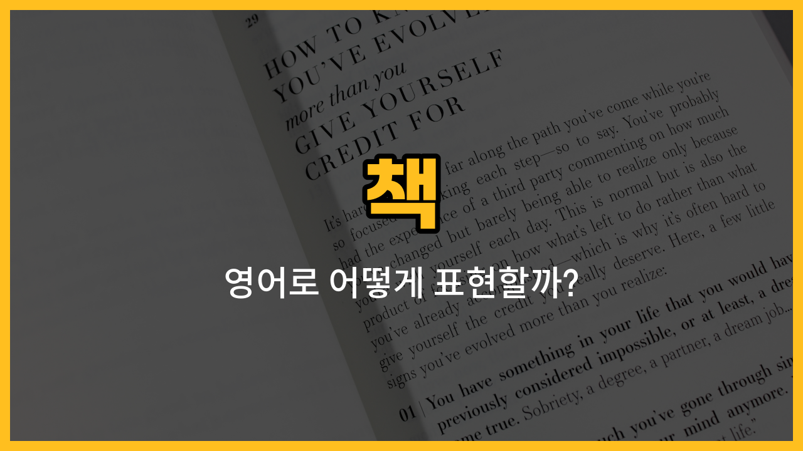

영어로 다양한 종류의 책을 어떻게 표현하는지 궁금하지 않으세요? 오늘은 일상에서 자주 접할 수 있는 책 종류인 동화책, 만화책, 사전, 요리책, 수필집의 영어 단어와 예문을 함께 배워볼 거예요. 각 단어의 발음, 뜻, 그리고 실제로 쓸 수 있는 문장까지 꼼꼼히 익혀보세요!

## 1. 동화책 (storybook)

아이들을 위해 재미있는 이야기가 담긴 책이에요. 상상력을 키워주고, 잠자기 전에 읽어주는 책으로도 유명하죠.

### 🗣️ 발음
- 발음기호: /ˈstɔːriˌbʊk/
- 한국어 발음: 스토리북

### 💭 관련 표현
- bedtime storybook: 잠자리 동화책
- picture storybook: 그림 동화책

### 📝 예문으로 연습하기!
1. "She reads a storybook to her son every night."

   "그녀는 매일 밤 아들에게 동화책을 읽어줘요."

2. "This storybook has beautiful illustrations."

   "이 동화책에는 아름다운 그림이 있어요."

## 2. 만화책 (comic book)

그림과 대사가 함께 있는 책으로, 어린이부터 어른까지 모두 즐길 수 있어요.

### 🗣️ 발음
- 발음기호: /ˈkɑːmɪk bʊk/
- 한국어 발음: 커믹 북

### 💭 관련 표현
- superhero comic [book](/blog/in-english/447.book/): 슈퍼히어로 만화책
- manga comic book: 일본 만화책

### 📝 예문으로 연습하기!
1. "I bought a new comic book yesterday."

   "어제 새 만화책을 샀어요."

2. "He [collects](/blog/in-english/350.collect/) [rare](/blog/in-english/832.rare/) comic books."

   "그는 희귀한 만화책을 모아요."

## 3. 사전 (dictionary)

단어나 표현의 뜻, 발음, 용례 등을 찾을 수 있는 책이에요. 영어 공부할 때 필수죠!

### 🗣️ 발음
- 발음기호: /ˈdɪkʃəˌnɛri/
- 한국어 발음: 딕셔네리

### 💭 관련 표현
- English dictionary: 영어 사전
- pocket dictionary: 휴대용 사전

### 📝 예문으로 연습하기!
1. "I use a dictionary to [look up](/blog/in-english/121.look-up/) new words."

   "새로운 단어를 찾으려고 사전을 사용해요."

2. "Do you have a Spanish dictionary?"

   "스페인어 사전 있어요?"

## 4. 요리책 (cookbook)

다양한 요리 레시피와 요리 방법이 담긴 책이에요. 집에서 새로운 요리를 시도할 때 유용하죠.

### 🗣️ 발음
- 발음기호: /ˈkʊkˌbʊk/
- 한국어 발음: 쿡북

### 💭 관련 표현
- [baking](/blog/in-english/462.bake/) cookbook: 베이킹 요리책
- [vegetarian](/blog/in-english/514.vegetarian/) cookbook: 채식 요리책

### 📝 예문으로 연습하기!
1. "She got a new cookbook for her birthday."

   "그녀는 생일 선물로 새 요리책을 받았어요."

2. "This cookbook has easy recipes for beginners."

   "이 요리책에는 초보자를 위한 쉬운 레시피가 있어요."

## 5. 수필집 (essay collection)

여러 가지 주제에 대한 짧은 글(수필)들이 모여 있는 책이에요. 작가의 생각이나 경험을 엿볼 수 있죠.

### 🗣️ 발음
- 발음기호: /ˈɛseɪ kəˈlɛkʃən/
- 한국어 발음: 에세이 컬렉션

### 💭 관련 표현
- personal essay collection: 개인 수필집
- travel essay collection: 여행 수필집

### 📝 예문으로 연습하기!
1. "I enjoy reading essay collections in my [free](/blog/in-english/1104.free/) time."

   "저는 여가 시간에 수필집 읽는 걸 즐겨요."

2. "The essay collection was written by a famous author."

   "그 수필집은 유명한 작가가 썼어요."

---

오늘은 다양한 종류의 책을 영어로 어떻게 표현하는지 배워봤어요. 오늘 배운 단어와 예문을 여러 번 소리내어 읽어보면 영어 실력이 쑥쑥 늘 거예요! 다음에도 더 유용한 영어 단어로 찾아올게요~
