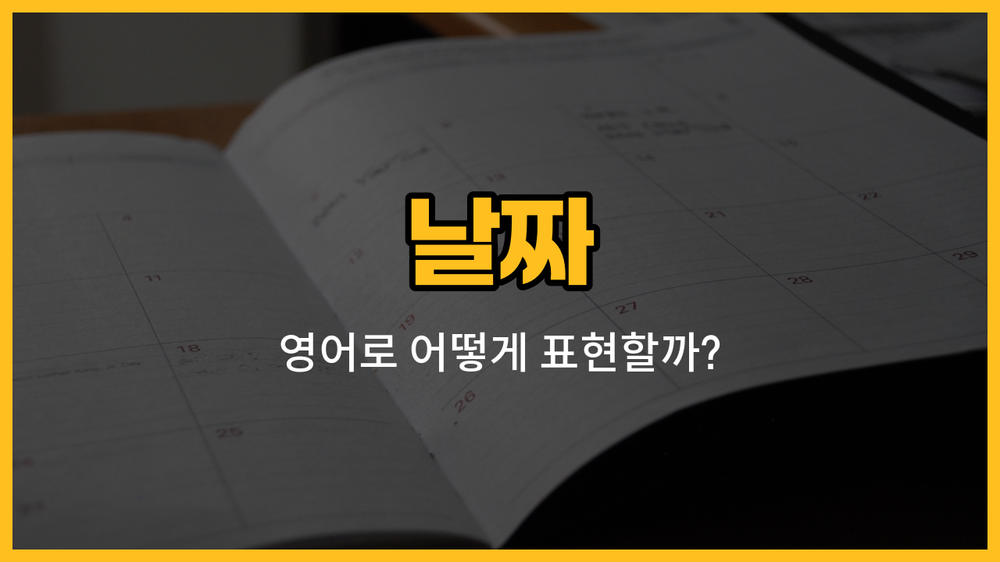

영어로 날짜를 표현할 때 자주 쓰는 단어들을 알아볼게요! 오늘, 어제, 내일처럼 일상에서 자주 사용하는 날짜 관련 단어들은 영어로도 정말 많이 쓰여요. 각각의 영어 표현과 발음, 그리고 예문까지 함께 익혀보세요.

## 1. 오늘 (today)

오늘은 영어로 "[today](/blog/in-english/1132.today/)"라고 해요. 지금 이 순간, 바로 오늘을 말할 때 쓰는 단어예요.

### 🗣️ 발음

- 발음기호: /təˈdeɪ/
- 한국어 발음: 투데이

### 💭 관련 표현

- today’s [weather](/blog/in-english/1437.weather/): 오늘 날씨
- today’s [plan](/blog/in-english/1449.plan/): 오늘 계획

### 📝 예문으로 연습하기!

1. "Today is my birthday."

   "오늘은 제 생일이에요."

2. "What are you doing today?"

   "오늘 뭐해요?"

## 2. 어제 (yesterday)

어제는 영어로 "yesterday"라고 해요. 바로 하루 전, 지난 하루를 나타내는 단어예요.

### 🗣️ 발음

- 발음기호: /ˈjestərdeɪ/
- 한국어 발음: 예스터데이

### 💭 관련 표현

- yesterday afternoon: 어제 오후
- yesterday’s [news](/blog/in-english/536.news/): 어제 뉴스

### 📝 예문으로 연습하기!

1. "I saw a movie yesterday."

   "어제 영화 봤어요."

2. "Did it [rain](/blog/in-english/1432.rain/) yesterday?"

   "어제 비 왔어요?"

## 3. 내일 (tomorrow)

내일은 영어로 "tomorrow"라고 해요. 오늘 다음에 오는 날, 미래의 하루를 나타내는 단어예요.

### 🗣️ 발음

- 발음기호: /təˈmɑːroʊ/
- 한국어 발음: 터마로우

### 💭 관련 표현

- tomorrow morning: 내일 아침
- see you tomorrow: 내일 봐요

### 📝 예문으로 연습하기!

1. "I have a test tomorrow."

   "내일 시험이 있어요."

2. "Let’s [meet](/blog/in-english/1417.meet/) tomorrow."

   "내일 만나요."

## 4. 모레 (the day after tomorrow)

모레는 영어로 "the day after tomorrow"라고 해요. 오늘 기준으로 이틀 뒤, 즉 내일의 다음 날이에요.

### 🗣️ 발음

- 발음기호: /ðə deɪ ˈæftər təˈmɑːroʊ/
- 한국어 발음: 더 데이 애프터 터마로우

### 💭 관련 표현

- the day after tomorrow morning: 모레 아침
- see you the day after tomorrow: 모레 봐요

### 📝 예문으로 연습하기!

1. "I will travel the day after tomorrow."

   "모레 여행 갈 거예요."

2. "The meeting is the day after tomorrow."

   "회의가 모레예요."

## 5. 그저께 (the day before yesterday)

그저께는 영어로 "the day before yesterday"라고 해요. 오늘 기준으로 이틀 전, 어제의 전날이에요.

### 🗣️ 발음

- 발음기호: /ðə deɪ bɪˈfɔːr ˈjestərdeɪ/
- 한국어 발음: 더 데이 비포어 예스터데이

### 💭 관련 표현

- the day before yesterday evening: 그저께 저녁
- since the day before yesterday: 그저께부터

### 📝 예문으로 연습하기!

1. "I finished the book the day before yesterday."

   "그저께 책을 다 읽었어요."

2. "She [arrived](/blog/in-english/403.arrive/) the day before yesterday."

   "그녀는 그저께 도착했어요."

---

이렇게 날짜와 관련된 영어 단어와 예문을 배워봤어요! 오늘 배운 표현들을 소리 내어 연습해 보세요. 날짜를 영어로 자연스럽게 말할 수 있을 거예요. 다음에도 더 유용한 영어 단어로 찾아올게요~
