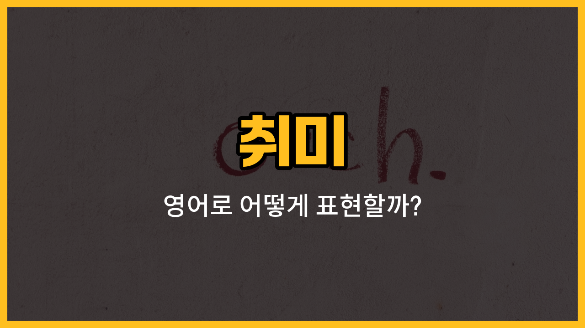

오늘은 일상에서 자주 이야기하는 대표적인 취미들을 영어로 어떻게 표현하는지 알아볼 거예요. 각 단어의 발음, 의미, 그리고 실제로 쓸 수 있는 예문까지 함께 공부해볼게요! 😊

## 1. 독서 (Reading)

책이나 잡지, 신문 등을 읽는 활동을 말해요. 영어로는 "Reading"이라고 해요.

### 🗣️ 발음
- 발음기호: /ˈriː.dɪŋ/
- 한국어 발음: 리딩

### 💭 관련 표현
- reading books: 책 읽기
- reading habit: 독서 습관

### 📝 예문으로 연습하기!

1. "I enjoy reading before bed."

   "저는 자기 전에 독서를 즐겨요."

2. "Reading [helps](/blog/in-english/1084.help/) me relax."

   "독서는 저를 편안하게 해줘요."

## 2. 운동 (Exercise)

건강을 위해 몸을 움직이는 모든 활동을 영어로 "[Exercise](/blog/in-english/1155.exercise/)"라고 해요.

### 🗣️ 발음
- 발음기호: /ˈek.sɚ.saɪz/
- 한국어 발음: 엑서사이즈

### 💭 관련 표현
- regular exercise: 규칙적인 운동
- do exercise: 운동하다

### 📝 예문으로 연습하기!

1. "I [try](/blog/in-english/1265.try/) to exercise every morning."

   "저는 매일 아침 운동하려고 해요."

2. "Exercise is good for your [health](/blog/in-english/1210.health/)."

   "운동은 건강에 좋아요."

## 3. 수영 (Swimming)

물에서 헤엄치는 활동으로, 영어로는 "Swimming"이라고 해요.

### 🗣️ 발음
- 발음기호: /ˈswɪm.ɪŋ/
- 한국어 발음: 스위밍

### 💭 관련 표현
- go swimming: 수영하러 가다
- swimming pool: 수영장

### 📝 예문으로 연습하기!

1. "I [love](/blog/in-english/1074.love/) swimming in the summer."

   "저는 여름에 수영하는 걸 정말 좋아해요."

2. "She goes swimming every weekend."

   "그녀는 주말마다 수영하러 가요."

## 4. 등산 (Hiking)

산이나 자연을 걸으며 즐기는 활동을 영어로는 "Hiking"이라고 해요.

### 🗣️ 발음
- 발음기호: /ˈhaɪ.kɪŋ/
- 한국어 발음: 하이킹

### 💭 관련 표현
- go hiking: 등산하러 가다
- hiking trail: 등산로

### 📝 예문으로 연습하기!

1. "We went hiking last weekend."

   "우리는 지난 주말에 등산 갔어요."

2. "Hiking is a great [way](/blog/in-english/1062.way/) to enjoy nature."

   "등산은 자연을 즐길 수 있는 좋은 방법이에요."

## 5. 요리 (Cooking)

음식을 만드는 활동을 영어로는 "Cooking"이라고 해요.

### 🗣️ 발음
- 발음기호: /ˈkʊk.ɪŋ/
- 한국어 발음: 쿠킹

### 💭 관련 표현
- cooking at home: 집에서 요리하기
- love cooking: 요리하는 것을 좋아하다

### 📝 예문으로 연습하기!

1. "I started cooking my own meals."

   "저는 제 음식을 직접 요리하기 시작했어요."

2. "Cooking is [fun](/blog/in-english/1376.fun/) and relaxing."

   "요리는 재미있고 마음이 편안해져요."

---

오늘 배운 취미 관련 영어 단어와 예문을 여러 번 소리 내어 연습해보세요! 여러분의 취미를 영어로 자연스럽게 말할 수 있게 될 거예요. 다음에도 더 유용한 단어로 만나요~
