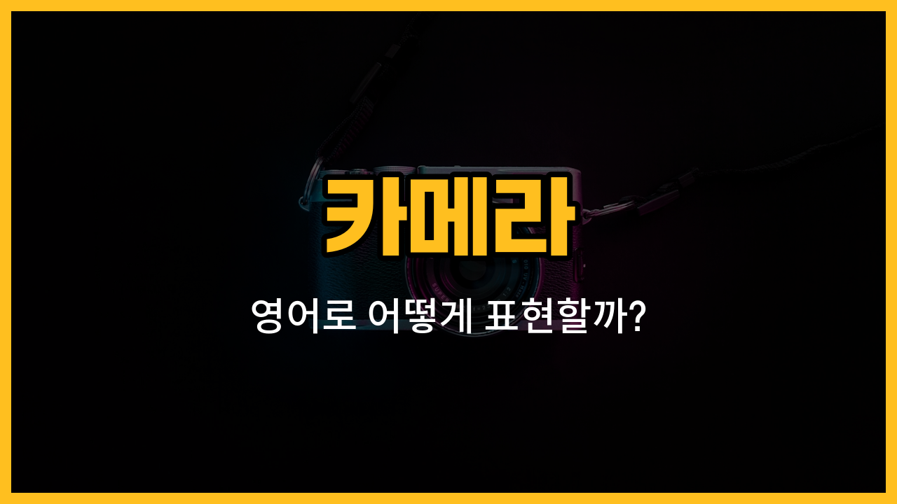

사진을 찍을 때 자주 듣게 되는 카메라 용어들을 영어로 어떻게 표현할까요? 오늘은 카메라를 사용할 때 꼭 알아야 하는 렌즈, 삼각대, 셔터, 플래시, 필름의 영어 단어와 함께 예문도 배워볼 거예요. 사진 촬영이나 여행에서 영어로 대화할 때 유용하게 쓸 수 있으니 꼭 익혀보세요!

## 1. 렌즈 (Lens)

렌즈는 빛을 모아 이미지를 만드는 투명한 유리나 플라스틱 조각이에요. 카메라에서 매우 중요한 부분이죠.

### 🗣️ 발음
- 발음기호: /lɛnz/
- 한국어 발음: 렌즈

### 💭 관련 표현
- camera lens: 카메라 렌즈
- [wide](/blog/in-english/410.wide/)-angle lens: 광각 렌즈
- zoom lens: 줌 렌즈

### 📝 예문으로 연습하기!

1. "I need a new lens for my camera."

   "카메라에 쓸 새 렌즈가 필요해요."

2. "This lens is great for landscape photos."

   "이 렌즈는 풍경 사진 찍기에 좋아요."

## 2. 삼각대 (Tripod)

삼각대는 카메라를 안정적으로 고정할 수 있게 해주는 도구예요. 흔들림 없이 사진을 찍을 때 꼭 필요하죠.

### 🗣️ 발음
- 발음기호: /ˈtraɪ.pɑːd/
- 한국어 발음: 트라이팟

### 💭 관련 표현
- camera tripod: 카메라 삼각대
- set up a tripod: 삼각대를 설치하다

### 📝 예문으로 연습하기!

1. "I set up my tripod before taking the photo."

   "사진을 찍기 전에 삼각대를 설치했어요."

2. "A tripod [helps](/blog/in-english/1084.help/) you take [clear](/blog/in-english/1495.clear/) pictures at night."

   "삼각대는 밤에 선명한 사진을 찍는 데 도움이 돼요."

## 3. 셔터 (Shutter)

셔터는 빛이 카메라 안으로 들어오게 열고 닫히는 장치예요. 셔터를 누르면 사진이 찍혀요.

### 🗣️ 발음
- 발음기호: /ˈʃʌtər/
- 한국어 발음: 셔터

### 💭 관련 표현
- shutter speed: 셔터 속도
- press the shutter: 셔터를 누르다

### 📝 예문으로 연습하기!

1. "Press the shutter to take a picture."

   "사진을 찍으려면 셔터를 누르세요."

2. "A fast shutter helps freeze [motion](/blog/in-english/1438.motion/)."

   "빠른 셔터는 움직임을 멈추게 해줘요."

## 4. 플래시 (Flash)

플래시는 어두운 곳에서 빛을 내어 사진을 밝게 찍을 수 있게 해주는 장치예요.

### 🗣️ 발음
- 발음기호: /flæʃ/
- 한국어 발음: 플래시

### 💭 관련 표현
- camera flash: 카메라 플래시
- [turn](/blog/in-english/1348.turn/) on the flash: 플래시를 켜다

### 📝 예문으로 연습하기!

1. "Don't [forget](/blog/in-english/023.forget/) to [turn on](/blog/in-english/310.turn-on/) the flash in the dark."

   "어두울 때는 플래시 켜는 걸 잊지 마세요."

2. "The flash made the photo much brighter."

   "플래시 덕분에 사진이 훨씬 밝아졌어요."

## 5. 필름 (Film)

필름은 옛날 카메라에서 사진을 저장하는 데 쓰던 얇은 플라스틱 재질의 롤이에요. 디지털 카메라와는 다르게 사진을 인화해야 볼 수 있어요.

### 🗣️ 발음
- 발음기호: /fɪlm/
- 한국어 발음: 필름

### 💭 관련 표현
- camera film: 카메라 필름
- develop film: 필름을 현상하다

### 📝 예문으로 연습하기!

1. "I bought a new roll of film for my camera."

   "카메라에 쓸 새 필름을 샀어요."

2. "You need to develop the film to see your photos."

   "사진을 보려면 필름을 현상해야 해요."

---

이렇게 카메라와 관련된 기본 영어 단어들을 배워봤어요. 오늘 배운 단어와 예문을 여러 번 소리내어 읽어보고, 실제로 사진을 찍으면서 영어로 말해보면 더 쉽게 익힐 수 있어요! 다음에도 더 유용한 영어 단어로 찾아올게요~
