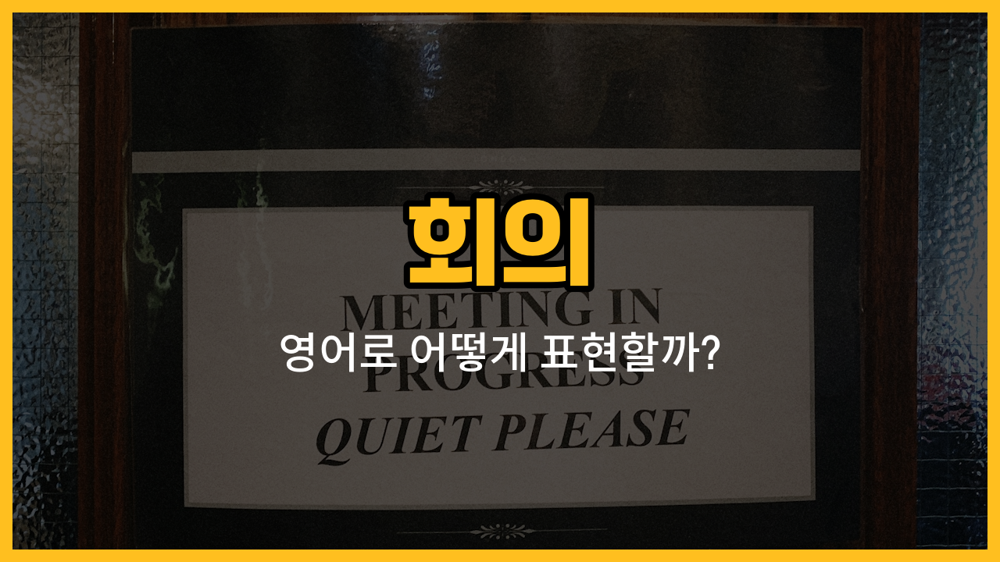

회사나 학교에서 자주 하는 '회의'와 관련된 영어 단어들을 알아볼게요. 오늘은 회의실([meeting](/blog/in-english/1417.meet/) room), 참석(attendance), 진행자(facilitator), 발표(presentation), 결론(conclusion)이라는 단어를 배워요. 각 단어의 발음과 예문까지 함께 익혀서 실제 회의 상황에서도 자연스럽게 사용할 수 있도록 해볼게요!

## 1. 회의실 (Meeting room)

회의를 진행하는 공간이에요. 영어로는 'meeting room'이라고 해요.

### 🗣️ 발음
- 발음기호: /ˈmiː.tɪŋ ruːm/
- 한국어 발음: 미팅 룸

### 💭 관련 표현
- book a meeting room: 회의실을 예약하다
- available meeting room: 사용 가능한 회의실

### 📝 예문으로 연습하기!
1. "Let’s meet in the meeting room on the second floor."

   "2층 회의실에서 만나요."

2. "Is the meeting room available at 3 p.m.?"

   "회의실이 오후 3시에 비어있나요?"

## 2. 참석 (Attendance)

회의에 누가 왔는지, 참여한 사람의 수를 말해요. 영어로는 'attendance'라고 해요.

### 🗣️ 발음
- 발음기호: /əˈten.dəns/
- 한국어 발음: 어텐던스

### 💭 관련 표현
- [check](/blog/in-english/1358.check/) attendance: 참석을 확인하다
- attendance list: 참석자 명단

### 📝 예문으로 연습하기!
1. "We need to check attendance before [starting](/blog/in-english/1127.start/) the meeting."

   "회의 시작 전에 참석을 확인해야 해요."

2. "Her attendance at meetings is always [perfect](/blog/in-english/413.perfect/)."

   "그녀는 회의에 항상 빠짐없이 참석해요."

## 3. 진행자 (Facilitator)

회의를 원활하게 이끌어 가는 사람을 말해요. 영어로는 'facilitator'라고 해요.

### 🗣️ 발음
- 발음기호: /fəˈsɪl.ɪ.teɪ.tər/
- 한국어 발음: 퍼실리테이터

### 💭 관련 표현
- [main](/blog/in-english/1404.main/) facilitator: 주 진행자
- [act](/blog/in-english/1138.act/) as a facilitator: 진행자 역할을 하다

### 📝 예문으로 연습하기!
1. "The facilitator kept the meeting on track."

   "진행자가 회의를 잘 이끌었어요."

2. "Who will be the facilitator for today’s meeting?"

   "오늘 회의 진행자는 누가 될까요?"

## 4. 발표 (Presentation)

회의에서 정보를 전달하거나 설명할 때 하는 것을 말해요. 영어로는 'presentation'이라고 해요.

### 🗣️ 발음
- 발음기호: /ˌprez.ənˈteɪ.ʃən/
- 한국어 발음: 프레젠테이션

### 💭 관련 표현
- give a presentation: 발표하다
- presentation slides: 발표 자료

### 📝 예문으로 연습하기!
1. "She gave a great presentation about the new project."

   "그녀가 새 프로젝트에 대해 멋지게 발표했어요."

2. "Can you send me your presentation slides?"

   "발표 자료를 저에게 보내줄 수 있나요?"

## 5. 결론 (Conclusion)

회의의 마지막에 내리는 최종적인 생각이나 결과를 말해요. 영어로는 'conclusion'이라고 해요.

### 🗣️ 발음
- 발음기호: /kənˈkluː.ʒən/
- 한국어 발음: 컨클루전

### 💭 관련 표현
- draw a conclusion: 결론을 내리다
- in conclusion: 결론적으로

### 📝 예문으로 연습하기!
1. "Let’s discuss the conclusion of today’s meeting."

   "오늘 회의의 결론을 이야기해봐요."

2. "In conclusion, we [agreed](/blog/in-english/342.agree/) to start the project next month."

   "결론적으로, 우리는 다음 달에 프로젝트를 시작하기로 했어요."

---

오늘 배운 회의 관련 영어 단어와 예문을 여러 번 소리 내어 연습해보세요! 실제 회의 상황에서 자신있게 사용할 수 있을 거예요. 다음에도 더 실용적인 영어 단어로 찾아올게요~
