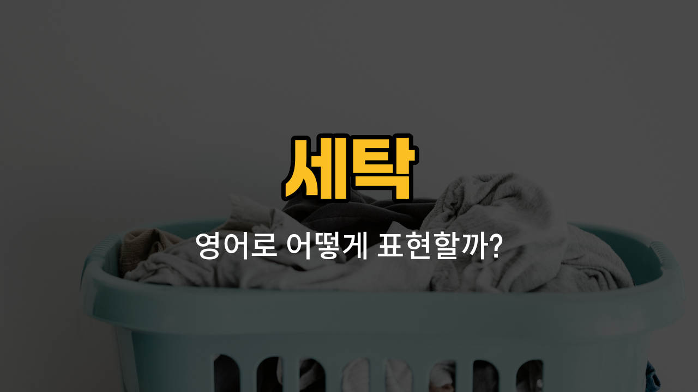

세탁을 할 때 자주 쓰이는 기본 동작들을 영어로 어떻게 표현할까요? 오늘은 삶다, 빨다, 널다, 개다, 탈수하다와 관련된 영어 단어와 예문을 같이 배워볼 거예요. 세탁을 직접 하거나 해외에서 코인 세탁소를 이용할 때 꼭 필요한 표현들이니, 함께 익혀봐요!

## 1. 삶다 (boil (laundry))

옷이나 수건을 깨끗하게 만들기 위해 끓는 물에 넣고 삶는 것을 말해요. 주로 흰 옷이나 아기 옷을 세균 없이 깨끗하게 하고 싶을 때 사용해요.

### 🗣️ 발음
- 발음기호: /bɔɪl/
- 한국어 발음: 보일

### 💭 관련 표현
- boil the laundry: 빨래를 삶다
- boiled clothes: 삶은 옷

### 📝 예문으로 연습하기!

1. "My grandmother [used to](/blog/in-english/143.used-to/) boil laundry to make it really [clean](/blog/in-english/523.clean/)."

   "할머니는 빨래를 정말 깨끗하게 하시려고 삶았어요."

2. "You should boil baby clothes to remove germs."

   "아기 옷은 세균을 없애기 위해 삶아야 해요."

## 2. 빨다 (wash (laundry))

옷이나 이불 등 빨래를 물과 세제로 깨끗하게 닦아내는 것을 말해요. 세탁기의 가장 기본적인 기능이기도 해요.

### 🗣️ 발음
- 발음기호: /wɑʃ/
- 한국어 발음: 워시

### 💭 관련 표현
- wash the laundry: 빨래를 하다
- hand wash: 손빨래하다

### 📝 예문으로 연습하기!

1. "I need to wash my clothes [today](/blog/in-english/1132.today/)."

   "오늘은 옷을 빨아야 해요."

2. "She washes her uniforms every weekend."

   "그녀는 주말마다 교복을 빨아요."

## 3. 널다 (hang (laundry))

빨래한 옷을 바람이 잘 통하는 곳에 널어서 말리는 것을 말해요. 건조대나 빨랫줄에 옷을 걸 때 쓰는 표현이에요.

### 🗣️ 발음
- 발음기호: /hæŋ/
- 한국어 발음: 행

### 💭 관련 표현
- [hang the laundry](/blog/in-english/029.hang-the-laundry/): 빨래를 널다
- hang clothes to dry: 옷을 말리려고 널다

### 📝 예문으로 연습하기!

1. "Don’t [forget](/blog/in-english/023.forget/) to hang the laundry after washing."

   "빨래한 후에 널어 놓는 거 잊지 마세요."

2. "I usually hang my clothes on the balcony."

   "저는 보통 베란다에 옷을 널어요."

## 4. 개다 (fold (laundry))

말린 옷이나 수건 등을 가지런히 접어서 정리하는 것을 말해요. 옷장이 깔끔해지는 비결이죠!

### 🗣️ 발음
- 발음기호: /foʊld/
- 한국어 발음: 폴드

### 💭 관련 표현
- fold the laundry: 빨래를 개다
- fold clothes: 옷을 개다

### 📝 예문으로 연습하기!

1. "Can you [help](/blog/in-english/1084.help/) me fold the laundry?"

   "빨래 개는 것 좀 도와줄래요?"

2. "I [like](/blog/in-english/1053.like/) to fold my shirts neatly."

   "저는 셔츠를 깔끔하게 개는 걸 좋아해요."

## 5. 탈수하다 (spin-dry)

빨래를 한 후에 물기를 빼내기 위해 세탁기에서 빠르게 돌리는 과정을 말해요. 건조 전에 꼭 필요한 단계예요.

### 🗣️ 발음
- 발음기호: /spɪn draɪ/
- 한국어 발음: 스핀 드라이

### 💭 관련 표현
- spin-dry the laundry: 빨래를 탈수하다
- spin-dry cycle: 탈수 코스

### 📝 예문으로 연습하기!

1. "Don’t forget to spin-dry the laundry before hanging it."

   "빨래를 널기 전에 탈수하는 것 잊지 마세요."

2. "The washing machine can spin-dry your clothes quickly."

   "세탁기가 옷을 빠르게 탈수해줘요."

---

오늘은 세탁과 관련된 대표적인 동작들의 영어 표현을 배워봤어요! 실제 상황에서 직접 써보면서 익혀보세요. 다음에도 더 유용한 생활 영어로 찾아올게요~
