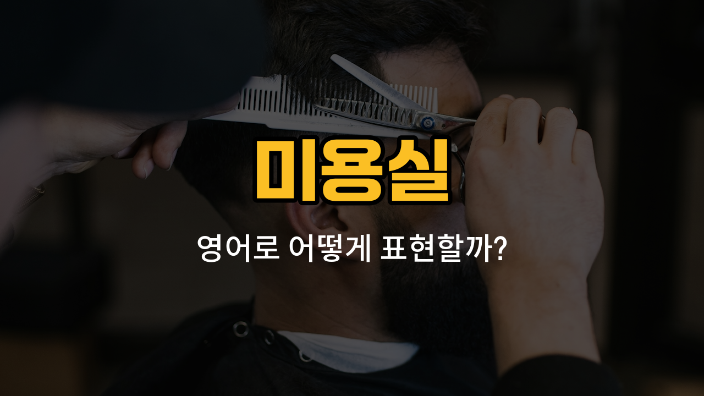

미용실에서 자주 쓰는 영어 단어들을 알아볼까요? 오늘은 머리카락, 이발, 염색, 펌, 드라이와 관련된 실용 영어 표현들을 배워볼 거예요. 각 단어의 발음, 의미, 예문도 함께 익혀보세요!

## 1. 머리카락 (Hair)

머리에서 자라는 털을 영어로는 hair라고 해요. 머리카락 전체나 한 올을 모두 hair로 표현할 수 있어요.

### 🗣️ 발음

- 발음기호: /her/
- 한국어 발음: 헤어

### 💭 관련 표현

- [long](/blog/in-english/1077.long/) hair: 긴 머리카락
- short hair: 짧은 머리카락
- curly hair: 곱슬머리

### 📝 예문으로 연습하기!

1. "Your hair [looks](/blog/in-english/1466.looks/) really [nice](/blog/in-english/1499.nice/) today."

   "오늘 머리카락이 정말 예뻐 보여요."

2. "She has very long hair."

   "그녀는 머리카락이 아주 길어요."

## 2. 이발 (Haircut)

머리카락을 자르는 것을 영어로 haircut이라고 해요. 이발소나 미용실에서 자주 쓰는 단어예요.

### 🗣️ 발음

- 발음기호: /ˈherˌkʌt/
- 한국어 발음: 헤어컷

### 💭 관련 표현

- get a haircut: 머리를 자르다
- a short haircut: 짧은 이발
- trim: 다듬다

### 📝 예문으로 연습하기!

1. "I need a haircut before the weekend."

   "주말 전에 이발을 해야겠어요."

2. "Did you get a new haircut?"

   "새로 머리 잘랐어요?"

## 3. 염색 (Dye)

머리카락 색을 바꾸는 것을 영어로 dye라고 해요. 보통 hair dye(염색약)라고도 해요.

### 🗣️ 발음

- 발음기호: /daɪ/
- 한국어 발음: 다이

### 💭 관련 표현

- dye hair: 머리카락을 염색하다
- hair dye: 염색약
- blonde dye: 금발 염색약

### 📝 예문으로 연습하기!

1. "She [wants](/blog/in-english/1060.want/) to dye her hair red."

   "그녀는 머리카락을 빨간색으로 염색하고 싶어 해요."

2. "What color dye do you want to use?"

   "어떤 색으로 염색하고 싶어요?"

## 4. 펌 (Perm)

머리카락을 곱슬거리거나 웨이브를 주는 시술을 영어로 perm이라고 해요.

### 🗣️ 발음

- 발음기호: /pɜːrm/
- 한국어 발음: 펌

### 💭 관련 표현

- get a perm: 파마하다
- curly perm: 곱슬펌
- straight perm: 매직펌

### 📝 예문으로 연습하기!

1. "I'm [thinking](/blog/in-english/1059.think/) about getting a perm."

   "저는 펌을 할까 생각 중이에요."

2. "Her perm looks really natural."

   "그녀의 펌이 정말 자연스러워 보여요."

## 5. 드라이 (Blow-dry)

머리카락을 말리거나 스타일링할 때 쓰는 드라이를 영어로 blow-dry라고 해요.

### 🗣️ 발음

- 발음기호: /ˈbloʊˌdraɪ/
- 한국어 발음: 블로우 드라이

### 💭 관련 표현

- blow-dry hair: 머리를 드라이하다
- quick blow-dry: 빠른 드라이
- blow-dry style: 드라이 스타일

### 📝 예문으로 연습하기!

1. "Can you blow-dry my hair straight?"

   "제 머리를 곧게 드라이해 줄 수 있어요?"

2. "I [love](/blog/in-english/1074.love/) the [way](/blog/in-english/1062.way/) they blow-dry my hair at the salon."

   "미용실에서 머리 드라이해주는 게 정말 좋아요."

---

오늘 배운 미용실 단어들과 예문들을 반복해서 연습해보세요! 실제 미용실에서 영어로 말할 때 훨씬 자신감이 생길 거예요. 다음에도 더 유용한 영어 단어로 만나요!
