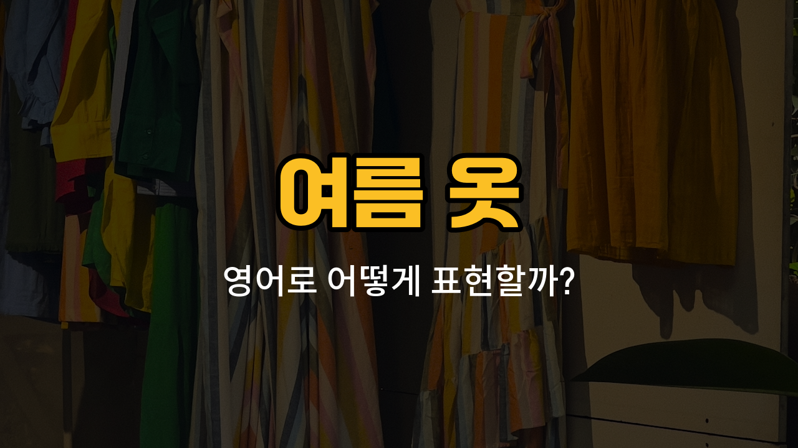

여름이 다가오면 가볍고 시원한 옷차림이 필요하죠! 오늘은 여름에 자주 입는 옷들을 영어로 어떻게 표현하는지 배워볼 거예요. 각 단어의 발음, 뜻, 그리고 자연스러운 예문까지 함께 익혀보세요.

## 1. 티셔츠 (T-shirt)

가장 기본적인 여름 옷 중 하나로, 반팔에 편하게 입을 수 있는 상의예요.

### 🗣️ 발음
- 발음기호: /ˈtiː ʃɜːrt/
- 한국어 발음: 티셔츠

### 💭 관련 표현
- [white](/blog/in-english/1236.white/) T-shirt: 흰색 티셔츠
- graphic T-shirt: 그림이 있는 티셔츠

### 📝 예문으로 연습하기!

1. "I bought a new T-shirt for summer."

   "여름을 위해 새 티셔츠를 샀어요."

2. "This T-shirt is very comfortable."

   "이 티셔츠는 정말 편해요."

## 2. 긴팔 셔츠 (Long-sleeved shirt)

팔이 긴 셔츠로, 햇볕을 가리거나 선선한 날씨에 입기 좋아요.

### 🗣️ 발음
- 발음기호: /lɔːŋ sliːvd ʃɜːrt/
- 한국어 발음: 롱슬리브드 셔츠

### 💭 관련 표현
- striped [long](/blog/in-english/1077.long/)-sleeved shirt: 줄무늬 긴팔 셔츠
- cotton long-sleeved shirt: 면 긴팔 셔츠

### 📝 예문으로 연습하기!

1. "She wore a long-sleeved shirt to protect her skin from the sun."

   "그녀는 햇볕에 피부를 보호하려고 긴팔 셔츠를 입었어요."

2. "I need a [light](/blog/in-english/1373.light/) long-sleeved shirt for cool [evenings](/blog/in-english/1450.evening/)."

   "저녁에 시원할 때 입을 가벼운 긴팔 셔츠가 필요해요."

## 3. 민소매티 (Sleeveless shirt)

팔이 없는 시원한 상의로, 더운 여름에 많이 입어요.

### 🗣️ 발음
- 발음기호: /ˈsliːvləs ʃɜːrt/
- 한국어 발음: 슬리브리스 셔츠

### 💭 관련 표현
- white sleeveless shirt: 흰색 민소매티
- sporty sleeveless shirt: 운동용 민소매티

### 📝 예문으로 연습하기!

1. "He likes to wear a sleeveless shirt when it's hot."

   "날씨가 더울 때 그는 민소매티를 입는 걸 좋아해요."

2. "I [packed](/blog/in-english/301.pack/) a sleeveless shirt for the trip."

   "여행을 위해 민소매티를 챙겼어요."

## 4. 청바지 (Jeans)

여름에도 많이 입는 데님 소재의 바지예요. 다양한 스타일로 코디할 수 있어요.

### 🗣️ 발음
- 발음기호: /dʒiːnz/
- 한국어 발음: 진즈

### 💭 관련 표현
- skinny jeans: 스키니진
- ripped jeans: 찢어진 청바지

### 📝 예문으로 연습하기!

1. "I wear jeans almost every day."

   "저는 거의 매일 청바지를 입어요."

2. "These jeans go well with any shirt."

   "이 청바지는 어떤 셔츠와도 잘 어울려요."

## 5. 슬랙스 (Slacks)

정장 느낌이 나는 얇고 편안한 바지예요. 여름에도 시원하게 입을 수 있어요.

### 🗣️ 발음
- 발음기호: /slæks/
- 한국어 발음: 슬랙스

### 💭 관련 표현
- [black](/blog/in-english/1217.black/) slacks: 검은색 슬랙스
- linen slacks: 린넨 슬랙스

### 📝 예문으로 연습하기!

1. "He wore slacks to the [office](/blog/in-english/1379.office/)."

   "그는 사무실에 슬랙스를 입고 갔어요."

2. "Slacks are comfortable for summer work."

   "슬랙스는 여름에 일할 때 편해요."

---

오늘은 여름에 자주 입는 옷들의 영어 표현을 배워봤어요! 오늘 배운 단어와 예문을 여러 번 소리 내어 연습해보세요. 다음에도 실생활에 꼭 필요한 영어 단어로 찾아올게요~
