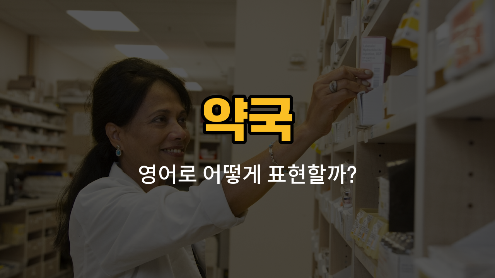

약국에 가면 자주 볼 수 있는 기본적인 약품들의 영어 표현을 알아볼까요? 오늘은 감기약, 진통제, 해열제, 소화제, 연고의 영어 단어와 함께 발음, 관련 표현, 예문까지 함께 공부해볼 거예요. 실제로 약국에서 필요한 상황에 바로 쓸 수 있는 표현들이니 꼭 익혀두세요!

## 1. 감기약 (cold medicine)

감기에 걸렸을 때 복용하는 약이에요. 기침, 콧물, 목 아픔 등을 완화해줘요.

### 🗣️ 발음
- 발음기호: /koʊld ˈmɛdəsən/
- 한국어 발음: 콜드 메디슨

### 💭 관련 표현
- over-the-counter cold [medicine](/blog/in-english/567.medicine/): 일반 감기약
- liquid cold medicine: 시럽 형태의 감기약
- cold medicine for [children](/blog/in-english/1418.child/): 어린이용 감기약

### 📝 예문으로 연습하기!

1. "Can I get some cold medicine for my [sore throat](/blog/in-english/077.sore-throat/)?"

   "목이 아픈데 감기약 좀 살 수 있을까요?"

2. "This cold medicine [makes](/blog/in-english/1209.makes/) me sleepy."

   "이 감기약을 먹으면 졸려요."

## 2. 진통제 (painkiller)

두통, 치통, 근육통 등 다양한 통증을 완화하는 데 쓰는 약이에요.

### 🗣️ 발음
- 발음기호: /ˈpeɪnˌkɪlər/
- 한국어 발음: 페인킬러

### 💭 관련 표현
- strong painkiller: 강한 진통제
- take a painkiller: 진통제를 복용하다
- prescription painkiller: 처방 진통제

### 📝 예문으로 연습하기!

1. "I took a painkiller for my headache."

   "두통 때문에 진통제를 먹었어요."

2. "Do you have any painkillers without aspirin?"

   "아스피린이 안 들어간 진통제 있어요?"

## 3. 해열제 (fever reducer)

열이 날 때 체온을 내려주는 약이에요.

### 🗣️ 발음
- 발음기호: /ˈfiːvər rɪˈduːsər/
- 한국어 발음: 피버 리듀서

### 💭 관련 표현
- [children](/blog/in-english/1226.children/)’s fever reducer: 어린이용 해열제
- liquid fever reducer: 시럽형 해열제
- take a fever reducer: 해열제를 먹다

### 📝 예문으로 연습하기!

1. "He gave his son a fever reducer."

   "그는 아들에게 해열제를 먹였어요."

2. "You should take a fever reducer if your temperature is [high](/blog/in-english/1069.high/)."

   "열이 높으면 해열제를 먹어야 해요."

## 4. 소화제 (digestive medicine)

소화가 잘 안 될 때 먹는 약으로, 속이 더부룩하거나 소화가 느릴 때 도움이 돼요.

### 🗣️ 발음
- 발음기호: /daɪˈdʒɛstɪv ˈmɛdəsən/
- 한국어 발음: 다이제스티브 메디슨

### 💭 관련 표현
- chewable digestive medicine: 씹어 먹는 소화제
- herbal digestive medicine: 한방 소화제
- take digestive medicine: 소화제를 먹다

### 📝 예문으로 연습하기!

1. "I need some digestive medicine after [eating](/blog/in-english/1257.eating/) too much."

   "너무 많이 먹어서 소화제가 필요해요."

2. "Do you have any digestive medicine for children?"

   "어린이용 소화제 있어요?"

## 5. 연고 (ointment)

상처, 화상, 피부 트러블 등에 바르는 약이에요. 바르는 형태로 피부에 직접 사용해요.

### 🗣️ 발음
- 발음기호: /ˈɔɪntmənt/
- 한국어 발음: 오인트먼트

### 💭 관련 표현
- antibiotic ointment: 항생제 연고
- burn ointment: 화상 연고
- apply ointment: 연고를 바르다

### 📝 예문으로 연습하기!

1. "Apply this ointment to the cut twice a day."

   "상처에 이 연고를 하루에 두 번 바르세요."

2. "Do you have ointment for skin rashes?"

   "피부 발진에 바르는 연고 있어요?"

---

오늘은 약국에서 자주 쓰이는 기본 약품들의 영어 표현을 배워봤어요. 실제로 약국이나 병원에서 필요할 때 당황하지 않도록, 오늘 배운 단어와 예문을 여러 번 소리내어 연습해보세요! 다음에도 더 유용한 영어 단어로 찾아올게요~
