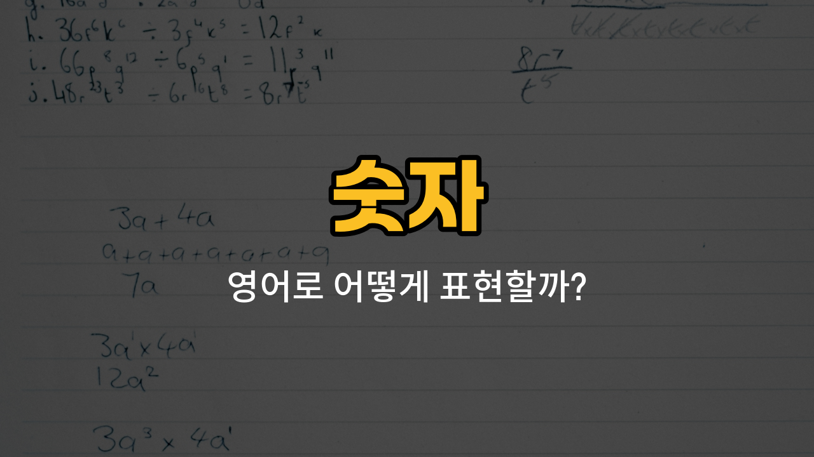

영어에서 숫자를 읽고 쓸 줄 아는 것은 아주 기본이지만, 실제 대화나 시험에서 자주 헷갈릴 수 있어요. 오늘은 0, 100, 13, 14, 15의 영어 표현과 발음, 그리고 예문을 함께 배워볼게요! 숫자 영어 단어를 정확히 익혀두면 전화번호, 가격, 나이, 날짜 등 다양한 상황에서 자신 있게 말할 수 있어요.

## 1. 0 (Zero)

숫자 0은 영어로 "zero"라고 해요. 영어에서 전화번호나 온도, 점수 등에서 자주 사용돼요.

### 🗣️ 발음

- 발음기호: /ˈzɪə.roʊ/
- 한국어 발음: 지로

### 💭 관련 표현

- zero degrees: 영도
- zero [points](/blog/in-english/1136.point/): 0점

### 📝 예문으로 연습하기!

1. "The temperature is zero degrees today."

   "오늘 온도가 0도예요."

2. "He got zero points on the test."

   "그는 시험에서 0점을 받았어요."

## 2. 100 (One hundred)

숫자 100은 영어로 "one hundred"라고 해요. 백 단위의 숫자를 말할 때 기본적으로 사용돼요.

### 🗣️ 발음

- 발음기호: /wʌn ˈhʌn.drəd/
- 한국어 발음: 원 헌드레드

### 💭 관련 표현

- one hundred dollars: 100달러
- one hundred people: 100명

### 📝 예문으로 연습하기!

1. "There are one hundred [students](/blog/in-english/1500.students/) in the class."

   "그 반에는 학생이 100명 있어요."

2. "I [saved](/blog/in-english/293.save/) one hundred dollars last month."

   "저는 지난달에 100달러를 모았어요."

## 3. 13 (Thirteen)

숫자 13은 영어로 "thirteen"이라고 해요. 10대 숫자 중에서 10(ten) 다음에 오는 숫자예요.

### 🗣️ 발음

- 발음기호: /ˌθɜːrˈtiːn/
- 한국어 발음: 써틴

### 💭 관련 표현

- thirteen years [old](/blog/in-english/1086.old/): 13살
- thirteen floors: 13층

### 📝 예문으로 연습하기!

1. "My cousin is thirteen years old."

   "제 사촌은 13살이에요."

2. "There are thirteen cookies in the box."

   "상자 안에 쿠키가 13개 있어요."

## 4. 14 (Fourteen)

숫자 14는 영어로 "fourteen"이라고 해요. 13 다음에 오는 숫자예요.

### 🗣️ 발음

- 발음기호: /ˌfɔːrˈtiːn/
- 한국어 발음: 포틴

### 💭 관련 표현

- fourteen days: 14일
- fourteen students: 14명 학생

### 📝 예문으로 연습하기!

1. "We have fourteen days [left](/blog/in-english/402.leave/) for the trip."

   "여행까지 14일 남았어요."

2. "Fourteen students joined the club."

   "14명의 학생이 동아리에 가입했어요."

## 5. 15 (Fifteen)

숫자 15는 영어로 "fifteen"이라고 해요. 14 다음에 오는 숫자예요.

### 🗣️ 발음

- 발음기호: /ˌfɪfˈtiːn/
- 한국어 발음: 피프틴

### 💭 관련 표현

- fifteen [minutes](/blog/in-english/1365.minutes/): 15분
- fifteen people: 15명

### 📝 예문으로 연습하기!

1. "Please [wait for](/blog/in-english/377.wait-for/) fifteen minutes."

   "15분만 기다려 주세요."

2. "There are fifteen people in the room."

   "방 안에 15명이 있어요."

---

오늘 배운 숫자 영어 단어들을 꼭 소리내어 여러 번 읽어보세요! 일상에서 숫자를 영어로 말하는 연습을 자주 하면, 더 자연스럽게 쓸 수 있게 돼요. 다음에 더 유용한 영어 단어로 다시 만나요~
