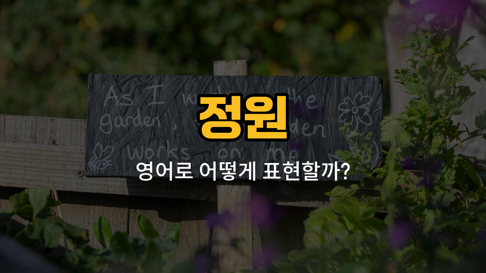

정원에서 자주 볼 수 있는 영어 단어들을 배워볼까요? 오늘은 꽃, 나무, 잔디, 화분, 덩굴과 같이 정원에서 자주 사용하는 단어들을 영어로 어떻게 말하는지 알아보고, 각각의 뜻과 예문도 함께 살펴볼 거예요. 정원 가꾸기나 자연을 영어로 이야기할 때 꼭 필요한 단어들이니 천천히 따라해보세요!

## 1. 꽃 (Flower)

정원을 예쁘게 꾸며주는 다양한 색깔과 향기의 식물을 말해요.

### 🗣️ 발음

- 발음기호: /ˈflaʊ.ər/
- 한국어 발음: 플라워

### 💭 관련 표현

- wild flower: 들꽃
- bouquet of flowers: 꽃다발
- flower garden: 꽃밭

### 📝 예문으로 연습하기!

1. "She picked a beautiful flower from the garden."

   "그녀는 정원에서 예쁜 꽃을 땄어요."

2. "I [love](/blog/in-english/1074.love/) the smell of fresh flowers."

   "저는 신선한 꽃 향기를 정말 좋아해요."

## 2. 나무 (Tree)

정원이나 공원에서 볼 수 있는 큰 식물로, 줄기와 가지, 잎이 있어요.

### 🗣️ 발음

- 발음기호: /triː/
- 한국어 발음: 트리

### 💭 관련 표현

- fruit tree: 과일나무
- tall tree: 키 큰 나무
- plant a tree: 나무를 심다

### 📝 예문으로 연습하기!

1. "There is a big tree in front of my [house](/blog/in-english/1088.house/)."

   "우리 집 앞에는 큰 나무가 있어요."

2. "Birds are singing in the tree."

   "나무에서 새들이 노래하고 있어요."

## 3. 잔디 (Grass)

정원이나 공원에 바닥을 덮고 있는 푸른 식물이에요. 밟아도 괜찮아서 놀기에도 좋아요.

### 🗣️ 발음

- 발음기호: /ɡræs/
- 한국어 발음: 그라스

### 💭 관련 표현

- [cut](/blog/in-english/1427.cut/) the grass: 잔디를 깎다
- green grass: 푸른 잔디
- grass lawn: 잔디밭

### 📝 예문으로 연습하기!

1. "The [children](/blog/in-english/1226.children/) [played](/blog/in-english/1081.play/) on the grass."

   "아이들이 잔디 위에서 놀았어요."

2. "Please don’t walk on the grass."

   "잔디 위를 걷지 말아주세요."

## 4. 화분 (Flowerpot)

식물을 심어서 키우는 작은 용기예요. 집이나 정원 어디든 둘 수 있어요.

### 🗣️ 발음

- 발음기호: /ˈflaʊ.ər.pɒt/
- 한국어 발음: 플라워팟

### 💭 관련 표현

- clay flowerpot: 흙으로 만든 화분
- plastic flowerpot: 플라스틱 화분
- [water](/blog/in-english/1251.water/) the flowerpot: 화분에 물을 주다

### 📝 예문으로 연습하기!

1. "I [bought](/blog/in-english/1287.buy/) a new flowerpot for my cactus."

   "나는 선인장용 새 화분을 샀어요."

2. "The flowerpot is on the windowsill."

   "화분이 창가에 있어요."

## 5. 덩굴 (Vine)

줄기가 길게 뻗어서 다른 것에 감기며 자라는 식물이에요. 벽이나 울타리를 타고 올라가기도 해요.

### 🗣️ 발음

- 발음기호: /vaɪn/
- 한국어 발음: 바인

### 💭 관련 표현

- grape vine: 포도 덩굴
- climbing vine: 타고 오르는 덩굴
- vine leaves: 덩굴 잎

### 📝 예문으로 연습하기!

1. "The vine grew along the fence."

   "덩굴이 울타리를 따라 자랐어요."

2. "We planted a vine in the garden."

   "우리는 정원에 덩굴을 심었어요."

---

오늘 배운 정원 관련 영어 단어와 예문들을 여러 번 소리내어 따라해보세요! 실제로 정원에서 이 단어들을 떠올리며 말해보면 더 쉽게 외울 수 있어요. 다음에도 실생활에서 자주 쓰는 단어들로 다시 찾아올게요~
