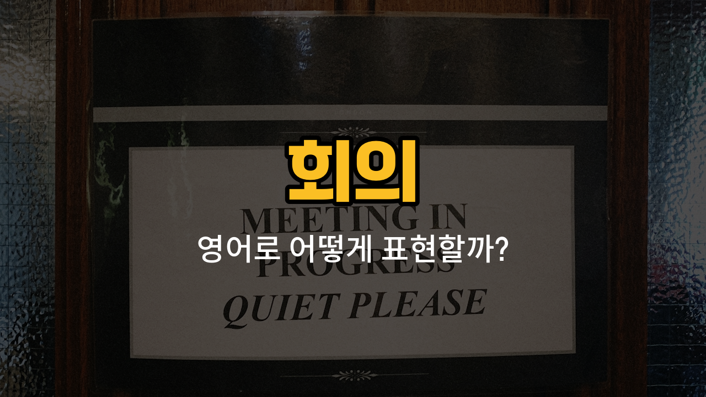

회의에서 자주 쓰이는 영어 단어들을 배워볼까요? 오늘은 회의에서 꼭 필요한 단어인 자료(material), 의견(opinion), 안건(agenda item), 진행([progress](/blog/in-english/859.progress/)), 발언(remark)에 대해 알아보고, 각각의 예문도 함께 연습해볼 거예요. 실제 회의 상황에서 바로 쓸 수 있는 표현들이니 꼭 익혀두세요!

## 1. 자료 (Material)

회의나 발표를 위해 준비하는 문서, 슬라이드, 표 등 다양한 참고 자료를 영어로는 "material"이라고 해요.

### 🗣️ 발음
- 발음기호: /məˈtɪriəl/
- 한국어 발음: 머티리얼

### 💭 관련 표현
- meeting material: 회의 자료
- reference material: 참고 자료
- training material: 교육 자료

### 📝 예문으로 연습하기!

1. "Did you bring the meeting material?"

   "회의 자료를 가져왔어요?"

2. "I need more material to [prepare](/blog/in-english/371.prepare/) for the presentation."

   "발표 준비를 위해 더 많은 자료가 필요해요."

## 2. 의견 (Opinion)

회의에서 자신의 생각이나 느낌, 주장 등을 표현할 때 "opinion"이라는 단어를 사용해요.

### 🗣️ 발음
- 발음기호: /əˈpɪnjən/
- 한국어 발음: 오피니언

### 💭 관련 표현
- personal opinion: 개인 의견
- [share](/blog/in-english/248.share/) an opinion: 의견을 나누다
- [ask for](/blog/in-english/125.ask-for/) an opinion: 의견을 묻다

### 📝 예문으로 연습하기!

1. "Can I share my opinion on this topic?"

   "이 주제에 대해 제 의견을 말해도 될까요?"

2. "What’s your opinion about the new project?"

   "새 프로젝트에 대해 어떻게 생각해요?"

## 3. 안건 (Agenda item)

회의에서 논의할 주제나 항목을 영어로 "agenda item"이라고 해요.

### 🗣️ 발음
- 발음기호: /əˈdʒɛndə ˈaɪtəm/
- 한국어 발음: 어젠더 아이템

### 💭 관련 표현
- next agenda item: 다음 안건
- [main](/blog/in-english/1404.main/) agenda item: 주요 안건
- add an agenda item: 안건을 추가하다

### 📝 예문으로 연습하기!

1. "Let’s move on to the next agenda item."

   "다음 안건으로 넘어가요."

2. "This agenda item is very [important](/blog/in-english/318.important/)."

   "이 안건은 매우 중요해요."

## 4. 진행 (Progress)

회의나 프로젝트가 얼마나 잘 진행되고 있는지를 표현할 때 "progress"라는 단어를 써요.

### 🗣️ 발음
- 발음기호: /ˈprɑːɡrɛs/
- 한국어 발음: 프라그레스

### 💭 관련 표현
- make progress: 진전을 보이다
- check progress: 진행 상황을 확인하다
- [report](/blog/in-english/1364.report/) progress: 진행을 보고하다

### 📝 예문으로 연습하기!

1. "We made good progress in the meeting."

   "회의에서 좋은 진전을 이뤘어요."

2. "Can you update us on the project’s progress?"

   "프로젝트 진행 상황을 알려줄 수 있어요?"

## 5. 발언 (Remark)

회의에서 누군가가 한 말이나 의견을 영어로는 "remark"라고 해요.

### 🗣️ 발음
- 발음기호: /rɪˈmɑːrk/
- 한국어 발음: 리마크

### 💭 관련 표현
- opening remark: 시작 발언
- closing remark: 마무리 발언
- make a remark: 발언하다

### 📝 예문으로 연습하기!

1. "Her remark was very helpful."

   "그녀의 발언이 정말 도움이 됐어요."

2. "Do you have any final remarks?"

   "마지막으로 하실 발언이 있나요?"

---

오늘은 회의에서 꼭 필요한 영어 단어 5가지를 배워봤어요. 실제 회의에서 직접 써보면 더 빨리 익힐 수 있어요! 다음에도 더 유용한 영어 단어와 예문으로 찾아올게요~
