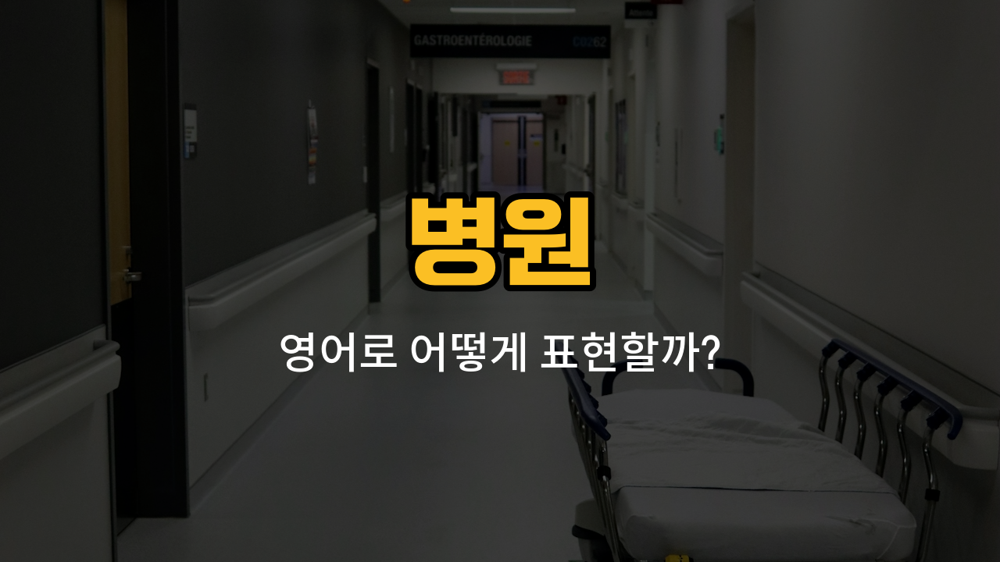

병원에 가면 자주 듣게 되는 영어 단어들이 있어요. 오늘은 병원에서 꼭 알아둬야 할 입원(hospitalization), 퇴원(discharge), 처방(prescription), 주사(injection), 수액(IV drip)이라는 단어들을 배워볼 거예요. 각 단어의 발음, 뜻, 그리고 실제로 쓸 수 있는 예문까지 함께 익혀봅시다!

## 1. 입원 (Hospitalization)

환자가 치료를 위해 병원에 머무는 것을 말해요.

### 🗣️ 발음
- 발음기호: /ˌhɑːspɪtələˈzeɪʃən/
- 한국어 발음: 하스피털리제이션

### 💭 관련 표현
- hospitalization period: 입원 기간
- need hospitalization: 입원이 필요하다

### 📝 예문으로 연습하기!

1. "He needed hospitalization after the accident."

   "그는 사고 후에 입원이 필요했어요."

2. "The doctor [recommended](/blog/in-english/308.recommend/) hospitalization for further treatment."

   "의사 선생님이 추가 치료를 위해 입원을 권했어요."

## 2. 퇴원 (Discharge)

병원에서 치료를 마치고 집으로 돌아가는 것을 말해요.

### 🗣️ 발음
- 발음기호: /ˈdɪstʃɑːrdʒ/
- 한국어 발음: 디스차지

### 💭 관련 표현
- discharge date: 퇴원 날짜
- [ready](/blog/in-english/1400.ready/) for discharge: 퇴원 준비가 되다

### 📝 예문으로 연습하기!

1. "She was [happy](/blog/in-english/1322.happy/) to be discharged from the hospital."

   "그녀는 병원에서 퇴원하게 되어 기뻐했어요."

2. "The doctor signed the discharge papers."

   "의사 선생님이 퇴원 서류에 서명했어요."

## 3. 처방 (Prescription)

의사가 약이나 치료 방법을 정해주는 것을 말해요.

### 🗣️ 발음
- 발음기호: /prɪˈskrɪpʃən/
- 한국어 발음: 프리스크립션

### 💭 관련 표현
- write a prescription: 처방전을 쓰다
- prescription [medicine](/blog/in-english/567.medicine/): 처방약

### 📝 예문으로 연습하기!

1. "The doctor gave me a prescription for antibiotics."

   "의사 선생님이 항생제 처방전을 써주셨어요."

2. "You need a prescription to [buy](/blog/in-english/1287.buy/) this medicine."

   "이 약을 사려면 처방전이 필요해요."

## 4. 주사 (Injection)

약이나 영양분을 주사기로 몸에 넣는 것을 말해요.

### 🗣️ 발음
- 발음기호: /ɪnˈdʒɛkʃən/
- 한국어 발음: 인젝션

### 💭 관련 표현
- get an injection: 주사를 맞다
- painkiller injection: 진통제 주사

### 📝 예문으로 연습하기!

1. "I got an injection for the flu."

   "독감 때문에 주사를 맞았어요."

2. "The nurse gave him an injection in his arm."

   "간호사 선생님이 그의 팔에 주사를 놨어요."

## 5. 수액 (IV drip)

영양분이나 약을 몸에 천천히 넣어주는 의료 장치예요.

### 🗣️ 발음
- 발음기호: /ˌaɪˈviː drɪp/
- 한국어 발음: 아이브이 드립

### 💭 관련 표현
- get an IV drip: 수액을 맞다
- saline IV drip: 생리식염수 수액

### 📝 예문으로 연습하기!

1. "She needed an IV drip because she was dehydrated."

   "그녀는 탈수 때문에 수액이 필요했어요."

2. "The nurse [set](/blog/in-english/1117.set/) up an IV drip for the [patient](/blog/in-english/562.patient/)."

   "간호사 선생님이 환자에게 수액을 연결해줬어요."

---

오늘 배운 병원 관련 영어 단어와 예문들을 꼭 여러 번 소리내어 연습해보세요! 병원에서 영어를 써야 할 때 큰 도움이 될 거예요. 다음에 더 유용한 영어 표현으로 만나요~
