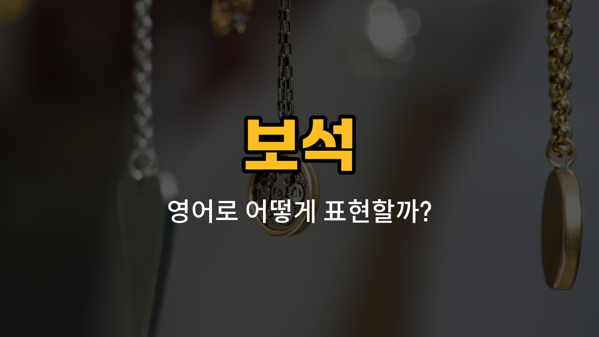

오늘은 아름다운 보석의 영어 표현을 배워볼 거예요! 옥, 자수정, 산호, 비취, 토파즈와 같은 보석들은 영어로 어떻게 말하는지, 각각의 발음과 뜻, 그리고 예문까지 함께 알아볼게요. 보석에 관심 있는 분들은 꼭 끝까지 읽어보세요~

## 1. 옥 (Jade)

옥은 동양에서 행운과 건강을 상징하는 녹색 보석이에요. 영어로는 "Jade"라고 해요.

### 🗣️ 발음
- 발음기호: /dʒeɪd/
- 한국어 발음: 제이드

### 💭 관련 표현
- jade ring: 옥 반지
- jade bracelet: 옥 팔찌

### 📝 예문으로 연습하기!
1. "She wears a beautiful jade necklace."

   "그녀는 아름다운 옥 목걸이를 하고 있어요."

2. "Jade is [often](/blog/in-english/326.often/) [used](/blog/in-english/171.used/) for [making](/blog/in-english/1135.making/) jewelry."

   "옥은 보통 장신구를 만드는 데 사용돼요."

## 2. 자수정 (Amethyst)

자수정은 보라색이 아름다운 보석으로, 영어로는 "Amethyst"라고 해요.

### 🗣️ 발음
- 발음기호: /ˈæm.ə.θɪst/
- 한국어 발음: 애머시스트

### 💭 관련 표현
- amethyst ring: 자수정 반지
- amethyst stone: 자수정 원석

### 📝 예문으로 연습하기!
1. "My birthstone is amethyst."

   "제 탄생석은 자수정이에요."

2. "She [bought](/blog/in-english/1287.buy/) an amethyst bracelet."

   "그녀는 자수정 팔찌를 샀어요."

## 3. 산호 (Coral)

산호는 바다에서 자라는 붉은색이나 분홍색의 보석이에요. 영어로는 "Coral"이라고 해요.

### 🗣️ 발음
- 발음기호: /ˈkɔːr.əl/
- 한국어 발음: 코럴

### 💭 관련 표현
- coral necklace: 산호 목걸이
- [red](/blog/in-english/1381.red/) coral: 붉은 산호

### 📝 예문으로 연습하기!
1. "She has a coral pendant."

   "그녀는 산호 펜던트를 가지고 있어요."

2. "Coral is often used in traditional jewelry."

   "산호는 전통 장신구에 자주 사용돼요."

## 4. 비취 (Jadeite)

비취는 옥의 한 종류로, 특히 선명한 녹색을 띠는 고급 보석이에요. 영어로는 "Jadeite"라고 해요.

### 🗣️ 발음
- 발음기호: /ˈdʒeɪ.daɪt/
- 한국어 발음: 제이다이트

### 💭 관련 표현
- jadeite bangle: 비취 팔찌
- jadeite carving: 비취 조각

### 📝 예문으로 연습하기!
1. "This ring is made of jadeite."

   "이 반지는 비취로 만들어졌어요."

2. "Jadeite is highly valued in Asia."

   "비취는 아시아에서 아주 귀하게 여겨져요."

## 5. 토파즈 (Topaz)

토파즈는 노란색, 파란색 등 다양한 색을 가진 보석이에요. 영어로는 "Topaz"라고 해요.

### 🗣️ 발음
- 발음기호: /ˈtoʊ.pæz/
- 한국어 발음: 토패즈

### 💭 관련 표현
- blue topaz: 블루 토파즈
- topaz earrings: 토파즈 귀걸이

### 📝 예문으로 연습하기!
1. "She received a topaz ring for her birthday."

   "그녀는 생일 선물로 토파즈 반지를 받았어요."

2. "Topaz can be [found](/blog/in-english/1094.found/) in many colors."

   "토파즈는 다양한 색깔로 볼 수 있어요."

---

오늘 배운 보석 영어 단어들, 예문과 함께 꼭 소리 내어 연습해보세요! 보석 가게나 여행할 때도 유용하게 쓸 수 있을 거예요. 다음에도 실생활에 도움되는 영어 단어로 만나요~
