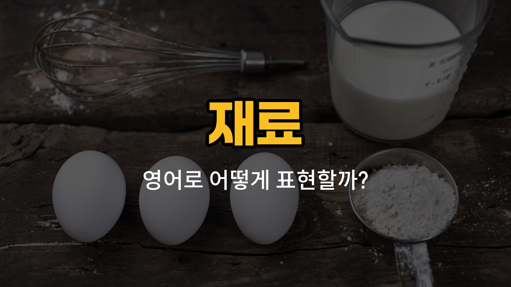

요리나 베이킹을 할 때 꼭 필요한 재료들의 영어 표현을 알아볼까요? 오늘은 밀가루, 설탕, 소금, 식초, 간장의 영어 단어와 발음, 그리고 일상에서 자주 쓰이는 예문까지 함께 공부할 거예요. 이 단어들은 요리 레시피나 마트에서 재료를 찾을 때 정말 유용하게 쓰여요!

## 1. 밀가루 (Flour)

빵이나 케이크 등 다양한 요리에 쓰이는 기본적인 가루 재료예요.

### 🗣️ 발음
- 발음기호: /flaʊər/
- 한국어 발음: 플라워

### 💭 관련 표현
- all-purpose flour: 다목적 밀가루
- cake flour: 케이크용 밀가루
- wheat flour: 밀 밀가루

### 📝 예문으로 연습하기!

1. "I need some flour to [bake](/blog/in-english/462.bake/) bread."

   "빵을 굽기 위해 밀가루가 좀 필요해요."

2. "Can you pass me the flour, please?"

   "밀가루 좀 건네줄래요?"

## 2. 설탕 (Sugar)

음식이나 음료를 달게 만들 때 쓰는 재료예요.

### 🗣️ 발음
- 발음기호: /ˈʃʊɡər/
- 한국어 발음: 슈거

### 💭 관련 표현
- brown sugar: 흑설탕
- powdered sugar: 가루 설탕
- white sugar: 백설탕

### 📝 예문으로 연습하기!

1. "Add two spoons of sugar to the tea."

   "차에 설탕 두 스푼을 넣어주세요."

2. "This cake is too sweet because of too much sugar."

   "이 케이크는 설탕이 너무 많아서 너무 달아요."

## 3. 소금 (Salt)

음식의 간을 맞추거나 맛을 내는 데 꼭 필요한 재료예요.

### 🗣️ 발음
- 발음기호: /sɔːlt/
- 한국어 발음: 솔트

### 💭 관련 표현
- sea salt: 천일염
- table salt: 식탁용 소금
- rock salt: 암염

### 📝 예문으로 연습하기!

1. "Don't [forget](/blog/in-english/023.forget/) to add salt to the soup."

   "수프에 소금 넣는 거 잊지 마세요."

2. "Too much salt is not good for your [health](/blog/in-english/1210.health/)."

   "소금을 너무 많이 먹으면 건강에 안 좋아요."

## 4. 식초 (Vinegar)

음식의 신맛을 내거나 절임 요리 등에 쓰는 액체 재료예요.

### 🗣️ 발음
- 발음기호: /ˈvɪnɪɡər/
- 한국어 발음: 비니거

### 💭 관련 표현
- apple cider vinegar: 사과 식초
- rice vinegar: 쌀 식초
- balsamic vinegar: 발사믹 식초

### 📝 예문으로 연습하기!

1. "Add a [little](/blog/in-english/1085.little/) vinegar to the salad."

   "샐러드에 식초를 조금 넣어보세요."

2. "Vinegar can be used to [clean](/blog/in-english/523.clean/) the kitchen."

   "식초는 주방 청소에도 사용할 수 있어요."

## 5. 간장 (Soy sauce)

한국 요리뿐만 아니라 다양한 요리에 쓰이는 짠맛의 액체 양념이에요.

### 🗣️ 발음
- 발음기호: /sɔɪ sɔːs/
- 한국어 발음: 소이 소스

### 💭 관련 표현
- [light](/blog/in-english/1373.light/) soy sauce: 연간장
- dark soy sauce: 진간장
- low-sodium soy sauce: 저염 간장

### 📝 예문으로 연습하기!

1. "Pour some soy sauce over the rice."

   "밥 위에 간장을 좀 뿌려보세요."

2. "I [use](/blog/in-english/1079.use/) soy sauce to marinate meat."

   "저는 고기를 재울 때 간장을 사용해요."

---

오늘은 요리할 때 자주 만나는 기본 재료들의 영어 단어를 배워봤어요. 오늘의 단어와 예문을 여러 번 소리내어 연습해보세요! 다음에도 더 유용한 영어 단어로 찾아올게요~
