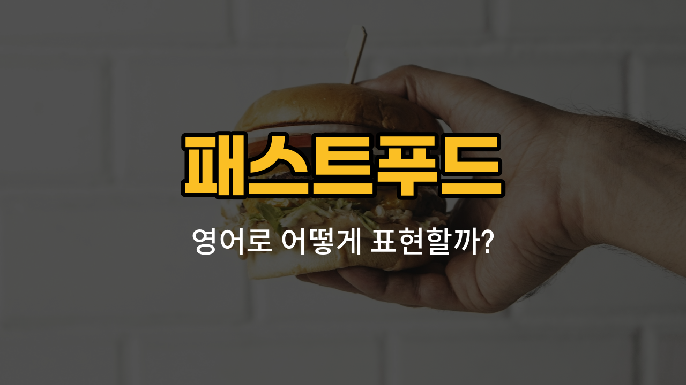

패스트푸드를 주문하거나 먹을 때 자주 쓰이는 영어 단어들을 알아볼까요? 오늘은 감자튀김, 치킨버거, 핫도그, 치즈버거, 콜라와 관련된 영어 표현과 예문을 소개할게요. 실제 패스트푸드점에서 쓸 수 있는 자연스러운 문장도 함께 연습해봐요!

## 1. 감자튀김 (French fries)

감자튀김은 패스트푸드점에서 가장 인기 있는 사이드 메뉴 중 하나예요. 영어로는 "French fries"라고 해요.

### 🗣️ 발음
- 발음기호: /frɛntʃ fraɪz/
- 한국어 발음: 프렌치 프라이즈

### 💭 관련 표현
- [large](/blog/in-english/1307.large/) French fries: 큰 감자튀김
- [extra](/blog/in-english/265.extra/) crispy fries: 아주 바삭한 감자튀김

### 📝 예문으로 연습하기!
1. "Can I get a large French fries, please?"

   "큰 감자튀김 하나 주세요."

2. "French fries taste great with ketchup."

   "감자튀김은 케첩과 같이 먹으면 정말 맛있어요."

## 2. 치킨버거 (Chicken burger)

닭고기로 만든 버거를 영어로는 "Chicken burger"라고 해요.

### 🗣️ 발음
- 발음기호: /ˈtʃɪkɪn ˈbɜːrɡər/
- 한국어 발음: 치킨 버거

### 💭 관련 표현
- spicy chicken burger: 매운 치킨버거
- grilled chicken burger: 구운 치킨버거

### 📝 예문으로 연습하기!
1. "I ordered a chicken burger for lunch."

   "점심으로 치킨버거를 주문했어요."

2. "Do you [want](/blog/in-english/1060.want/) cheese on your chicken burger?"

   "치킨버거에 치즈 추가할래요?"

## 3. 핫도그 (Hot dog)

빵 사이에 소시지를 넣은 간단한 음식이에요. 영어로는 "Hot dog"라고 해요.

### 🗣️ 발음
- 발음기호: /hɑːt dɔːɡ/
- 한국어 발음: 핫도그

### 💭 관련 표현
- chili hot dog: 칠리 핫도그
- corn dog: 콘도그 (미국식 핫도그)

### 📝 예문으로 연습하기!
1. "He [likes](/blog/in-english/1053.like/) to eat a hot dog at baseball [games](/blog/in-english/1335.games/)."

   "그는 야구장에서 핫도그 먹는 걸 좋아해요."

2. "Can I get a hot dog with mustard?"

   "머스터드 뿌린 핫도그 하나 주세요."

## 4. 치즈버거 (Cheeseburger)

치즈가 들어간 햄버거를 영어로는 "Cheeseburger"라고 해요.

### 🗣️ 발음
- 발음기호: /ˈtʃiːzˌbɜːrɡər/
- 한국어 발음: 치즈버거

### 💭 관련 표현
- double cheeseburger: 더블 치즈버거
- bacon cheeseburger: 베이컨 치즈버거

### 📝 예문으로 연습하기!
1. "She ordered a cheeseburger and fries."

   "그녀는 치즈버거와 감자튀김을 주문했어요."

2. "This cheeseburger is really delicious!"

   "이 치즈버거 정말 맛있어요!"

## 5. 콜라 (Cola)

패스트푸드점에서 자주 마시는 탄산음료예요. 영어로는 "Cola"라고 해요.

### 🗣️ 발음
- 발음기호: /ˈkoʊlə/
- 한국어 발음: 콜라

### 💭 관련 표현
- diet cola: 다이어트 콜라
- large cola: 큰 콜라

### 📝 예문으로 연습하기!
1. "Can I have a cola with no ice?"

   "얼음 없이 콜라 한 잔 주세요."

2. "He spilled cola on the table."

   "그가 테이블에 콜라를 쏟았어요."

---

오늘 배운 패스트푸드 영어 단어들로 실제 주문 상황에서 자신 있게 말해보세요! 여러 번 소리 내어 연습하면 자연스럽게 익힐 수 있어요. 다음에도 실생활에서 자주 쓰는 영어 단어로 다시 만나요~
